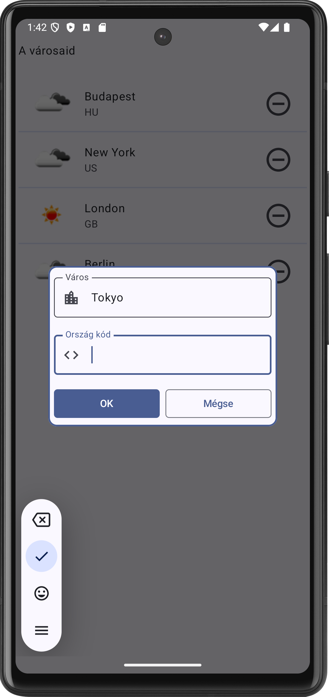
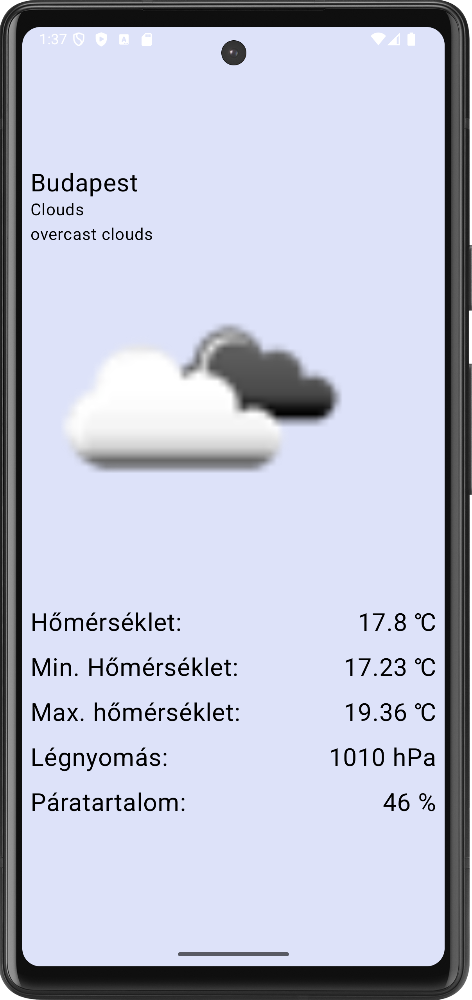

# Labor 04 - Időjárás alkalmazás készítése - Compose, Network (Weather Info)

## Bevezető

A labor során egy időjárás információkat megjelenítő alkalmazás elkészítése a feladat. A korábban látott Compose UI elemek használata mellett láthatunk majd példát hálózati kommunkáció hatékony megvalósítására is a [`Retrofit`](https://square.github.io/retrofit/) library felhasználásával.

Az alkalmazás városok listáját jeleníti meg, illetve tárolja egy adatbázisban. Egy kiválasztott város részletes időjárás adatait az [OpenWeatherMap](https://openweathermap.org/) REST API-jának segítségével kérdezi le. Új város hozzáadására egy  [`FloatingActionButton`](https://developer.android.com/guide/topics/ui/floating-action-button) megnyomásával van lehetőség. 

!!!info "REST"
    REST = [Representational State Transfer](https://en.wikipedia.org/wiki/Representational_state_transfer)

<p align="center">



</p>


## Az alkalmazás specifikációja

Az alkalmazás két fő `Screen`-ből áll. 

Az alkalmazás indulásakor megjelenő `Screen` a felhasználó által felvett városok listáját jeleníti meg. Minden lista elemhez tartozik egy *Remove* gomb, aminek a megnyomására az adott város törlődik a listából. Új várost a nézet jobb alsó sarkában található `FloatingActionButton` megnyomásával lehet felvenni.

Egy városra való kattintás hatására megnyílik egy új `Screen` két , amely a kiválasztott város időjárásának leírását és az ahhoz tartozó ikont jeleníti meg. 


## Előkészületek

A feladatok megoldása során ne felejtsd el követni a [feladat beadás folyamatát](../../tudnivalok/github/GitHub.md).

### Git repository létrehozása és letöltése

1. Moodle-ben keresd meg a laborhoz tartozó meghívó URL-jét és annak segítségével hozd létre a saját repository-dat.

2. Várd meg, míg elkészül a repository, majd checkout-old ki.

    !!! tip ""
        Egyetemi laborokban, ha a checkout során nem kér a rendszer felhasználónevet és jelszót, és nem sikerül a checkout, akkor valószínűleg a gépen korábban megjegyzett felhasználónévvel próbálkozott a rendszer. Először töröld ki a mentett belépési adatokat (lásd [itt](../../tudnivalok/github/GitHub-credentials.md)), és próbáld újra.

3. Hozz létre egy új ágat `megoldas` néven, és ezen az ágon dolgozz.

4. A `neptun.txt` fájlba írd bele a Neptun kódodat. A fájlban semmi más ne szerepeljen, csak egyetlen sorban a Neptun kód 6 karaktere.

## Közös feladatok (0,5 pont)

### Projekt megnyitása

Ezen a laboron nem új projektet fogunk létrehozni, hanem egy már létezőből indulunk ki, ez megtalálható a kicheckoutolt repositoryban `WorkplaceApp` néven. Nyissuk meg a projektet és a laborvezetővel nézzük át a felépítését.

!!!info "A kezőprojekt"
	A megnyitott projekt egy már kellően komlex alkalmazás, ami képes a felvett városok adataim Room adatbázisban eltárolni. A laborvezető segítségével tekintsük át a kezdőporjektet, de annak mérete és komplexitása miatt otthon is érdemes még rá időt szánni.


#### OpenWeatherMap API kulcs

Regisztráljunk saját felhasználót az [OpenWeatherMap](https://openweathermap.org/) oldalon, és hozzunk létre egy API kulcsot, aminek a segítségével használhatjuk majd a szolgáltatást az alkalmazásunkban! 

1. Kattintsunk a *Sign in* majd a *Create an account* gombra.
2. Töltsük ki a regisztrációs formot
3. A *Company* mező értéke legyen "BME", a *Purpose* értéke legyen "Education/Science"
4. Sikeres regisztráció után az *API keys* tabon található az alapértelmezettként létrehozott API kulcs.

A kapott API kulcsra később szükségünk lesz az időjárás adatokat lekérő API hívásnál.

### Hálózati kommunikáció megvalósítása

Az alkalmazásban szükségünk lesz internet elérésre. Vegyük fel az `AndroidManifest.xml` állományban az *Internet permission*-t az `application` tagen *kívülre*:

```xml
<uses-permission android:name="android.permission.INTERNET" />
```

!!!info "Engedélyek"
    Androidon API 23-tól (6.0, Marshmallow) az engedélyek két csoportba lettek osztva. A *normal* csoportba tartozó engedélyeket elég felvenni az `AndroidManifest.xml` fájlba az előbb látott módon és az alkalmazás automatikusan megkapja őket. A *dangerous* csoportba tartozó engedélyek esetén ez már nem elég, futás időben explicit módon el kell kérni őket a felhasználótól, aki akármikor meg is tagadhatja az alkalmazástól a kért engedélyt. Az engedélyek kezeléséről bővebben a [developer.android.com](https://developer.android.com/guide/topics/permissions/overview) oldalon lehet tájékozódni.

#### A hálózati réteg megvalósítása

A `hu.bme.aut.kliensalkalmazasok.weatherinfo.data.remote.api` package-ben hozzuk létre egy `WeatherApi` nevű interfészt. 

```kotlin
package hu.bme.aut.kliensalkalmazasok.weatherinfo.data.remote.api

import hu.bme.aut.kliensalkalmazasok.weatherinfo.data.remote.model.WeatherData
import retrofit2.Call
import retrofit2.http.GET
import retrofit2.http.Query

interface WeatherApi {
    @GET("/data/2.5/weather")
    fun getWeather(
        @Query("q") cityName: String?,
        @Query("units") units: String?,
        @Query("appid") appId: String?
    ): Call<WeatherData?>?
}
```

Látható, hogy *annotációk* alkalmazásával tuduk jelezni, hogy az adott függvényhívás milyen hálózati hívásnak fog megfelelni. A `@GET` annotáció *HTTP GET* kérést jelent, a paraméterként adott string pedig azt jelzi, hogy hogy a szerver alap *URL*-éhez képest melyik végpontra szeretnénk küldeni a kérést.

!!!note ""
    Hasonló módon tudjuk leírni a többi HTTP kérés típust is: @POST, @UPDATE, @PATCH, @DELETE

A függvény paremétereit a `@Query` annotációval láttuk el. Ez azt jelenti, hogy a `Retrofit` az adott paraméter értékét a kéréshez fűzi *query paraméterként* az annotációban megadott kulccsal.

!!!note ""
    További említésre méltó annotációk a teljesség igénye nélkül: @HEAD, @Multipart, @Field

A hálózati hívást jelölő interfész függvény visszatérési értéke egy`Call<WeatherData>` típusú objektum lesz. (A retrofites Callt importáljuk a megjelenő lehetőségek közül.) Ez egy olyan hálózati hívást ír le, aminek a válasza `WeatherData` típusú objektummá alakítható.

Hozzunk létre a `remote.repository` package-ben egy `WeatherRepository` osztályt:

```kotlin
package hu.bme.aut.kliensalkalmazasok.weatherinfo.data.remote.repository

import hu.bme.aut.kliensalkalmazasok.weatherinfo.data.remote.model.WeatherData
import retrofit2.Call

interface WeatherRepository {
    suspend fun getWeather(city: String?): Call<WeatherData?>?
}
```
Majd ennek egy konkrét implementációját is:

```kotlin
package hu.bme.aut.kliensalkalmazasok.weatherinfo.data.remote.repository

import com.squareup.moshi.Moshi
import com.squareup.moshi.kotlin.reflect.KotlinJsonAdapterFactory
import hu.bme.aut.kliensalkalmazasok.weatherinfo.data.remote.api.WeatherApi
import hu.bme.aut.kliensalkalmazasok.weatherinfo.data.remote.model.WeatherData
import okhttp3.OkHttpClient
import retrofit2.Call
import retrofit2.Retrofit
import retrofit2.converter.moshi.MoshiConverterFactory

class WeatherRepositoryImpl : WeatherRepository {
    private val retrofit: Retrofit
    private val weatherApi: WeatherApi

    companion object {
        private const val SERVICE_URL = "https://api.openweathermap.org"
        private const val APP_ID = "310b7a8053e8224177e0847644f726ef"
    }

    init {
        val moshi = Moshi.Builder().addLast(KotlinJsonAdapterFactory()).build()
        retrofit = Retrofit.Builder()
            .baseUrl(SERVICE_URL)
            .client(OkHttpClient.Builder().build())
            .addConverterFactory(MoshiConverterFactory.create(moshi))
            .build()
        weatherApi = retrofit.create(WeatherApi::class.java)
    }

    override suspend fun getWeather(city: String?): Call<WeatherData?>? {
        return weatherApi.getWeather(city, "metric", APP_ID)
    }
}
```

Ez az osztály lesz felelős a hálózati kérések lebonyolításáért. 

A `Retrofit.Builder()` hívással kérhetünk egy pareméterezhető `Builder` példányt. Ebben adhatjuk meg a hálózati hívásaink tulajdonságait. Jelen példában beállítjuk az elérni kívánt szolgáltatás címét, a HTTP kliens implementációt ([OkHttp](http://square.github.io/okhttp/)), valamint a JSON és objektum reprezentációk közötti konvertert (Gson).

A `WeatherApi` interfészből a `Builder`-rel létrehozott `Retrofit` példány segítségével tudjuk elkérni a fordítási időben generált, paraméterezett implementációt.

 A `retrofit.create(WeatherApi.class)` hívás eredményeként kapott objektum megvalósítja a `WeatherApi` interfészt.  Ha ezen az objektumon meghívjuk a `getWeather(...)` függvényt, akkor megtörténik az általunk az interfészben definiált hálózati hívás. 

**Cseréljük le** az `APP_ID` értékét az [OpenWeatherMap](https://openweathermap.org/) oldalon kapott saját API kulcsunkra!

Egyetlen példányra lesz szükségünk az osztályból, ezt vegyük föl a lokális repository-hoz hasonlóan a WeatherInfoApplication osztályba:

```kotlin
package hu.bme.aut.kliensalkalmazasok.weatherinfo

import android.app.Application
import androidx.room.Room
import hu.bme.aut.kliensalkalmazasok.weatherinfo.data.local.CityDatabase
import hu.bme.aut.kliensalkalmazasok.weatherinfo.data.local.repository.CityRepositoryImpl
import hu.bme.aut.kliensalkalmazasok.weatherinfo.data.remote.repository.WeatherRepositoryImpl

class WeatherInfoApplication : Application() {
    companion object {
        private lateinit var db: CityDatabase

        lateinit var cityRepository: CityRepositoryImpl

        lateinit var weatherRepository: WeatherRepositoryImpl
    }

    override fun onCreate() {
        super.onCreate()
        db = Room.databaseBuilder(
            applicationContext,
            CityDatabase::class.java,
            "city_database"
        ).fallbackToDestructiveMigration().build()

        cityRepository = CityRepositoryImpl(db.dao)

        weatherRepository = WeatherRepositoryImpl()
    }
}
```

Ezek után készítsük el a lokálishoz hasonló UseCase-eket, amikkel egyszerűen összefoghatjuk a funkcióinkat. Vegyük fel a `domain.usecases.weather` package-ben a követkető osztályokat:

```kotlin
package hu.bme.aut.kliensalkalmazasok.weatherinfo.domain.usecases.weather

import hu.bme.aut.kliensalkalmazasok.weatherinfo.data.remote.repository.WeatherRepository

class WeatherUseCases(repository: WeatherRepository) {
    val getCityWeatherUseCase = GetCityWeatherUseCase(repository)
}
```

és

```kotlin
package hu.bme.aut.kliensalkalmazasok.weatherinfo.domain.usecases.weather

import hu.bme.aut.kliensalkalmazasok.weatherinfo.data.remote.model.WeatherData
import hu.bme.aut.kliensalkalmazasok.weatherinfo.data.remote.repository.WeatherRepository
import retrofit2.Call
import java.io.IOException

class GetCityWeatherUseCase(private val repository: WeatherRepository) {

    suspend operator fun invoke(city: String): Call<WeatherData?>? {

        return try {
            return repository.getWeather(city)
        } catch (e: IOException) {
            e.printStackTrace()
            return null
        }
    }

}
```

A hálózati kommunikáció beállításával elkészültünk, a megfelelő függvényhívással már megkaphatjuk a kívánt adatot. Először a Város listába helyezzük el az aktuális időjárásnak megfelelő ikont. 

!!!note ""
    Az *OpenWeatherMap* API-tól a képek lekérhetők a visszakapott adatok alapján, pl: [https://openweathermap.org/img/w/10d.png](http://openweathermap.org/img/w/10d.png) 

Ezek a kódrészletek kikommnetezve találhatóak a fájlokban. Távolítsuk el a komment jeleket a következő fájlokból, és nézzük át a függvényeket:

- CityListItem.kt
- CityListViewModel.kt

Figyeljük meg, hogy hogy használjuk a kódban a `Coin` library `AsyncImage` függvényét!

El is készültünk a hálózati kommunikáció beállításával, próbáljuk ki az alkalmazást!

!!!example "BEADANDÓ"
	Készíts egy **képernyőképet**, amelyen látszik a **város lista nézet az ikonokkal** (emulátoron, készüléket tükrözve vagy képernyőfelvétellel), a **WeatherApiImpl osztály kódja**, valamint a **neptun kódod a kódban valahol kommentként**. 

	A képet a megoldásban a repository-ba f1.png néven töltsd föl. 

	A képernyőkép szükséges feltétele a pontszám megszerzésének.

#### A részletező nézet megvalósítása

Kezdjük a részletes nézet felületével. Ezeket a fájlokat a `feature.weather` package-be készítsük el. Az állapotokat a `WeatherState` fogja össze:

```kotlin
package hu.bme.aut.kliensalkalmazasok.weatherinfo.feature.weather

import hu.bme.aut.kliensalkalmazasok.weatherinfo.data.remote.model.WeatherData

data class WeatherState(
    val isLoading: Boolean = false,
    val error: Throwable? = null,
    val isError: Boolean = error != null,
    val currentWeather: WeatherData? = null,
)
```

Amelyeket a `WeatherViewModel` tárol. Itt található meg a hálózati hívás is.

```kotlin
package hu.bme.aut.kliensalkalmazasok.weatherinfo.feature.weather

import androidx.lifecycle.*
import androidx.lifecycle.viewmodel.initializer
import androidx.lifecycle.viewmodel.viewModelFactory
import hu.bme.aut.kliensalkalmazasok.weatherinfo.WeatherInfoApplication
import hu.bme.aut.kliensalkalmazasok.weatherinfo.data.remote.model.WeatherData
import hu.bme.aut.kliensalkalmazasok.weatherinfo.domain.usecases.weather.WeatherUseCases
import kotlinx.coroutines.CoroutineScope
import kotlinx.coroutines.Dispatchers
import kotlinx.coroutines.flow.MutableStateFlow
import kotlinx.coroutines.flow.asStateFlow
import kotlinx.coroutines.flow.update
import kotlinx.coroutines.launch
import retrofit2.Call
import retrofit2.Callback
import retrofit2.Response

class WeatherViewModel(
    private val savedStateHandle: SavedStateHandle,
    private val weatherOperations: WeatherUseCases
) : ViewModel() {

    private val _state = MutableStateFlow(WeatherState())
    val state = _state.asStateFlow()

    var cityName: String

    init {
        cityName = checkNotNull(savedStateHandle["cityName"])
        loadWeatherData()
    }

    private fun loadWeatherData() {

        viewModelScope.launch {
            try {
                CoroutineScope(coroutineContext).launch(Dispatchers.IO) {
                    weatherOperations.getCityWeatherUseCase(cityName)
                        ?.enqueue(object : Callback<WeatherData?> {
                            override fun onResponse(
                                call: Call<WeatherData?>,
                                response: Response<WeatherData?>
                            ) {
                                if (response?.isSuccessful!!) {
                                    _state.update {
                                        it.copy(
                                            isLoading = false,
                                            currentWeather = response.body()
                                        )
                                    }
                                }
                            }

                            override fun onFailure(
                                call: Call<WeatherData?>,
                                t: Throwable
                            ) {
                                t.printStackTrace()
                            }
                        })

                }

            } catch (e: Exception) {
                _state.update {
                    it.copy(
                        isLoading = false,
                        error = e
                    )
                }
            }
        }
    }


    companion object {
        val Factory: ViewModelProvider.Factory = viewModelFactory {
            initializer {
                val savedStateHandle = createSavedStateHandle()
                val weatherOperations = WeatherUseCases(WeatherInfoApplication.weatherRepository)
                WeatherViewModel(
                    savedStateHandle = savedStateHandle,
                    weatherOperations = weatherOperations
                )
            }
        }
    }
}
```

Az eredményt pedig végül a `WeatherScreen` jeleníti meg:

```kotlin
package hu.bme.aut.kliensalkalmazasok.weatherinfo.feature.weather

import androidx.compose.foundation.ExperimentalFoundationApi
import androidx.compose.foundation.background
import androidx.compose.foundation.layout.*
import androidx.compose.material3.*
import androidx.compose.runtime.Composable
import androidx.compose.runtime.getValue
import androidx.compose.ui.Alignment
import androidx.compose.ui.Modifier
import androidx.compose.ui.layout.ContentScale
import androidx.compose.ui.platform.LocalContext
import androidx.compose.ui.res.painterResource
import androidx.compose.ui.res.stringResource
import androidx.compose.ui.unit.dp
import androidx.compose.ui.unit.sp
import androidx.lifecycle.compose.collectAsStateWithLifecycle
import androidx.lifecycle.viewmodel.compose.viewModel
import coil.compose.AsyncImage
import coil.request.ImageRequest
import hu.bme.aut.kliensalkalmazasok.weatherinfo.R

@OptIn(ExperimentalFoundationApi::class, ExperimentalMaterial3Api::class)
@Composable
fun WeatherScreen(
    viewModel: WeatherViewModel = viewModel(factory = WeatherViewModel.Factory)
) {
    val state by viewModel.state.collectAsStateWithLifecycle()

    Scaffold(
        modifier = Modifier.fillMaxSize(),

        ) {
        Box(
            modifier = Modifier
                .fillMaxSize()
                .padding(it)
                .background(
                    color = if (!state.isLoading && !state.isError) {
                        MaterialTheme.colorScheme.secondaryContainer
                    } else {
                        MaterialTheme.colorScheme.background
                    }
                ),
            contentAlignment = Alignment.Center
        ) {
            if (state.isLoading) {
                CircularProgressIndicator(
                    color = MaterialTheme.colorScheme.secondaryContainer
                )
            } else if (state.isError) {
                Text(
                    text = state.error?.message
                        ?: stringResource(id = R.string.some_error_message)
                )
            } else {
                Column(

                ) {
                    Text(
                        text = viewModel.cityName,
                        fontSize = 24.sp
                    )
                    Text(
                        text = state.currentWeather?.weather?.get(0)?.main ?: ""
                    )


                    Text(
                        text = state.currentWeather?.weather?.get(0)?.description ?: ""
                    )
                    AsyncImage(
                        model = ImageRequest.Builder(context = LocalContext.current)
                            .data("https://openweathermap.org/img/w/${state.currentWeather?.weather?.first()?.icon}.png")
                            .crossfade(enable = true)
                            .build(),
                        contentDescription = null,
                        contentScale = ContentScale.Crop,
                        placeholder = painterResource(id = R.drawable.placeholder),
                        modifier = Modifier
                            .size(320.dp)
                    )


                    Spacer(modifier = Modifier.size(24.dp))

                    Row() {
                        Text(
                            modifier = Modifier.weight(1f),
                            text = stringResource(R.string.label_temperature)
                        )
                        Text(
                            text = state.currentWeather?.main?.temp.toString() ?: ""
                        )
                    }
                    Row() {
                        Text(
                            modifier = Modifier.weight(1f),
                            text = stringResource(R.string.label_min_temperature)
                        )
                        Text(
                            text = state.currentWeather?.main?.temp_min.toString() ?: ""
                        )
                    }
                    Row() {
                        Text(
                            modifier = Modifier.weight(1f),
                            text = stringResource(R.string.label_max_temperature)
                        )
                        Text(
                            text = state.currentWeather?.main?.temp_max.toString() ?: ""
                        )
                    }
                    Row() {
                        Text(
                            modifier = Modifier.weight(1f),
                            text = stringResource(R.string.label_pressure)
                        )
                        Text(
                            text = state.currentWeather?.main?.pressure.toString() ?: ""
                        )
                    }
                    Row() {
                        Text(
                            modifier = Modifier.weight(1f),
                            text = stringResource(R.string.label_humidity)
                        )
                        Text(
                            text = state.currentWeather?.main?.humidity.toString() ?: ""
                        )
                    }


                }
            }
        }
    }
}
```

#### A részletes nézet bekötése a navigációba

A felületek elkészülte után már csak össze kell kötnünk őket a navigációs gráffal. Itt fontos, hogy a részletes nézetnek át kell adnunk a megjeleníteni kívánt város nevét, hogy ő maga is le tudja kérni az adatokat. Először vegyük fel a `WeatherScreen`-t a `Screen` osztályba, és ne felejtsük el a paramétert:

package hu.bme.aut.kliensalkalmazasok.weatherinfo.navigation

```kotlin
sealed class Screen(val route: String) {
    object CityListScreen : Screen(route = "city_list")

    object WeatherScreen : Screen(route = "weather/{${Args.cityName}}") {
        fun passCityName(cityName: String) = "weather/$cityName"

        object Args {
            const val cityName = "cityName"
        }
    }
}
```

Majd pedig egészítsük ki a `NavGraph`-ot:

```kotlin
package hu.bme.aut.kliensalkalmazasok.weatherinfo.navigation

import androidx.compose.foundation.ExperimentalFoundationApi
import androidx.compose.material3.ExperimentalMaterial3Api
import androidx.compose.runtime.Composable
import androidx.compose.ui.Modifier
import androidx.navigation.NavHostController
import androidx.navigation.NavType
import androidx.navigation.compose.NavHost
import androidx.navigation.compose.composable
import androidx.navigation.compose.rememberNavController
import androidx.navigation.navArgument
import hu.bme.aut.kliensalkalmazasok.weatherinfo.feature.CityListScreen
import hu.bme.aut.kliensalkalmazasok.weatherinfo.feature.weather.WeatherScreen

@ExperimentalFoundationApi
@ExperimentalMaterial3Api
@Composable
fun NavGraph(
    navController: NavHostController = rememberNavController(),
    modifier: Modifier = Modifier
) {
    NavHost(
        navController = navController,
        startDestination = Screen.CityListScreen.route,
        modifier = modifier
    ) {
        composable(Screen.CityListScreen.route) {
            CityListScreen(
                onListItemClick = {
                    navController.navigate(Screen.WeatherScreen.passCityName(it))
                },
            )
        }
        composable(Screen.WeatherScreen.route,
        arguments = listOf(
            navArgument("cityName") {
                type = NavType.StringType
            }
        )
        ) {
            WeatherScreen()
        }
    }
}
```

Ezzel készen is vagyunk, már megjelennek a részletes nézeten az adatok. Próbáljuk is ki az alkalmazást!

!!!example "BEADANDÓ"
	Készíts egy **képernyőképet**, amelyen látszik egy város **részletes nézete** (emulátoron, készüléket tükrözve vagy képernyőfelvétellel), a **WeatherViewModel**, valamint a **neptun kódod a kódban valahol kommentként**. 

	A képet a megoldásban a repository-ba f2.png néven töltsd föl. 

	A képernyőkép szükséges feltétele a pontszám megszerzésének.

## Önálló feladat: város lista törlés megvalósítása (0,5 pont)

Valósítsuk meg a városok törlését egy újonnan felvett *Floating Action Button* megnyomásának hatására.

!!!example "BEADANDÓ"
	Készíts egy **képernyőképet**, amelyen látszik az **üres lista nézet** (emulátoron, készüléket tükrözve vagy képernyőfelvétellel), a **törléshez tartozó kód**, valamint a **neptun kódod a kódban valahol kommentként**. 

	A képet a megoldásban a repository-ba f3.png néven töltsd föl. 

	A képernyőkép szükséges feltétele a pontszám megszerzésének.

## Bónusz feladat: Előrejelzés

Az aktuális időjárás nézet mellé (mondjuk egy horizontalPagerbe, lsd. előző labor) készítsünk egy előrejelző felületet! Az `OpenWeatherMap` API szerencsére ehhez is biztosít végpontot:

http://api.openweathermap.org/data/2.5/forecast?q=Budapest&units=metric&appid={APPID}