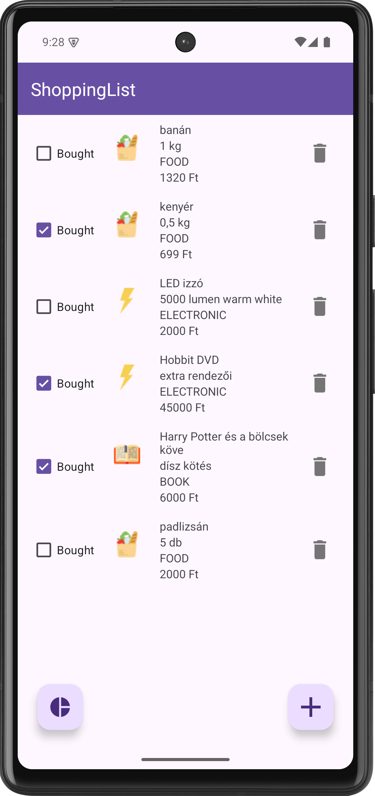
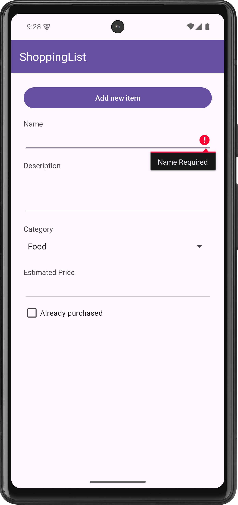
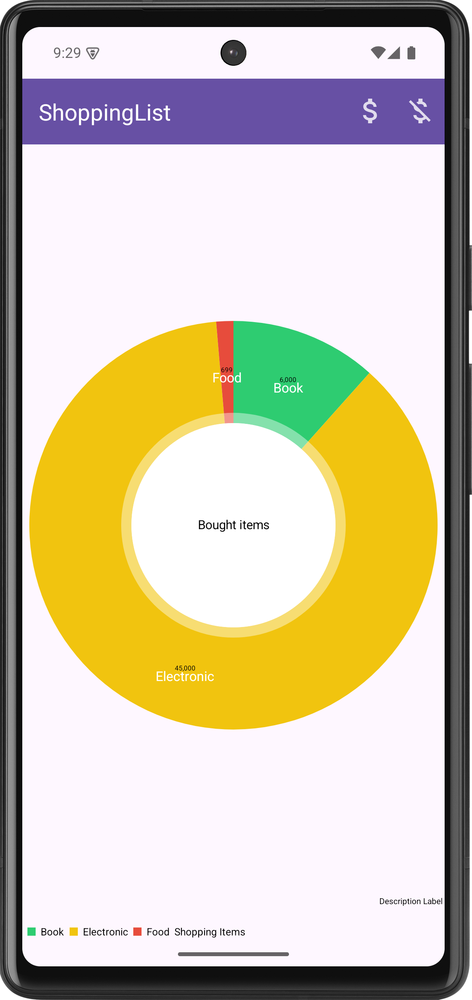
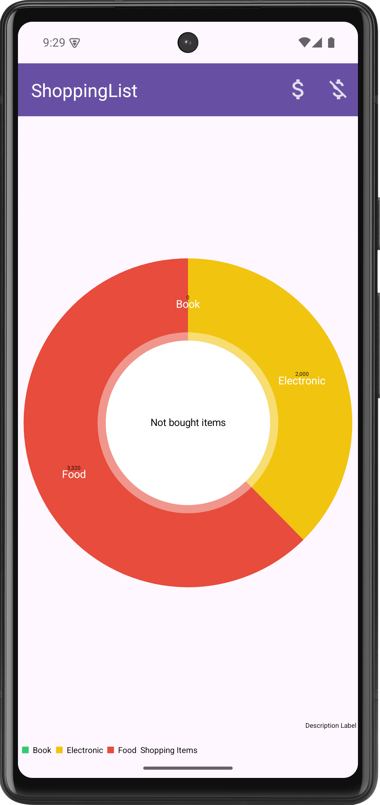
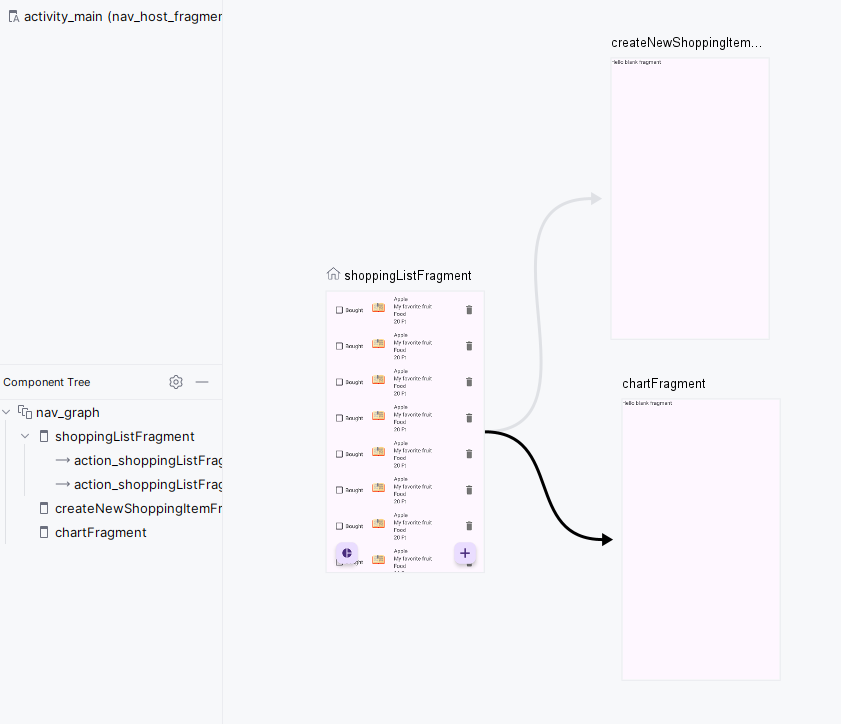

# Labor 02 - Bevásárló alkalmazás készítése - Fragmentek, Navigation, Room (ShoppingList)

## Bevezető

A labor során egy bevásárló lista alkalmazást készítünk el, amelybe belépve a felhasználó fel tudja venni a megvásárolni kívánt termékeket, valamint a vásárlás során megvásároltnak jelölni azokat. Az alkalmazás az adatokat perzisztensen tárolja, illetve a megvásárolt és még nem megvásárolt termékekről statisztikát is képes mutatni.

Az alkalmazás a termékek listáját [`RecyclerView`](https://developer.android.com/guide/topics/ui/layout/recyclerview)-ban jeleníti meg, a lista elemeket és azok állapotát a [`Room`](https://developer.android.com/topic/libraries/architecture/room) nevű ORM library segítségével tárolja perzisztensen. Új elem felvételére egy [`FloatingActionButton`](https://developer.android.com/guide/topics/ui/floating-action-button) megnyomásával van lehetőség. A felületek közötti navigáziót a [`Navigation Component`](https://developer.android.com/guide/navigation/navigation-getting-started) segíti. A kördiagram az [`MPAndroidChart`](https://github.com/PhilJay/MPAndroidChart) nevő könyvátrral kerül kirajzolásra.

!!!info "ORM"
    ORM = [Object-relational mapping](https://en.wikipedia.org/wiki/Object-relational_mapping)

## Felhasznált technológiák:

- [`Activity`](https://developer.android.com/guide/components/activities/intro-activities)  
- [`Fragment`](https://developer.android.com/guide/components/fragments)  
- [`RecyclerView`](https://developer.android.com/guide/topics/ui/layout/recyclerview)  
- [`FloatingActionButton`](https://developer.android.com/guide/topics/ui/floating-action-button)   
- [`Room`](https://developer.android.com/topic/libraries/architecture/room)
- [`Navigation Component`](https://developer.android.com/guide/navigation/navigation-getting-started)
- [`MPAndroidChart`](https://github.com/PhilJay/MPAndroidChart)

## Az alkalmazás specifikációja

Az alkalmazás három felületből áll: egy a bevásárlólista elemeit jelenít meg. Új elemet a jobb alsó sarokban található `FloatingActionButton` segítségével vehetünk fel. Erre kattintva egy  új felület jelenik meg, amin megadhatjuk a vásárolni kívánt áru nevét, leírását, kategóriáját és becsült árát.
Az új felületen az *Add new item* gombra kattintva a megadott adatokkal létrejön egy lista elem a listában. Az egyes lista elemeken `CheckBox` segítségével jelezhetjük, hogy már megvásároltuk őket. A kuka ikonra kattintva törölhetjük az adott elemet.
A bal alsó sarokban található `FloatingActionButton`-re kattintva statisztikákat láthatunk a listánkról. A jobb fölső menü gombokra kattintva válthatunk a két mód között.


<p align="center">


</p>
<p align="center">


</p>

## Előkészületek

A feladatok megoldása során ne felejtsd el követni a [feladat beadás folyamatát](../../tudnivalok/github/GitHub.md).

### Git repository létrehozása és letöltése

1. Moodle-ben keresd meg a laborhoz tartozó meghívó URL-jét és annak segítségével hozd létre a saját repository-dat.

2. Várd meg, míg elkészül a repository, majd checkout-old ki.

    !!! tip ""
        Egyetemi laborokban, ha a checkout során nem kér a rendszer felhasználónevet és jelszót, és nem sikerül a checkout, akkor valószínűleg a gépen korábban megjegyzett felhasználónévvel próbálkozott a rendszer. Először töröld ki a mentett belépési adatokat (lásd [itt](../../tudnivalok/github/GitHub-credentials.md)), és próbáld újra.

3. Hozz létre egy új ágat `megoldas` néven, és ezen az ágon dolgozz.

4. A `neptun.txt` fájlba írd bele a Neptun kódodat. A fájlban semmi más ne szerepeljen, csak egyetlen sorban a Neptun kód 6 karaktere.

## Közös feladatok (0,5 pont)

### Projekt megnyitása

Ezen a laboron nem új projektet fogunk létrehozni, hanem egy már létezőből indulunk ki, ez megtalálható a kicheckoutolt repositoryban `ShoppingList` néven. Nyissuk meg a projektet és a laborvezetővel nézzük át a felépítését.

???info "A kezőprojekt"
	A megnyitott projekt egyetlen *Activity*-t tartalmaz. 	Megfigyelhető, hogy a témában kikapcsoltuk az ActionBar megjelenését, helyette az xml fájlban szerepel egy [Toolbar](https://developer.android.com/reference/android/widget/Toolbar) típusú elem, egy AppBarLayout-ba csomagolva. Mostanában tanácsos nem a beépített ActionBar-t használni, hanem helyette egy Toolbar-t lehelyezni, mert ez több, hasznos funkciót is támogat, például integrálódni tud egy NavigationDrawer-rel, vagy az újabb navigációs komponenssel (amit ebből a tárgyból nem veszünk).

	```xml
	<?xml version="1.0" encoding="utf-8"?>
	<androidx.constraintlayout.widget.ConstraintLayout xmlns:android="http://schemas.android.com/apk/res/android"
	    xmlns:app="http://schemas.android.com/apk/res-auto"
	    xmlns:tools="http://schemas.android.com/tools"
	    android:layout_width="match_parent"
	    android:layout_height="match_parent"
	    tools:context=".MainActivity">
	
	    <com.google.android.material.appbar.AppBarLayout
	        android:id="@+id/appbar"
	        android:layout_width="match_parent"
	        android:layout_height="wrap_content"
	        app:layout_constraintLeft_toLeftOf="parent"
	        app:layout_constraintRight_toRightOf="parent"
	        app:layout_constraintTop_toTopOf="parent">
	
	        <androidx.appcompat.widget.Toolbar
	            android:id="@+id/toolbar"
	            android:layout_width="match_parent"
	            android:layout_height="?attr/actionBarSize"
	            android:background="?attr/colorPrimary"
	            app:titleTextColor="@color/white" />
	    </com.google.android.material.appbar.AppBarLayout>
	    ...
	</androidx.constraintlayout.widget.ConstraintLayout>
	```

	Ez be van állítva a `MainActivity` `onCreate`-jében:

	```kotlin
	override fun onCreate(savedInstanceState: Bundle?) {
        super.onCreate(savedInstanceState)
        binding = ActivityMainBinding.inflate(layoutInflater)
        setContentView(binding.root)

        setSupportActionBar(binding.toolbar)
    }	
	```

	Valamint le van tiltva az Actionbar az almalmazás témájában (NoActionBar öröklés):

	```xml
	<style name="Theme.ShoppingList" parent="Theme.MaterialComponents.DayNight.NoActionBar">
        <!-- Customize your theme here. -->
		...
    </style>
	```
	Az erőforrások között szerepelnek még a szükséges *string* -ek és képek valamint ikonok.

	```xml
	<resources>
	    <string name="app_name">ShoppingList</string>
	    <string name="name">Name</string>
	    <string name="description">Description</string>
	    <string name="category">Category</string>
	    <string name="estimated_price">Estimated Price</string>
	    <string name="already_purchased">Already purchased</string>
	    <string name="new_shopping_item">New Shopping Item</string>
	    <string name="bought">Bought</string>
	    <string name="create">Create</string>
	    <string name="label_shopping_items">Shopping Items</string>
	    <string name="not_bought">Not bought</string>
	    <string name="name_required">Name Required</string>
	    <string name="add_new_item">Add new item</string>
	    <string name="label_bought_items">Bought items</string>
	    <string name="label_not_bought_items">Not bought items</string>	

	    <string-array name="category_items">
	        <item>Food</item>
	        <item>Electronic</item>
	        <item>Book</item>
	    </string-array>
	</resources>
	```

	Be van kapcsolva a *ViewBinding* :

	```groovy
	...
	android {
		...
		buildFeatures {
			viewBinding true
		}
	}
	```

	Szintén be vannak állítva a függőségek a megfelelő helyeken:

	A PieChart kirajzolásához az [MPAndroidChart](https://github.com/PhilJay/MPAndroidChart) library-t fogjuk használni.

	settings.gradle:
	```groovy
	dependencyResolutionManagement {
	    repositories {
	        ...
	        maven { url "https://jitpack.io" }
	    }
	}
	```
	
	App szintű build.gradle:
	```groovy
	dependencies {
	    ...
	    implementation 'com.github.PhilJay:MPAndroidChart:v3.1.0'
	}

	
	A [`Navigation Component`](https://developer.android.com/guide/navigation/navigation-getting-started) függőségei:

	Elsőre nézzük a **project** szintű *Gradle* fájlt:
	A *Jetpack Navigation* könyvtár használata miatt föl van véve a többi plugin mellé a `androidx.navigation.safeargs`:
	
	```groovy
	plugins {
		...
		id 'androidx.navigation.safeargs' version '2.5.3' apply false
	}
	```

	A pluginok közé a modul szintű `build.gragle`-be még fel van véve a `androidx.navigation.safeargs.kotlin:
	
	```groovy
	plugins {
	    ...
	    id 'androidx.navigation.safeargs.kotlin'
	}
	
	android { ... }
	
	dependencies {
		...
		def nav_version = '2.5.3'
		implementation "androidx.navigation:navigation-fragment-ktx:$nav_version"
		implementation "androidx.navigation:navigation-ui-ktx:$nav_version"
	}
	```
	
	[`Room`](https://developer.android.com/topic/libraries/architecture/room) hozzáadása a projekthez
	
	Az app modulhoz tartozó build.gradle fájlban a pluginokhoz hozzáírtunk egy sort (bekapcsoljuk a Kotlin Annotation Processort - KAPT):
	```gradle
	plugins {
		//...
	    id 'kotlin-kapt'
		//...
	}
	
	//...
	```
	
	Ezt követően, szintén ebben a `build.gradle` fájlban a `dependencies` blokkhoz van hozzáadva `Room` library:
	```gradle
	dependencies {
	    //...
	    def room_version = "2.3.0"
	    implementation "androidx.room:room-runtime:$room_version"
	    implementation "androidx.room:room-ktx:$room_version"
	    kapt "androidx.room:room-compiler:$room_version"
	}
	```

### Navigation Component inicializálás

!!!info "Képernyők kezelése Android alkalmazásokban"
	A legtöbb mobilalkalmazás jól elkülöníthető oldalak/képernyők kombinációjából épül fel. Az egyik első fő döntés, amit alkalmazástervezés közben meg kell hoznunk, ezeknek a képernyőknek a felépítése, illetve a képernyők közötti navigáció megvalósítása. Egy Android alapú alkalmazás esetén több megoldás közül is választhatunk:
	
	-  *Activity alapú megközelítés*: Minden képernyő egy **Activity**. Mivel az **Activity** egy rendszerszintű komponense az Androidnak, ezért ennek kezeléséért is az operációs rendszer a felelős. Mi közvetlenül sose példányosítjuk, hanem **Intent**-et küldünk a rendszer felé. A navigációért is a rendszer felel, bizonyos opciókat *flagek* segítségével tudunk beállítani.
	- *Fragment alapú megközelítés*: Ez esetben a képernyőink egy vagy több **Fragment**-ből épülnek fel. Ezeknek kezelése az alkalmazás szintjén történik meg, emiatt mindenképp szükséges egy **Activity**, mely a megjelenítésért felel. A megjelenítést, illetve a navigációt a **FragmentManager** osztály végzi.
	- *Egyéb egyedi megoldás*: Külső vagy saját könyvtár használata a megjelenítéshez, mely tipikusan az alap **View** osztályból származik le. Ilyen például a régi *Conductor*, illetve az újabb *Jetpack Compose*.

	Régebben az alkalmazások az Activity alapú megközelítést használták, később azonban áttértek a Fragmentekre. Az ilyen alkalmazásoknál összesen egy fő **Activity** van, mely tartalmazza azt a **FragmentManager** példányt, amit a későbbiekben a **Fragment** alapú képernyők megjelenítésére használunk.

	Ez egy alapvetően rugalmas és jól használható megoldás volt, azonban ehhez részleteiben meg kellett ismerni a **FragmentManager** működését, különben könnyen hibákba futhattunk. Ennek a megoldására fejlesztette ki a Google a *Navigation Component* csomagot, mellyel az Android Studió környezetében egy grafikus eszközzel könnyen létre tudjuk hozni az oldalak közötti navigációt, illetve ezt a kódból egyszerűen el tudjuk indítani. 

A Navigation Component használatához a projektünkben szerepelnie kell annak függőségének. Szerencsére ezt már megtaláljuk a megfelelő helyeket az alap projektben.

A Navigation Component egy *navigációs gráfot* használ a képernyők, illetve a közöttük lévő kapcsolatok definiálására. Ezt a gráfot a többi erőforráshoz hasonlóan egy `.xml` kiterjesztésű fájlban tudjuk megadni. Hozzuk létre ezt a fájlt:

1. A `res` mappán jobb gombbal kattintva válasszuk ki a **New &rarr; Android Resource Directory** opciót, majd a *Resource Type* mezőben válasszuk ki a *navigation* lehetőséget.
2. Az így létrejött `navigation` mappán jobb klikkelve válasszuk ki a **new &rarr; Navigation Resource File** opciót, legyen a fájl neve *nav_graph*.

Ahhoz, hogy a létrehozott navigációs gráf által működjön az alkalmazásunk, fel kell vennünk az alkalmazásunkban is. Ehhez módosítanunk kell az üres Activity példányunkat. Nyissuk meg az `activity_main.xml` fájlt, és írjuk felül a tartalmát az alábbi kóddal:

```xml
<?xml version="1.0" encoding="utf-8"?>
<androidx.constraintlayout.widget.ConstraintLayout xmlns:android="http://schemas.android.com/apk/res/android"
    xmlns:app="http://schemas.android.com/apk/res-auto"
    xmlns:tools="http://schemas.android.com/tools"
    android:layout_width="match_parent"
    android:layout_height="match_parent"
    tools:context=".MainActivity">

    <com.google.android.material.appbar.AppBarLayout
        android:id="@+id/appbar"
        android:layout_width="match_parent"
        android:layout_height="wrap_content"
        app:layout_constraintLeft_toLeftOf="parent"
        app:layout_constraintRight_toRightOf="parent"
        app:layout_constraintTop_toTopOf="parent">

        <androidx.appcompat.widget.Toolbar
            android:id="@+id/toolbar"
            android:layout_width="match_parent"
            android:layout_height="?attr/actionBarSize"
            android:background="?attr/colorPrimary"
            app:titleTextColor="@color/white" />
    </com.google.android.material.appbar.AppBarLayout>

    <androidx.fragment.app.FragmentContainerView
        android:id="@+id/nav_host_fragment"
        android:name="androidx.navigation.fragment.NavHostFragment"
        android:layout_width="0dp"
        android:layout_height="0dp"
        android:layout_marginTop="?attr/actionBarSize"
        app:defaultNavHost="true"
        app:layout_constraintBottom_toBottomOf="parent"
        app:layout_constraintLeft_toLeftOf="parent"
        app:layout_constraintRight_toRightOf="parent"
        app:layout_constraintTop_toTopOf="parent"
        app:navGraph="@navigation/nav_graph" />

</androidx.constraintlayout.widget.ConstraintLayout>
```

A most hozzáadott `FragmentContainerView` lesz az a nézet, melyben a navigációs gráfban felvett képernyők meg fognak jelenni. A `navGraph` paraméterrel tudjuk megadni az aktuális navigációs gráfot, míg a `defaultNavHost`-al tudjuk jelezni, hogy a rendszer vissza gombját alapértelmezetten ennek a nézetnek kell lekezelnie.

!!!info "Több navigációs gráf"
    Bár a Navigation Component támogatja, hogy több különböző navigáció gráfot is létrehozzunk az alkalmazásunkban, a legtöbb alkalmazásnál elegendő egy darab.

Próbáljuk meg futtatni az alkalmazást! Az indulás után az alkalmazásunk crashelni fog, mivel még nem vettünk fel képernyőket a navigáció gráfban, az Activity semmit se tud megjeleníteni, hibára fut.

### Felületek és navigáció elkészítése

Az első képernyő, amit létrehozunk, a lista lesz.

Nyissuk meg a `nav_graph.xml` fájlt, és kattintsunk a *New Destination* gombra (bal felső gomb), majd a *Create new destination* gombra:
<p align="center"> 

</p>
Válasszuk ki a *Fragment (Blank)* gombot, és legyen az oldal neve *ListFragment*. Ezzel létrehoztunk az első oldalunkat, ami automatikusan megkapta a *Home Destination* jelölőt, ezzel mutatva, hogy az alkalmazás indulásakor ez lesz az első oldalunk.
A létrejött `fragment_shopping_list.xml` tartalmát cseréljük ki az alábbira:

```xml
<?xml version="1.0" encoding="utf-8"?>
<androidx.constraintlayout.widget.ConstraintLayout xmlns:android="http://schemas.android.com/apk/res/android"
    xmlns:app="http://schemas.android.com/apk/res-auto"
    xmlns:tools="http://schemas.android.com/tools"
    android:layout_width="match_parent"
    android:layout_height="match_parent"
    tools:context=".MainActivity">

    <androidx.recyclerview.widget.RecyclerView
        android:id="@+id/rvMain"
        android:layout_width="match_parent"
        android:layout_height="match_parent"
        tools:listitem="@layout/item_shopping_list" />

    <com.google.android.material.floatingactionbutton.FloatingActionButton
        android:id="@+id/fabNewItem"
        android:layout_width="wrap_content"
        android:layout_height="wrap_content"
        android:layout_gravity="bottom|end"
        android:layout_margin="24dp"
        app:layout_constraintBottom_toBottomOf="parent"
        app:layout_constraintRight_toRightOf="parent"
        app:srcCompat="@drawable/ic_add" />

    <com.google.android.material.floatingactionbutton.FloatingActionButton
        android:id="@+id/fabChart"
        android:layout_width="wrap_content"
        android:layout_height="wrap_content"
        android:layout_gravity="bottom|end"
        android:layout_margin="24dp"
        app:layout_constraintBottom_toBottomOf="parent"
        app:layout_constraintLeft_toLeftOf="parent"
        app:srcCompat="@drawable/ic_chart" />

</androidx.constraintlayout.widget.ConstraintLayout>
```

A *ConstraintLayout*-ban a *RecyclerView*-n kívül két *FloatingActionButton*-t helyeztünk el.

A `tools:listitem` paraméter segítségével az Android Studio layout megjelenítő felületén megjelenik a paraméterben átadott listaelem. Ezt most pirossal jelöli a környezet, mert még nem létezik. Készítsük tehát el (`item_shopping_list.xml`):

```xml
<?xml version="1.0" encoding="utf-8"?>
<LinearLayout xmlns:android="http://schemas.android.com/apk/res/android"
    xmlns:tools="http://schemas.android.com/tools"
    android:layout_width="match_parent"
    android:layout_height="wrap_content"
    android:orientation="horizontal"
    android:paddingBottom="8dp"
    android:paddingLeft="16dp"
    android:paddingRight="16dp"
    android:paddingTop="8dp">

    <CheckBox
        android:id="@+id/cbIsBought"
        android:layout_width="wrap_content"
        android:layout_height="wrap_content"
        android:layout_gravity="center_vertical"
        android:text="@string/bought" />

    <ImageView
        android:id="@+id/ivIcon"
        android:layout_width="64dp"
        android:layout_height="64dp"
        android:layout_marginLeft="8dp"
        tools:src="@drawable/open_book" />

    <LinearLayout
        android:layout_width="0dp"
        android:layout_height="wrap_content"
        android:layout_marginLeft="8dp"
        android:layout_weight="1"
        android:orientation="vertical">

        <TextView
            android:id="@+id/tvName"
            android:layout_width="wrap_content"
            android:layout_height="wrap_content"
            tools:text="Apple" />

        <TextView
            android:id="@+id/tvDescription"
            android:layout_width="wrap_content"
            android:layout_height="wrap_content"
            tools:text="My favorite fruit" />

        <TextView
            android:id="@+id/tvCategory"
            android:layout_width="wrap_content"
            android:layout_height="wrap_content"
            tools:text="Food" />

        <TextView
            android:id="@+id/tvPrice"
            android:layout_width="wrap_content"
            android:layout_height="wrap_content"
            tools:text="20 Ft" />
    </LinearLayout>

    <ImageButton
        android:id="@+id/ibRemove"
        style="@style/Widget.AppCompat.Button.Borderless"
        android:layout_width="50dp"
        android:layout_height="50dp"
        android:layout_gravity="center_vertical"
        android:scaleType="fitXY"
        android:src="@drawable/ic_delete_grey600_48dp" />

</LinearLayout>
```

Valósítsuk meg a navigációt a másik két oldalra. Hozzunk létre két új *Fragment (Blank)* képernyőt (`CreateNewShoppingItemFragment` és `ChartFragment`). A navigációs gráfban az oldalak közötti navigációt akciókkal tudjuk meghatározni. Egy új akcióhoz fogjuk meg a kiindulási képernyő jobb oldalán lévő kis pöttyöt, és húzzuk a cél oldalra. A `ShoppingListFragment`-ből induló két akció mellett egy harmadikra is szükségünk van: az új elem létrehozás után vissza kell navigálnunk a lista képernyőre. A három akció létrehozása után tehát így fog kinézni a navigációs gráf:

<p align="center"> 

</p>

Az akciók meghívásához használjuk a view binding-ot a `ShoppingListFragment`-ben:

```kotlin
class ShoppingListFragment : Fragment() {

    private var _binding: FragmentShoppingListBinding? = null
    private val binding get() = _binding!!

    override fun onCreateView(
        inflater: LayoutInflater,
        container: ViewGroup?,
        savedInstanceState: Bundle?
    ): View? {
        _binding = FragmentShoppingListBinding.inflate(inflater, container, false)

        return binding.root
    }

    override fun onViewCreated(view: View, savedInstanceState: Bundle?) {
        super.onViewCreated(view, savedInstanceState)

        binding.fabNewItem.setOnClickListener {
            findNavController().navigate(
                ShoppingListFragmentDirections.actionShoppingListFragmentToCreateNewShoppingItemFragment()
            )
        }

        binding.fabChart.setOnClickListener {
            findNavController().navigate(
                ShoppingListFragmentDirections.actionShoppingListFragmentToChartFragment()
            )
        }

    }

    override fun onDestroyView() {
        _binding = null
        super.onDestroyView()
    }
}
```

A `findNavController()` függvénnyel érhetjük el a **NavController** osztály aktuális példányát, mellyel a navigációt tudjuk megvalósítani. A navigációhoz használt akciókhoz automatikusan generálódik egy azonosító, de ezeket a szerkesztőben módosíthatjuk, ha szeretnénk.

Rakjuk össze a másik két felületet is. Először az új elem felvételére szolgátó `fragment_create_new_shopping_item.xml`-t:

```xml
<?xml version="1.0" encoding="utf-8"?>
<LinearLayout xmlns:android="http://schemas.android.com/apk/res/android"
    android:layout_width="match_parent"
    android:layout_height="match_parent"
    android:orientation="vertical"
    android:padding="24dip">

    <Button
        android:id="@+id/btnCreate"
        android:layout_width="match_parent"
        android:layout_height="wrap_content"
        android:text="@string/add_new_item" />

    <ScrollView
        android:layout_marginTop="16dp"
        android:layout_width="match_parent"
        android:layout_height="match_parent">

        <LinearLayout
            android:layout_width="match_parent"
            android:layout_height="wrap_content"
            android:orientation="vertical">

            <TextView
                android:layout_width="match_parent"
                android:layout_height="wrap_content"
                android:text="@string/name" />

            <EditText
                android:id="@+id/etName"
                android:layout_width="match_parent"
                android:layout_height="wrap_content"
                android:imeOptions="actionNext"
                android:lines="1"
                android:maxLines="1"
                android:singleLine="true" />

            <TextView
                android:layout_width="match_parent"
                android:layout_height="wrap_content"
                android:layout_marginTop="16dip"
                android:text="@string/description" />

            <EditText
                android:id="@+id/etDescription"
                android:layout_width="match_parent"
                android:layout_height="wrap_content"
                android:lines="3"
                android:maxLines="3" />

            <TextView
                android:layout_width="match_parent"
                android:layout_height="wrap_content"
                android:layout_marginTop="16dip"
                android:text="@string/category" />

            <Spinner
                android:id="@+id/spCategory"
                android:layout_width="match_parent"
                android:layout_height="wrap_content" />

            <TextView
                android:layout_width="match_parent"
                android:layout_height="wrap_content"
                android:layout_marginTop="16dip"
                android:text="@string/estimated_price" />

            <EditText
                android:id="@+id/etEstimatedPrice"
                android:layout_width="match_parent"
                android:layout_height="wrap_content"
                android:imeOptions="actionDone"
                android:inputType="numberDecimal"
                android:lines="1"
                android:maxLines="1"
                android:singleLine="true" />

            <CheckBox
                android:id="@+id/cbAlreadyPurchased"
                android:layout_width="match_parent"
                android:layout_height="wrap_content"
                android:text="@string/already_purchased" />

        </LinearLayout>
    </ScrollView>
</LinearLayout>
```

Majd a diagram megjelenítésére szolgáló `fragment_chart.xml`-t:

```xml
<?xml version="1.0" encoding="utf-8"?>
<LinearLayout xmlns:android="http://schemas.android.com/apk/res/android"
    android:layout_width="match_parent"
    android:layout_height="match_parent"
    android:orientation="vertical">

    <com.github.mikephil.charting.charts.PieChart
        android:id="@+id/chartHoliday"
        android:layout_width="match_parent"
        android:layout_height="match_parent" />

</LinearLayout>
```

Látható, hogy az [MPAndroidChart](https://github.com/PhilJay/MPAndroidChart) külső könyvtárból használt *View*-t ugyan úgy kell elhelyezni a felületen, mintha beépített típus lenne: teljes *package* névvel hivatkozzuk.

Próbáljuk ki az alkalmazást! A "lista" nézetről a *FloatingActionButton*-ök hatására már át kell tudnunk navigálni a másik két Fragmentre.

### Perzisztens adattárolás megvalósítása

Az adatok perzisztens tárolásához a [`Room`](https://developer.android.com/topic/libraries/architecture/room) könyvtárat fogjuk használni.

!!!info "Room"
    A  `Room` egy kényelmes adatbazáskezelést lehetővé tevő API-t nyújt a platform szintű SQLite implementáció fölé. Megspórolható vele a korábban látott sok újra és újra megírandó kód, például a táblák adatait és létrehozó scriptjét tartalmazó *Table osztályok, a DBHelper és a PersistentDataHelper*. Ezeket és más segédosztályokat a `Room` *annotation* alapú kódgenerálással hozza létre a *build* folyamat részeként.

    A `Room` alapvető komponenseinek, architektúrájának és használatának leírása megtalálható a megfelelő [developer.android.com](https://developer.android.com/training/data-storage/room/) oldalon.

#### Egy modell osztály létrehozása
A `hu.bme.aut.kliensalkalmazasok.shoppinglist` *package*-ben hozzunk létre egy új *package*-et `data` néven. A `data` *package*-ben hozzunk létre egy új Kotlin osztályt, aminek a neve legyen  `ShoppingItem`:

```kotlin
@Entity(tableName = "shoppingitem")
data class ShoppingItem(
    @ColumnInfo(name = "id") @PrimaryKey(autoGenerate = true) var id: Long? = null,
    @ColumnInfo(name = "name") var name: String,
    @ColumnInfo(name = "description") var description: String,
    @ColumnInfo(name = "category") var category: Category,
    @ColumnInfo(name = "estimated_price") var estimatedPrice: Int,
    @ColumnInfo(name = "is_bought") var isBought: Boolean
) {
    enum class Category {
        FOOD, ELECTRONIC, BOOK;

        companion object {
            @JvmStatic
            @TypeConverter
            fun getByOrdinal(ordinal: Int): Category? {
                var ret: Category? = null
                for (cat in values()) {
                    if (cat.ordinal == ordinal) {
                        ret = cat
                        break
                    }
                }
                return ret
            }
            
            @JvmStatic
            @TypeConverter
            fun toInt(category: Category): Int {
                return category.ordinal
            }
        }
    }
}
```

Látható, hogy az osztályon, az osztály változóin, valamint az osztályon belül lévő *enum* osztály függvényein *annotációkat* helyeztünk el. Az `@Entity` jelzi a `Room` kódgenerátorának, hogy ennek az osztálynak a példányai adatbázis rekordoknak fognak megfelelni egy táblában és hogy az egyes változói felelnek majd meg a tábla oszlopainak. A `@ColumnInfo` *annotációval* megadjuk, hogy mi legyen a tagváltozónak megfelelő oszlop neve. `@PrimaryKey`-jel jelöljük a tábla egyszerű kulcs attribútumát.

Az osztályban létrehoztunk egy `enum`-ot is, amivel egy kategóriát akarunk kódolni. Az enum-nak van két statikus metódusa, `@TypeConverter` annotációval ellátva. Ezekkel oldható meg, hogy az adatbázis akár összetett adatszerkezeteket is tárolni tudjon. Ezek a függvények felelősek azért, hogy egy felhasználói típust lefordítsanak egy, az adatbázis által támogatott típusra, illetve fordítva.   
Megfigyelhető továbbá, hogy ezen függvények el vannak látva a `@JvmStatic` annotációval is. Erre azért van szükség, mert alapvetően, amikor a companion object-ek Jvm bájtkódra fordulnak, akkor egy külön statikus osztály jön számukra létre. Ezzel az annotációval lehet megadni, hogy ne jöjjön létre külön statikus osztály, ehelyett a bennfoglaló osztály (jelen esetben Category) statikus függvényei legyenek. Erre a speciális viselkedésre pedig a Room működése miatt van szükség, ugyanis tudnia kell, hol keresse egy-egy típusra a konvertereket.

!!!info "data class"
    Kotlinban van lehetőség úgynevezett data class létrehozására. Ezt talán legkönnyebben a Java-s POJO (Plain-Old-Java-Object) osztályoknak lehet megfeleltetni. A céljuk, hogy publikus property-kben összefüggő adatokat tároljanak, semmi több! Ezen kívül automatikusan létrejönnek bizonyos segédfüggvények is, például egy megfelelő equals, toString és copy implementáció.

#### Egy DAO osztály létrehozása

!!!info "DAO"
    DAO = [Data Access Object](https://en.wikipedia.org/wiki/Data_access_object)

A `data` package-ben hozzunk létre egy új Kotlin interfészt, aminek a neve legyen  `ShoppingItemDao`:

```kotlin
@Dao
interface ShoppingItemDao {
    @Query("SELECT * FROM shoppingitem")
    fun getAll(): List<ShoppingItem>

    @Query("SELECT * FROM shoppingitem WHERE is_bought = :isBought")
    fun getItemByIsBought(isBought: Boolean): List<ShoppingItem>

    @Insert
    fun insert(shoppingItems: ShoppingItem): Long

    @Update
    fun update(shoppingItem: ShoppingItem)

    @Delete
    fun deleteItem(shoppingItem: ShoppingItem)
}
```

Egy `@Dao` *annotációval* ellátott interfész a `Room` kódgenerátora számára azt jelzi, hogy generálni kell az interfészhez egy olyan implementációt, ami az interfész függvényeket az azokon lévő annotációk (`@Query`, `@Insert`, `@Update`, `@Delete`) alapján valósítja meg.

Figyeljük meg, hogy az Android Studio a `@Query` *annotáció* paramétereként átadott SQLite scriptre is nyújt kódkiegészítést, hiba jelzést!

#### Az adatbázis osztály létrehozása

A `data` package-ben hozzunk létre egy új Kotlin osztályt, aminek a neve legyen  `ShoppingListDatabase`:

```kotlin
@Database(entities = [ShoppingItem::class], version = 1)
@TypeConverters(value = [ShoppingItem.Category::class])
abstract class ShoppingListDatabase : RoomDatabase() {
    abstract fun shoppingItemDao(): ShoppingItemDao

    companion object {
        fun getDatabase(applicationContext: Context): ShoppingListDatabase {
            return Room.databaseBuilder(
                applicationContext,
                ShoppingListDatabase::class.java,
                "shopping-list"
            ).build()
        }
    }
}
```

A `@Database` *annotációval* lehet jelezni a kódgenerátornak, hogy egy osztály egy adatbázist fog reprezentálni. Az ilyen osztálynak *absztraktnak* kell lennie, valamint a `RoomDatabase`-ből kell származnia. Az *annotáció* `entities` paraméterének egy listát kell átadni, ami az adatbázis tábláknak megfelelő `@Entity`-vel jelzett osztályokat tartalmazza. A `version` paraméter értéke a lokális adatbázis verzió. A `@TypeConverters` *annotációval* lehet megadni a `Room`-nak olyan osztályokat, amik `@TypeConverter`-rel ellátott függvényeket tartalmaznak, ezzel támogatva a típuskonverziót adatbázis és objektum modell között. A `ShoppingListDatabase` osztály felelős a megfelelő DAO osztályok elérhetőségéért is.

Ezen kívül van még egy statikus *getDatabase* függvény, ami azt írja le, hogyan kell létrehozni az adatbázist (melyik osztályból, milyen néven). Ez a függvény az alkalmazás kontextusát várja paraméterül.

### Lista megjelenítése `RecyclerView`-val

#### A lista adapter létrehozása
Következő lépésként a lista adaptert fogjuk létrehozni, ami a modell elemeket fogja majd szolgáltatni a `RecyclerView`-nak.

A `hu.bme.aut.kliensalkalmazasok.shoppinglist` package-ben hozzunk létre egy új package-et `adapter` néven!

Az `adapter` package-ben hozzunk létre egy új Kotlin osztályt `ShoppingAdapter` néven:

```kotlin
class ShoppingAdapter(private val listener: ShoppingItemClickListener) :
    RecyclerView.Adapter<ShoppingAdapter.ShoppingViewHolder>() {

    private val items = mutableListOf<ShoppingItem>()
    override fun onCreateViewHolder(parent: ViewGroup, viewType: Int) = ShoppingViewHolder(
        ItemShoppingListBinding.inflate(LayoutInflater.from(parent.context), parent, false)
    )

    override fun onBindViewHolder(holder: ShoppingViewHolder, position: Int) {
        // TODO implementation
    }

    override fun getItemCount(): Int = items.size

    interface ShoppingItemClickListener {
        fun onItemChanged(item: ShoppingItem)
    }

    inner class ShoppingViewHolder(val binding: ItemShoppingListBinding) : RecyclerView.ViewHolder(binding.root)
}
```

 A listát `RecyclerView` segítségével szeretnénk megjeleníteni, ezért az adapter a `RecyclerView.Adapter` osztályból származik. Az adapter a modell elemeket egy listában tárolja. A rendszer a `RecyclerView`-val való hatékony lista megjelenítéshez a [*ViewHolder* tervezési mintát](https://developer.android.com/training/improving-layouts/smooth-scrolling#java) valósítja meg, ezért szükség van egy `ViewHolder` osztály megadására is. `ViewHolder`-eken keresztül érhetjük majd el a lista elemekhez tartozó `View`-kat. Mivel a `ViewHolder` osztály példányai az Adapterhez lesznek csatolva (azért, hogy elérjék a belső változóit), `inner class` osztályként kell definiálni.

A `RecyclerView.Adapter` három absztrakt függvényt definiál, amelyeket kötelező megvalósítani. Az `onCreateViewHolder()`-ben hozzuk létre az adott lista elemet megjelenítő `View`-t és a hozzá tartozó `ViewHolder`-t. Az `onBindViewHolder()`-ben kötjük hozzá a modell elemhez a nézetet, a `getItemCount()` pedig a listában található (általános esetre fogalmazva a megjelenítendő) elemek számát kell, hogy visszaadja.

A `ShoppingAdapter`-ben definiáltunk egy `ShoppingItemClickListener` nevű interfészt is, aminek a segítségével jelezhetjük az alkalmazás többi része felé, hogy esemény történt egy lista elemen.

Írjuk meg `onBindViewHolder`-ben az adatok megjelenítésének logikáját. Érdemes megfigyelni a `getImageResource` függvényt, ami az enum-hoz társítja a megfelelő képi erőforrást.

```kotlin
override fun onBindViewHolder(holder: ShoppingViewHolder, position: Int) {
    val shoppingItem = items[position]

    holder.binding.ivIcon.setImageResource(getImageResource(shoppingItem.category))
    holder.binding.cbIsBought.isChecked = shoppingItem.isBought
    holder.binding.tvName.text = shoppingItem.name
    holder.binding.tvDescription.text = shoppingItem.description
    holder.binding.tvCategory.text = shoppingItem.category.name
    holder.binding.tvPrice.text = "${shoppingItem.estimatedPrice} Ft"

    holder.binding.cbIsBought.setOnCheckedChangeListener { buttonView, isChecked ->
        shoppingItem.isBought = isChecked
        listener.onItemChanged(shoppingItem)
    }

}

@DrawableRes()
private fun getImageResource(category: ShoppingItem.Category): Int {
    return when (category) {
        ShoppingItem.Category.FOOD -> R.drawable.groceries
        ShoppingItem.Category.ELECTRONIC -> R.drawable.lightning
        ShoppingItem.Category.BOOK -> R.drawable.open_book
    }
}
```
Látható, hogy a felületet a *holder* nevű *ViewHolder* objektum *binding* attribútumán keresztül érjük el, innen tudjuk használni a *resource id*-kat.

Biztosítsuk egy elem hozzáadásának, valamint a teljes lista frissítésének lehetőségét az alábbi függvényekkel:

```kotlin
fun addItem(item: ShoppingItem) {
	items.add(item)
	notifyItemInserted(items.size - 1)
}

fun update(shoppingItems: List<ShoppingItem>) {
	items.clear()
	items.addAll(shoppingItems)
	notifyDataSetChanged()
}
```
!!!info "RecyclerView notify"
    A RecyclerView megírásánál figyeltek arra, hogy hatékony legyen, ezért az adathalmaz változásakor csak azokat a nézeteket frissíti, amit feltétlen szükséges. Azonban szintén hatékonyság miatt, nem az adapter fogja kiszámolni a változást, hanem ezt a programozónak kell kézzel jeleznie. Erre szolgál a `notify***` függvénycsalád, aminek két tagja fent látható. Az alsó hatására a teljes adathalmaz lecserélődik, és újrarajzolódik minden. Az első hatására viszont a már létező elemek nem módosulnak, csak egy újonnan beszúrt elem lesz kirajzolva.

#### A `RecyclerView` és az adatok megjelenítése

Adjuk hozzá az alábbi változókat a `ShoppingListFragment`-hez és cseréljük le a projekt létrehozásakor generált `onCreate()` függvényt:

```kotlin
private var _binding: FragmentShoppingListBinding? = null
private val binding get() = _binding!!

private lateinit var database: ShoppingListDatabase
private lateinit var adapter: ShoppingAdapter

override fun onCreateView(
    inflater: LayoutInflater,
    container: ViewGroup?,
    savedInstanceState: Bundle?
): View? {
    _binding = FragmentShoppingListBinding.inflate(inflater, container, false)

    setHasOptionsMenu(true)

    database = ShoppingListDatabase.getDatabase(requireContext())

    return binding.root
}
```

Majd adjuk hozzá a  `RecyclerView`-t inicializáló kódrészletet: 

```kotlin
private fun initRecyclerView() {
        adapter = ShoppingAdapter(this)
        binding.rvMain.layoutManager = LinearLayoutManager(requireContext())
        binding.rvMain.adapter = adapter
        loadItemsInBackground()
}

private fun loadItemsInBackground() {
	thread {
		val items = database.shoppingItemDao().getAll()
		requireActivity().runOnUiThread {
                adapter.update(items)
            }	
	}
}
```

Mivel az adatbázis kérés nem történhet az alkalmazás főszálán, a Kotlin által biztosított `thread()` segédfüggvénnyel létrehozunk egy új szálat, a kiolvasott listát pedig az Activity által biztosított `runOnUiThread` függvény segítségével a főszálon adjuk át az adapternek.
Ez nem tökéletes megoldás, mivel ha elhagynánk az activity-t a kiolvasás során, a thread életben maradna, ami akár memóriaszivárgást is okozhat.
Egy jobb megoldást biztosít a [Kotlin Coroutine](https://kotlinlang.org/docs/coroutines-guide.html) támogatása, ennek bemutatására azonban sajnos a labor keretei között nincsen idő.

A `ShoppingAdapter` létrehozásakor a `ShoppingListFragment`-et adjuk át az adapter konstruktor paramétereként, de a `ShoppingListFragment` még nem implementálja a szükséges interfészt. Pótoljuk a hiányosságot:

```kotlin
class ShoppingListFragment :Fragment(), ShoppingAdapter.ShoppingItemClickListener {
//...

    override fun onItemChanged(item: ShoppingItem) {
        thread { 
            database.shoppingItemDao().update(item)
            Log.d("ShoppingListFragment", "ShoppingItem update was successful")
        }
    }
}
```

Hívjuk meg az `initRecyclerView()` függvényt az `onViewCreated()` függvény utolsó lépéseként:

```kotlin
override fun onViewCreated(view: View, savedInstanceState: Bundle?) {
    super.onViewCreated(view, savedInstanceState)

    binding.fabNewItem.setOnClickListener {
        findNavController().navigate(
            ShoppingListFragmentDirections.actionShoppingListFragmentToCreateNewShoppingItemFragment()
        )
    }

    binding.fabChart.setOnClickListener {
        findNavController().navigate(
            ShoppingListFragmentDirections.actionShoppingListFragmentToChartFragment()
        )
    }

    initRecyclerView()
}
```

Ezen a ponton az alkalmazásunk már meg tudja jeleníteni az adatbázisban tárolt vásárolni valókat, azonban sajnos még egy elemünk sincs, mivel lehetőségünk sem volt felvenni őket. A következő lépés az új elem létrehozását biztosító funkció implementálása.

### Új elem hozzáadásának megvalósítása

A `fragment_create_new_shopping_item.xml` felület már létezik, már csak azt kell megoldanunk, hogy a "Create new item" gomb megnyomásának hatására a kitöltött adatok alapján létrejöjjön egy új elem, és az bekerüljön az adatbázisba.

Ehhez írjuk felüle a `CreateNewShoppingItem` osztályt az alábbi kóddal:

```Kotlin
class CreateNewShoppingItemFragment : Fragment() {

    private lateinit var binding: FragmentCreateNewShoppingItemBinding

    override fun onCreateView(
        inflater: LayoutInflater,
        container: ViewGroup?,
        savedInstanceState: Bundle?
    ): View? {

        binding = FragmentCreateNewShoppingItemBinding.inflate(LayoutInflater.from(context))
        binding.spCategory.adapter = ArrayAdapter(
            requireContext(),
            android.R.layout.simple_spinner_dropdown_item,
            resources.getStringArray(R.array.category_items)
        )

        binding.btnCreate.setOnClickListener {
           ///TODO: create new item
        }
        return binding.root
    }
}
```

Figyeljük meg, hogy a *Spinner*-nek is szüksége van adapterre, amiből most egy egyszerű, beépített *ArrayAdapter*-t használunk. Itt paraméterként kell megadni az elem kinézetét (ami most szintén beépített layout), valamint a megjelenített szüveget tömbjét. Ezt az egyszerű szövegekhez hasonlóan szintén a `strings.xml`-ben definiáljuk.

Implementáljunk még két segédfüggvényt, amik a bemenet ellenőrzését és az új `ShoppingItem` összeállítását végzik:

```Kotlin
private fun isValid() = binding.etName.text.isNotEmpty()

private fun getShoppingItem() = ShoppingItem(
    name = binding.etName.text.toString(),
    description = binding.etDescription.text.toString(),
    estimatedPrice = binding.etEstimatedPrice.text.toString().toIntOrNull() ?: 0,
    category = ShoppingItem.Category.getByOrdinal(binding.spCategory.selectedItemPosition)
        ?: ShoppingItem.Category.BOOK,
    isBought = binding.cbAlreadyPurchased.isChecked
)
```

A fenti kódrészletben két dolgot érdemes megfigyelni. Egyrészt, a konstruktor paramétereit (és Kotlinban általánosan bármely függvény paramétereit) név szerint is át lehet adni, így nem szükséges megjegyezni a paraméterek sorrendjét, ha esetleg sok paraméterünk lenne. Amennyiben a függvényparamétereknek még alapértelmezett értéket is adunk, úgy még kényelbesebbé válhat ez a funkció, hiszen csak az "érdekes" paraméterek kapnak értéket. Ez a módszer esetleg a Python nyelvből lehet ismerős.

!!!info "Elvis operátor"
    Egy másik érdekesség a `?:`, avagy az [Elvis operátor](https://kotlinlang.org/docs/null-safety.html#elvis-operator). Ez azt csinálja, hogy amennyiben a bal oldali kifejezés nem null-ra értékelődik ki, akkor értékül a bal oldali kifejezést adja, ha pedig null-ra értékelődik ki, akkor a jobb oldali kifejezést. Így egyszerű null értéktől függő értékadást tömören le lehet írni.

#### Fragmentek közötti kommunikáció a Navigation Component segítségével

Ahhoz, hogy a felületen összeállított új `ShoppingItem` visszakerüljön a `ShoppingListFragment`-hez, kihasználjuk, hogy a *Fragment*-ek közötti kommunikációban az akciókhoz argumentumok is kapcsolhatók.

Térjünk vissza a `nav_graph.xml`-hez, és adjuk meg, hogy a `ShoppingListFragment`-hez argumentum is tartozhat. Ezt a grafikus felületen is megtehetjük, de kódból talán egyszerűbb:

```xml
<fragment
    android:id="@+id/shoppingListFragment"
    android:name="hu.bme.aut.kliensalkalmazasok.shoppinglist.ShoppingListFragment"
    android:label="fragment_shopping_list"
    tools:layout="@layout/fragment_shopping_list">
    <action
        android:id="@+id/action_shoppingListFragment_to_createNewShoppingItemFragment"
        app:destination="@id/createNewShoppingItemFragment"
        app:launchSingleTop="true" />
    <action
        android:id="@+id/action_shoppingListFragment_to_chartFragment"
        app:destination="@id/chartFragment"
        app:launchSingleTop="true" />
    <argument
        android:name="newShoppingItem"
        android:defaultValue="@null"
        app:argType="hu.bme.aut.kliensalkalmazasok.shoppinglist.data.ShoppingItem"
        app:nullable="true" />
</fragment>
```

Ilyen argumentumok vagy egyszerű típusok lehetnek, vagy *Serializable*-nek vagy *Parcelable*-nek kell lenniük. A `ShoppingItem` egyik sem, de ezen könnyen segíthetünk. Implementálja az osztály a *Serializable* interfészt:

```Kotlin
@Entity(tableName = "shoppingitem")
data class ShoppingItem(
    @ColumnInfo(name = "id") @PrimaryKey(autoGenerate = true) var id: Long? = null,
    @ColumnInfo(name = "name") var name: String,
    @ColumnInfo(name = "description") var description: String,
    @ColumnInfo(name = "category") var category: Category,
    @ColumnInfo(name = "estimated_price") var estimatedPrice: Int,
    @ColumnInfo(name = "is_bought") var isBought: Boolean
) : java.io.Serializable {
// ...
```

Ezek után már át tudjuk adni az akció paramétereként az új `ShoppingItem`-et az `OnClickListener`-ben:

```Kotlin
binding.btnCreate.setOnClickListener {
    binding.btnCreate.setOnClickListener {
        if (isValid())
            findNavController().navigate(
                CreateNewShoppingItemFragmentDirections
                    .actionCreateNewShoppingItemFragmentToShoppingListFragment(
                        getShoppingItem()
                    )
            )
        else
            binding.etName.error = getString(R.string.name_required)
    }
}
```

Innen már nincs is más dolgunk hátra, minthogy fogadó oldalon, azaz a `ShoppingListFragment` osztályban az `onViewCreated`-ben kiolvassuk az értéket:

```Kotlin
if (ShoppingListFragmentArgs.fromBundle(requireArguments()).newShoppingItem != null) {
    createShoppingItem(ShoppingListFragmentArgs.fromBundle(requireArguments()).newShoppingItem as ShoppingItem)
    requireArguments().clear()
} 
```
A kiolvasás után a törlés is fontos, mert ha az érték benn marad az argumentumok között, egy következő navigációnál újra feldolgozhatjuk.

Végül az új elem mentésének kódja a `ShoppingListFragment`-ben:

```Kotlin
private fun createShoppingItem(newItem: ShoppingItem) {
    thread {
        val insertId = database.shoppingItemDao().insert(newItem)
        newItem.id = insertId
        requireActivity().runOnUiThread {
            adapter.addItem(newItem)
        }
    }
}
```

Figyeljük meg, hogy ebben az esetben is `thread`-be csomagolva futtatunk adatbázis műveletet. A `Room` tiltja a UI szálon történő adatbázis műveletek futtatását. Emellett a *user experience (UX)* is romlik, ha az esetlegesen lassú műveletek megakasztják a UI szálat.

Az adatbázisba való beillesztés után szükséges az eredeti objektumunk id-jét az adatbázistól kapott id-re beállítani, különben egyéb műveletek nem végezhetők rajta.

Próbáljuk ki az alkalmazást!

### Statisztika képernyő elkészítése

A Statisztika képernyőn egy kördiagramot fogunk megjeleníteni, ami az egyes kategóriák egymáshoz való arányát mutatja a már megvásárolt és a még meg nem vásárolt termékek között. A két diagram közötti váltani a menü gombok megnyolásával lehet.

A PieChart kirajzolásához az [MPAndroidChart](https://github.com/PhilJay/MPAndroidChart) library-t fogjuk használni. A függöségek már benne vannak a projektben, ahogyan a diagram is fönt van a felületen. Már csak fel kell tölteni adattal.

Írjuk meg a Fragment kódját (`ChartFragment.kt`):

```kotlin
class ChartFragment : Fragment() {
    
    private var _binding: FragmentChartBinding? = null
    private val binding get() = _binding!!

    override fun onCreateView(
        inflater: LayoutInflater,
        container: ViewGroup?,
        savedInstanceState: Bundle?
    ): View? {
        _binding = FragmentChartBinding.inflate(inflater, container, false)

        loadChart(true)

        return binding.root
    }

    private fun loadChart(isBought: Boolean) {

        thread {
            var bookCost = 0
            var electronicCost = 0
            var foodCost = 0

            for (item in ShoppingListDatabase.getDatabase(requireContext()).shoppingItemDao()
                .getItemByIsBought(isBought)) {
                when (item.category) {
                    ShoppingItem.Category.BOOK -> bookCost += item.estimatedPrice
                    ShoppingItem.Category.ELECTRONIC -> electronicCost += item.estimatedPrice
                    ShoppingItem.Category.FOOD -> foodCost += item.estimatedPrice
                }
            }
            requireActivity().runOnUiThread {
                setupChart(bookCost.toFloat(), electronicCost.toFloat(), foodCost.toFloat())

                if (isBought)
                    binding.chartHoliday.centerText = getString(R.string.label_bought_items)
                else
                    binding.chartHoliday.centerText = getString(R.string.label_not_bought_items)

            }
        }
    }

    private fun setupChart(
        bookCost: Float,
        electronicCost: Float,
        foodCost: Float
    ) {
        val entries = listOf(
            PieEntry(bookCost, "Book"),
            PieEntry(electronicCost, "Electronic"),
            PieEntry(foodCost, "Food")
        )

        val dataSet = PieDataSet(entries, getString(R.string.label_shopping_items))
        dataSet.colors = ColorTemplate.MATERIAL_COLORS.toList()

        val data = PieData(dataSet)
        binding.chartHoliday.data = data
        binding.chartHoliday.invalidate()
    }

    override fun onDestroyView() {
        _binding = null
        super.onDestroyView()
    }
}
```

Próbáljuk ki az alkalmazást! A PieChart most már megjelenik, de még nem tudunk váltani a megvásárolt és meg nem vásárolt termékek között.
 
#### A menü megvalósítása

Android platformon a menü megvalósításának több módszere is van. Mi most a legkézenfekvőbbet használjuk, ahol egy menü erőforrással befiniáljuk a menüt. Hozzunk létre egy új *Android Resource File*-t, aminek a neve legyen `menu_chart.xml`, a típusa pedig menu.

Ebben vegyük fel a két opciónkat, amik közül az egyik a vegvett, a másik a meg nem vett tételeket fogja listázni:

```xml
<?xml version="1.0" encoding="utf-8"?>
<menu xmlns:android="http://schemas.android.com/apk/res/android"
    xmlns:app="http://schemas.android.com/apk/res-auto">
    <group
        android:id="@+id/isBoughtButtons"
        android:checkableBehavior="single">
        <item
            android:id="@+id/boughtButton"
            android:checked="true"
            android:icon="@drawable/ic_bought"
            android:title="@string/bought"
            app:showAsAction="ifRoom" />
        <item
            android:id="@+id/notBoughtButton"
            android:icon="@drawable/ic_not_bought"
            android:title="@string/not_bought"
            app:showAsAction="ifRoom" />

    </group>
</menu>
```

A két *item* ebben az esetben csoportba van foglalva, és természetesen közülük egyszerre csak az egyik lehet kiválasztva.

Ahhoz, hogy ez a menü felkerüljön a felületre, a `ChartFragment`-ben kell felülírnunk az `onCreateOptionsMenu` függvényt:

```kotlin
override fun onCreateOptionsMenu(menu: Menu, inflater: MenuInflater) {
    super.onCreateOptionsMenu(menu, inflater)
    inflater.inflate(R.menu.menu_chart, menu)
}
```

A választás kezeléséhez pedig az `onOptionsItemSelected` függvény felülírására van szükségünk:

```kotlin
override fun onOptionsItemSelected(item: MenuItem): Boolean {
    when (item.itemId) {
        R.id.boughtButton -> loadChart(true)
        R.id.notBoughtButton -> loadChart(false)
    }
    return super.onOptionsItemSelected(item)
}
```

Még egyetlen egy dolgunk van. A menüt általában az Activity kezeli, így a Fragmentből nem lehet elérni, sőt a függvények felüldefiniálása sem hatásos, mivel nem hívódnak meg. Ha mégis szeretnénk egy Fragmentből kezelni a a menüt, akkor ezt jeleznünk kell a `setHasOptionsMenu` beállításával:

```kotlin
override fun onCreateView(
    inflater: LayoutInflater,
    container: ViewGroup?,
    savedInstanceState: Bundle?
): View? {
    _binding = FragmentChartBinding.inflate(inflater, container, false)

    setHasOptionsMenu(true)

    loadChart(true)

    return binding.root
}
```

Próbáljuk ki az alkalmazást! Most már teljes a funkciónalitás, lehet elemeket felvenni, megvásároltnak jelölni és megnézni a statisztikákat.

!!!example "BEADANDÓ (0,5 pont)"
	Ezen a ponton összsen **három képernyőképet** kell készítened:

	Készíts egy **képernyőképet**, amelyen látszik a **lista** (emulátoron, készüléket tükrözve vagy képernyőfelvétellel), egy **ahhoz tartozó kódrészlet**, valamint a **neptun kódod a listában egy termék neveként**. A képet a megoldásban a repository-ba f1.png néven töltsd föl. 

	Készíts egy **képernyőképet**, amelyen látszik az **új elem felvétele felület** (emulátoron, készüléket tükrözve vagy képernyőfelvétellel), egy **ahhoz tartozó kódrészlet**, valamint a **neptun kódod a termék neveként**. A képet a megoldásban a repository-ba f2.png néven töltsd föl. 

	Készíts egy **képernyőképet**, amelyen látszik a **statisztikák felület** (emulátoron, készüléket tükrözve vagy képernyőfelvétellel), egy **ahhoz tartozó kódrészlet**, valamint a **neptun kódod a kódban valahol kommentként**. A képet a megoldásban a repository-ba f3.png néven töltsd föl. 


	A képernyőképek szükséges feltételei a pontszám megszerzésének.

## Önálló feladat: törlés megvalósítása (0,5 pont)
Elem törlése egyesével, az elemeken található szemetes ikonra kattintás hatására.
???success "Megoldás"
      - Gomb eseménykezelőjének megvalósítása
      - Interfész kibővítése
      - Interfész függvény megvalósítása
      - Törlés az adatbázisból
      - Törlés az adapterből
      - `RecyclerView` frissítése

!!!example "BEADANDÓ (0,5 pont)"
	Készíts egy **képernyőképet**, amelyen látszik az **üres lista** (emulátoron, készüléket tükrözve vagy képernyőfelvétellel), egy **a törléshez tartozó kódrészlet**, valamint a **neptun kódod a kódban valahol kommentként**. A képet a megoldásban a repository-ba f4.png néven töltsd föl. 

	A képernyőkép szükséges feltétele a pontszám megszerzésének.