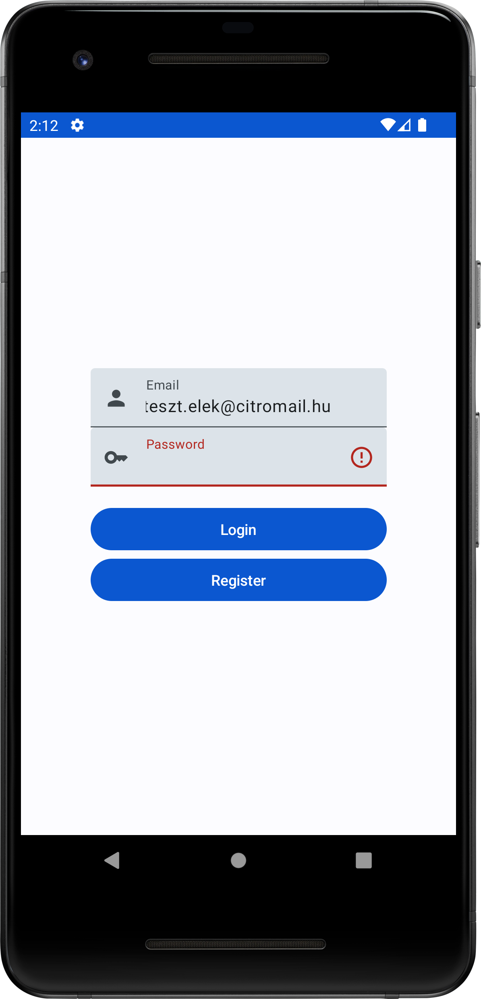
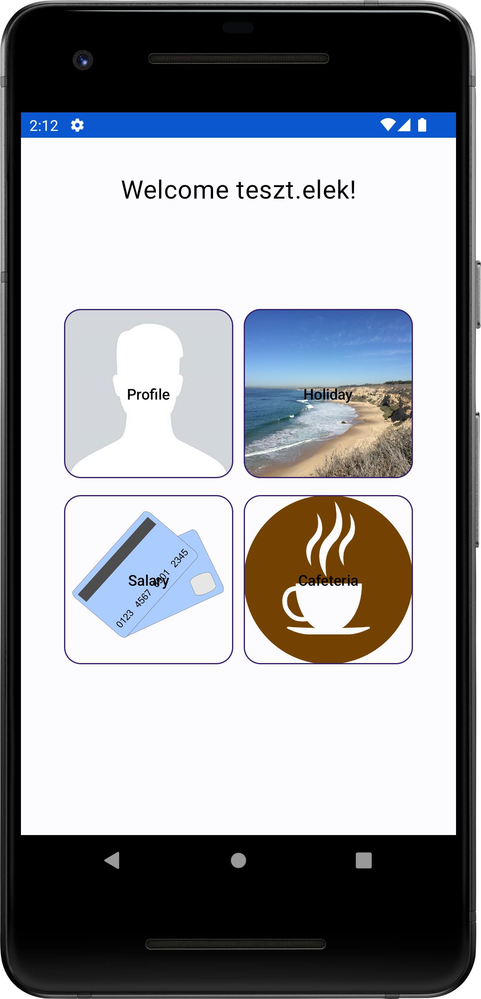
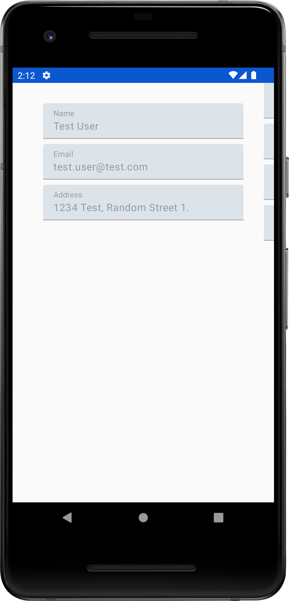
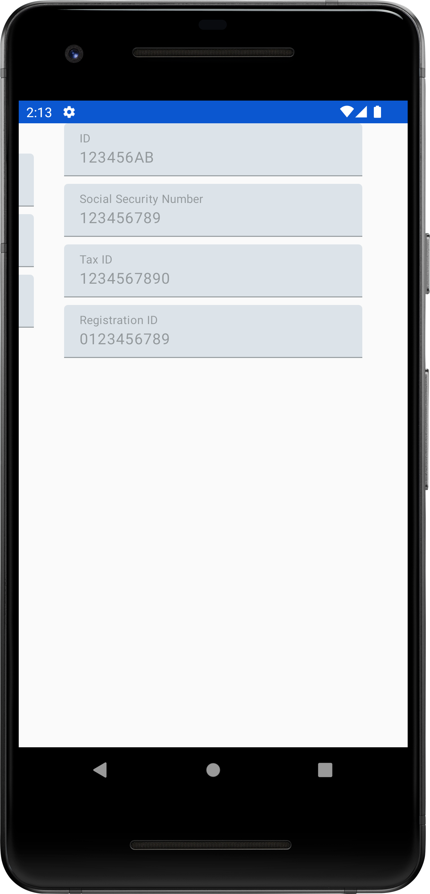

# Labor 03 - Felhasználói felület készítése Jetpack Compose-zal (WorkplaceApp)

## Bevezető

A labor célja a Jetpack Compose használatának bemutatása: felhasználói felületek készítése egyszerű, egymásba ágyazható *composable* metódusok segítségével, XML leírók használata nélkül. A labor során egy egyszerű HR alkalmazást készítünk el, amelybe a felhasználó be tud lépni, és meg tudja tekinteni személyes adatait. A többi funkció egyelőre nincs megvalósítva.


<p align="center">


</p>
<p align="center">


</p>

## Előkészületek

A feladatok megoldása során ne felejtsd el követni a [feladat beadás folyamatát](../../tudnivalok/github/GitHub.md).

### Git repository létrehozása és letöltése

1. Moodle-ben keresd meg a laborhoz tartozó meghívó URL-jét és annak segítségével hozd létre a saját repository-dat.

2. Várd meg, míg elkészül a repository, majd checkout-old ki.

    !!! tip ""
        Egyetemi laborokban, ha a checkout során nem kér a rendszer felhasználónevet és jelszót, és nem sikerül a checkout, akkor valószínűleg a gépen korábban megjegyzett felhasználónévvel próbálkozott a rendszer. Először töröld ki a mentett belépési adatokat (lásd [itt](../../tudnivalok/github/GitHub-credentials.md)), és próbáld újra.

3. Hozz létre egy új ágat `megoldas` néven, és ezen az ágon dolgozz.

4. A `neptun.txt` fájlba írd bele a Neptun kódodat. A fájlban semmi más ne szerepeljen, csak egyetlen sorban a Neptun kód 6 karaktere.

## Közös feladatok (0,5 pont)

### Projekt megnyitása

Ezen a laboron nem új projektet fogunk létrehozni, hanem egy már létezőből indulunk ki, ez megtalálható a kicheckoutolt repositoryban `WorkplaceApp` néven. Nyissuk meg a projektet és a laborvezetővel nézzük át a felépítését.

???info "A kezőprojekt"
	A megnyitott projekt egyelőre nem tartalmaz sem Activity-t, sem más komponenst. Csak az arőforrások (stringek és képek), valamint a dummy adatként használt Person adat osztály és a hozzá tartozó repository található benne.

	Ezen kínül be vannak állítva és aktualizálva vannak a szükséges függőségek.

### Elemi UI építőelemek elkészítése

A fenti képeken látható, hogy a bejelentkeztetési és a regisztrációs formok egyedi kinézetű szövegmezőkből és címkékből épülnek fel. A *Compose* alapelve - ahogyan a neve is tükrözi, - hogy a felhasználói felületünket hierarchikusan építhetjük fel, és a kisebb építőelemekből összetettebbeket állíthatunk össze. Ez egyrészt segíti a fejlesztői gondolkodást, hiszen könnyen tudunk a felhasználói felület adott részére koncentrálni, ezeket függetlenül elkészíteni, és így idővel a részekből már könnyen összerakható lesz a teljes kívánt UI is. Másrészt, ez a megközelítés segíti az újrafelhasználást, hiszen a kisebb felületi elemek könnyen újrafelhasználhatók az alkalmazás különböző részeiben is.

Először hozzunk létre egy `hu.bme.aut.kliensalkalmazasok.workplaceapp.ui.common` package-et. Ebbe fognak kerülni az alapvető fontosságú UI építőelemeink.

Ezen belül készítsünk egy `ImageButton` nevű *composable* függvényt a következő tartalommal:

```kotlin
@Composable
fun ImageButton(
    modifier: Modifier,
    label: String,
    painter: Painter,
    size: Dp,
    contentDescription: String? = null,
    onClick: () -> Unit
) {
    OutlinedButton(
        onClick = onClick,
        shape = RoundedCornerShape(16.dp),
        contentPadding = PaddingValues(
            start = 0.dp,
            top = 0.dp,
            end = 0.dp,
            bottom = 0.dp
        ),
        border = BorderStroke(1.dp, darkColorScheme().onPrimary)

    ) {
        Box(modifier = modifier.padding(0.dp)) {
            Image(
                contentScale = ContentScale.Crop,
                modifier = modifier
                    .align(Alignment.Center)
                    .size(size),
                painter = painter,
                contentDescription = contentDescription
            )
            Text(
                color = Color.Black,
                modifier = modifier.align(Alignment.Center),
                text = label
            )

        }
    }
}
```

Ez egy egyszerű gomb, amin képeket és szövekeget is egyszerűen tudunk elhelyezni. A lényeges attribútumok kivezetésre kerültek paraméterekként.

Ugyan még nincs Activity-nk, amin megjelenhetne, de az általunk összerakott felületi elemet már meg tudjuk nézni egy *Preview*-ban. Ehhez adjuk hozzá az iménti fájlhoz az alábbi függvényt:

```kotlin
@Preview
fun ImageButtonPreview() {
    ImageButton(
        modifier = Modifier,
        label = "Profile",
        painter = painterResource(id = R.drawable.profile),
        onClick = {},
        size = 150.dp
    )
}
```

Ezek után készítsünk el egy igen általános szövegmezőt, amelyet majd az éppen aktuális igényeknek megfelelően gazdagon tudunk paraméterezni. Tulajdonképpen a rendszer részét képező `TextField` is sokrétű funkcionalitással rendelkezik, azonban szeretnénk egy magasabb szintű komponenst, amely számunkra könnyebben használható, és a hibajelzés megjelenítését is megoldja.

```kotlin
@ExperimentalMaterial3Api
@Composable
fun IconTextField(
    value: String,
    label: String,
    onValueChange: (String) -> Unit,
    leadingIcon: @Composable (() -> Unit)?,
    modifier: Modifier = Modifier,
    isError: Boolean = false,
    keyboardType: KeyboardType,
    imeAction: ImeAction
) {
    TextField(
        value = value.trim(),
        onValueChange = onValueChange,
        label = { Text(text = label) },
        leadingIcon = leadingIcon,
        trailingIcon = {
            if (isError) {
                Icon(
                    imageVector = Icons.Default.Error,
                    contentDescription = stringResource(R.string.error)
                )
            } else {
            }
        },
        modifier = modifier
            .width(TextFieldDefaults.MinWidth),
        singleLine = true,
        isError = isError,
        keyboardOptions = KeyboardOptions(
            keyboardType = keyboardType,
            imeAction = imeAction
        )
    )
}

@ExperimentalMaterial3Api
@Preview
@Composable
fun IconTextField_Preview() {
    IconTextField(
        value = "Csetneki Péter",
        label = "Név",
        onValueChange = {},
        leadingIcon = {},
        imeAction = ImeAction.Next,
        keyboardType = KeyboardType.Text
    )
}
```

Előnézeti függvényből többet is létrehozhatunk, hogy lássuk, hogyan néz ki a komponensünk különböző
paraméterezések esetén. Vizsgáljuk meg a hibajelzéssel ellátott megjelenést is:

```kotlin
@ExperimentalMaterial3Api
@Preview
@Composable
fun IconTextField_Error_Preview() {
    IconTextField(
        value = "Csetneki Péter",
        label = "Név",
        onValueChange = {},
        leadingIcon = {},
        imeAction = ImeAction.Next,
        keyboardType = KeyboardType.Text,
		isError = true
    )
}
```

!!! info ""
	A Kotlin nyelv megengedi, hogy a függvényparamétereket függvényhíváskor nevesítve adjuk meg, így a paraméterek sorrendje változhat, mivel a név alapján a fordító össze tudja kapcsolni a paramétereket a megadott értékekkel. Egy másik hasznos tulajdonsága a Kotlin nyelvnek, hogy a paramétereknek alapértelmezett (default) érték adható meg a függvénydefinícióban, és ezzel elkerülhetjük, hogy egy függvénynek sok overloadolt változatát kelljen elkészítenünk. A két funkciót kombinálva nagyon rugalmasan tudjuk az így definiált függvényeket hívni, és ezt a Compose technológia remekül kihasználja.

Tekintsük át a fenti kódot! A komponens a konstruktoron keresztül számos paramétert át tud venni:

- **value**: a szövegmező tartalma; ezt egyszerűen továbbadjuk a felhasznált `TextField` komponensnek, de az eleji/végi whitespace karaktereket a `trim()` segítségével levágjuk
- **label**: a szövegmező címkéje, amely magyarázza annak tartalmát; ezt egy `Text` composable-be csomagolva továbbadjuk
- **onValueChange**: eseménykezelő, amely a tartalom megváltoztatásakor hívódik; egyszerűen továbbadjuk
- **leadingIcon** és **traliningIcon**: a szövegmező elején és végén megjelenítendő ikonok, amelyeket egy újabb composable függvényként lehet megadni; a komponensünk beépített hibajelzést valósít meg, ezért ha hiba van beállítva, akkor a szöveg végén nem a beállított ikon, hanem hibajelzés jelenik meg
- **modifier**: a megjelenést módosító paraméterek; itt továbbadjuk a megadottakat, és még hozzáadjuk, hogy a téma szerinti minimális szélesség lépjen érvényre
- **isError**: ha a szövegmező tartalma nem érvényes, akkor beállíthatjuk `true` értékre, és a szövegmező végén egy hibajelző ikon fog megjelenni.
- **keyboardType**: a fekjövő billentyűzet típusa adható meg, ami nagyban segíti a bevitelt.
- **imeAction**: Az az akció, amit a mezőben az enter lenyomására le szeretnénk játszani.
- 
A `modifier` értékeként a komponens felhasználásakor nagyon sok paraméter megadható. Erre számos példát láthatunk az Android hivatalos dokumentációjában: [](https://developer.android.com/jetpack/compose/modifiers)

A fentihez hasonlóan a `ui.common` package-be készítsünk egy újabb komponenst `PasswordTextField` néven az alábbi tartalommal:

```kotlin
@ExperimentalMaterial3Api
@Composable
fun PasswordTextField(
    value: String,
    label: String,
    onValueChange: (String) -> Unit,
    leadingIcon: @Composable (() -> Unit)?,
    modifier: Modifier = Modifier,
    isVisible: Boolean = true,
    onVisibilityChanged: () -> Unit,
    isError: Boolean = false,
    keyboardType: KeyboardType,
    imeAction: ImeAction
) {
    val visibilityIcon = if (isVisible) {
        Icons.Default.VisibilityOff
    } else {
        Icons.Default.Visibility
    }
    TextField(
        value = value.trim(),
        onValueChange = onValueChange,
        label = { Text(text = label) },
        leadingIcon = leadingIcon,
        trailingIcon = if (isError) {
            {
                Icon(
                    imageVector = Icons.Default.ErrorOutline,
                    contentDescription = null
                )
            }
        } else {
            {
                IconButton(onClick = onVisibilityChanged) {
                    Icon(
                        imageVector = visibilityIcon,
                        contentDescription = stringResource(id = R.string.show_password)
                    )
                }
            }
        },
        modifier = modifier
            .width(TextFieldDefaults.MinWidth),
        singleLine = true,
        isError = isError,
        visualTransformation = if (isVisible) VisualTransformation.None else PasswordVisualTransformation(),
        keyboardOptions = KeyboardOptions(
            keyboardType = keyboardType,
            imeAction = imeAction
        )
    )
}

@ExperimentalMaterial3Api
@Preview
@Composable
fun PasswordTextView_Preview() {
    PasswordTextField(
        value = "Csetneki Péter",
        label = "Név",
        onValueChange = {},
        leadingIcon = {},
        onVisibilityChanged = {},
        imeAction = ImeAction.Next,
        keyboardType = KeyboardType.NumberPassword
    )
}
```

Ez a komponens csak két apró dologban tér el az előzőtől:

1. Mivel jelszavak begépeléséhez használjuk, a jelszó kitakarása vagy mutatása is állítható a komponensben. Ezt úgy valósítjuk meg, hogy nem lehet külön ikont megadni a szövegmező végéhez, hanem ott egy csukott vagy nyitott szem jelenik meg, és az erre történő kattintással lehet a láthatóságot állítani. A láthatóság állapota és az eseménykezelő paraméterekként vannak megadva, tehát a láthatóság állapotát és az eseménykezelőt a komponens bennfoglaló komponensében kell megvalósítani.

1. A komponensnek a láthatóság állapotától függően egy vizuális transzformáció is be van állítva, hogy a tartalmát ne közvetlen, hanem kitakartan jelenítse meg.

### Az alkalmazás képernyőinek elkészítése

#### A Login képernyő elkészítése

Most, hogy a képernyők minden fontos alkotórésze a rendelkezésünkre áll, elkezdhetjük maguknak a képernyőknek az elkészítését. Kezdjük sorban a bejelentkező képernyővel!

A képernyőknek és a hozzájuk kapcsolódó kódoknak hozzunk létre egy közös `hu.bme.aut.kliensalkalmazasok.workplaceapp.feature` package-et, majd ezen belül a bejelentkező képernyő a `login` package-be kerüljön! Készítsük el a képernyő kódját `LoginScreen` néven, majd adjuk meg a következő kódot:

```kotlin
@ExperimentalMaterial3Api
@Composable
fun LoginScreen(
    modifier: Modifier = Modifier,
    onLoginClick: (String) -> Unit,
    onRegisterClick: () -> Unit
) {
    var usernameValue by remember { mutableStateOf("") }
    var isUsernameError by remember { mutableStateOf(false) }

    var passwordValue by remember { mutableStateOf("") }
    var isPasswordVisible by remember { mutableStateOf(false) }
    var isPasswordError by remember { mutableStateOf(false) }
    Box(
        modifier = modifier
            .fillMaxSize()
            .background(MaterialTheme.colorScheme.background),
        contentAlignment = Alignment.Center
    ) {
        Column(horizontalAlignment = Alignment.CenterHorizontally) {
            IconTextField(
                value = usernameValue,
                label = stringResource(id = R.string.email),
                onValueChange = { newValue ->
                    usernameValue = newValue
                    isUsernameError = false
                },
                leadingIcon = {
                    Icon(
                        imageVector = Icons.Default.Person,
                        contentDescription = stringResource(
                            R.string.email
                        )
                    )
                },
                isError = isUsernameError,
                keyboardType = KeyboardType.Email,
                imeAction = ImeAction.Next
            )

            PasswordTextField(
                value = passwordValue,
                label = stringResource(id = R.string.password),
                onValueChange = { newValue ->
                    passwordValue = newValue
                    isPasswordError = false
                },
                leadingIcon = {
                    Icon(
                        imageVector = Icons.Default.Key,
                        contentDescription = stringResource(
                            R.string.password
                        )
                    )
                },
                isError = isPasswordError,
                isVisible = isPasswordVisible,
                onVisibilityChanged = { isPasswordVisible = !isPasswordVisible },
                keyboardType = KeyboardType.NumberPassword,
                imeAction = ImeAction.Done
            )
            Spacer(
                modifier = Modifier.height(16.dp)
            )
            Button(
                onClick = {
                    if (usernameValue.isEmpty())
                        isUsernameError = true
                    else if (passwordValue.isEmpty())
                        isPasswordError = true
                    else
                        onLoginClick(usernameValue.substringBefore('@'))
                },
                modifier = Modifier.width(TextFieldDefaults.MinWidth)
            ) {
                Text(text = stringResource(R.string.login))
            }

            Button(
                onClick = onRegisterClick,
                modifier = Modifier.width(TextFieldDefaults.MinWidth)
            ) {
                Text(text = stringResource(R.string.register))
            }

        }
    }

}
```

Egy fontos eddig nem látott elem, hogy a felhasználói felület elemeinek állapottárolására (pl. szövegmező tartalma, látható-e valami, jelölőnégyzet be van pipálva stb.) `MutableState` típusú tárolókat kell létrehoznunk. Ezt a `mutableStateOf()` factory-metódussal tudjuk megtenni, és ennek meg kell adni a kezdőállapotot. Mindezt az inicializációt lazy betöltéssel akarjuk végezni, hogy a felület felépítése közben történjen. Ehhez használjuk a `remember` kulcsszót.

Feltűnnek még különböző konténerelemek, amelyek segítségével a felületi elemek elrendezését tudjuk meghatározni. Ilyen a korábban már érintett `Box`. Ez alkalmas a teljes képernyőtartalmak befoglalására. Ezzel állítjuk be a hátteret a Material témánk szerintire, illetve hogy a képernyő teljes tartalmát töltse ki a befoglalt tartalom. Ezen belül látunk egy `Column` elemet, amellyel egy oszlopba vannak rendezve egymás alá a szövegmezők. A vízszintes igazítás az oszlopon középre van állítva. A középső oszlopon a normál és a jelszavas saját szövegmezőn, valamint alattuk egy bejelentkeztető gomb van megadva, köztük térelválasztó `Spacer` komponenssel.

Összességében azt figyelhetjük meg, hogy a logika egy része már itt fel van oldva, hiszen az állapot egyes részeit itt kezeljük, és ehhez kapcsolódóan eseménykezelőket is adunk tovább az építőelemként szolgáló kisebb komponenseknek. Viszont vannak olyan dolgok, mint pl. a login és a regisztráció gomb eseménykezelője, ezek még mindig felülről jönnek. Alapvetően a Compose-ban úgy kell gondolkodnunk, hogy az állapotot, amire több felületi elemnek szüksége van, azt feljebb kell emelnünk egy közös ősbe. Ezt az Android terminológia úgy hívja, hogy [`state hoisting`](https://developer.android.com/jetpack/compose/state-hoisting) Pl. a begépelt felhasználónevet a szövegmező is használja, illetve a befoglaló bejelentkező képernyőnél is szükség van rá. Maga a bejelentkező képernyő a legfelső komponens a hierarchiában, amelyik használja, ezért itt tudjuk ezt az állapotot kezelni. A navigáció viszont, hogy mi történjen a gombokra kattintáskor, az már más komponenseket is érint, ezért azt fentebbi szinten kell kezelni, ezért ez még mindig paraméterként érkezik a képernyőt megtestesítő komponenshez.

!!! note ""
	Aki fejlesztett már a React webes keretrendszerben, annak ismerős lehet ez a koncepció, mert nagyon hasonló a React komponensek működéséhez.

Nézzük is meg az elkészült komponenst:

```kotlin
@ExperimentalMaterial3Api
@Preview
@Composable
fun LoginScreenPreview() {
    LoginScreen(
        onLoginClick = {},
        onRegisterClick = {}
    )
}
```

#### A menü képernyő elkészítése

A második képernyő, amit el tudunk készíteni az alap építőelemeinkből, az a menü képernyő. Ezen négy gomb lesz a négy különböző funkcióhoz, azonban jelenleg csak egyet valósítunk meg. Helyezzünk el négy *ImageButton*-t a képernyő közepére 2x2-es elrendezésben. A képernyőt a `hu.bme.aut.kliensalkalmazasok.workplaceapp.feature.menu` package-be készísük el:

```kotlin
@ExperimentalMaterial3Api
@Composable
fun MenuScreen(
    argument: String,
    modifier: Modifier = Modifier,
    onProfileButtonClick: () -> Unit,
    onHolidayButtonClick: () -> Unit,
    onSalaryButtonClick: () -> Unit,
    onCafeteriaButtonClick: () -> Unit,
) {
    Box(
        modifier = modifier
            .fillMaxSize()
            .background(MaterialTheme.colorScheme.background)
            .padding(16.dp),
        contentAlignment = Alignment.Center
    ) {
        Text(
            text = stringResource(R.string.welcome,argument),
            modifier = Modifier
                .align(Alignment.TopCenter)
                .padding(16.dp),
            fontSize = 24.sp
        )
        Row(verticalAlignment = Alignment.CenterVertically) {
            Column(horizontalAlignment = Alignment.CenterHorizontally) {
                ImageButton(
                    onClick = onProfileButtonClick,
                    modifier = modifier,
                    label = stringResource(R.string.profile),
                    painter = painterResource(id = R.drawable.profile),
                    size = 160.dp,
                    contentDescription = stringResource(R.string.profile)
                )
                Spacer(
                    modifier = Modifier.height(16.dp)
                )
                ImageButton(
                    onClick = onSalaryButtonClick,
                    modifier = modifier,
                    label = stringResource(R.string.salary),
                    painter = painterResource(id = R.drawable.payment),
                    size = 160.dp,
                    contentDescription = stringResource(R.string.salary)
                )

            }
            Spacer(
                modifier = Modifier.width(10.dp)
            )
            Column(horizontalAlignment = Alignment.CenterHorizontally) {
                ImageButton(
                    onClick = onHolidayButtonClick,
                    modifier = modifier,
                    label = stringResource(R.string.holiday),
                    painter = painterResource(id = R.drawable.holiday),
                    size = 160.dp,
                    contentDescription = stringResource(R.string.holiday)
                )
                Spacer(
                    modifier = Modifier.height(16.dp)
                )
                ImageButton(
                    onClick = onCafeteriaButtonClick,
                    modifier = modifier,
                    label = stringResource(R.string.cafeteria),
                    painter = painterResource(id = R.drawable.cafeteria),
                    size = 160.dp,
                    contentDescription = stringResource(R.string.cafeteria)
                )
            }
        }
    }

}

@ExperimentalMaterial3Api
@Preview
@Composable
fun MenuScreenPreview() {
    MenuScreen(
        argument = "Teszt Elek",
        onProfileButtonClick = {},
        onHolidayButtonClick = {},
        onCafeteriaButtonClick = {},
        onSalaryButtonClick = {}
    )
}
```

Látható, hogy a két eddigi képernyő között előkészítettünk egy adat átadást. Az e-mail címből képzett nevet szeretnénk megjeleníteni a gombok fölött. Tehát itt az ideje, hogy elkészítsük a képernyők közötti navigációt.

### A navigáció elkészítése

Vegyünk fel egy `hu.bme.aut.kliensalkalmazasok.workplaceapp.navigation` package-et, és ebbe kerüljön az alábbi `Screen` osztály. Most nem enumot, hanem `sealed classot` alkalmazunk, mert a főképernyő kezelése kicsit speciális, argumentumot is kaphat:

```kotlin
sealed class Screen(val route: String) {
    object LoginScreen : Screen(route = "login")

    object MenuScreen : Screen(route = "menu/{${Args.username}}") {
        fun passUsername(username: String) = "menu/$username"

        object Args {
            const val username = "username"
        }
    }
}
```

Figyeljük meg, hogy az útvonal az egyes képernyőkhöz paraméterként tartalmazhatja az argumentumokat is.

!!! info "sealed class"
	A Kotlin sealed class-ai olyan osztályok, amelyekből korlátozott az öröklés, és fordítási időben minden leszármazott osztálya ismert. Ezeket az osztályokat az enumokhoz hasonló módon tudjuk alkalmazni. Jelen esetben a `MenuScreen` valójában nem a `Screen` közvetlen leszármazottja, hanem anonim leszármazott osztálya, mivel a felhasználónév paraméterként történő kezelését is tartalmazza.


Ezek után a navigációs gráf a következőként alakul (szintén a *navigation* package-be:

```kotlin
@ExperimentalFoundationApi
@ExperimentalMaterial3Api
@Composable
fun NavGraph(
    navController: NavHostController = rememberNavController(),
    modifier: Modifier = Modifier
) {
    NavHost(
        navController = navController,
        startDestination = Screen.LoginScreen.route,
        modifier = modifier
    ) {
        composable(Screen.LoginScreen.route) {
            LoginScreen(
                modifier = modifier,
                onLoginClick = {
                    navController.navigate(Screen.MenuScreen.passUsername(it))
                },
                onRegisterClick = {
                    navController.navigate(Screen.MenuScreen.route)
                }
            )
        }
        composable(Screen.MenuScreen.route) {
            MenuScreen(
                argument = navController.currentBackStackEntry?.arguments
                    ?.getString(Screen.MenuScreen.Args.username) ?: "",
                onProfileButtonClick = {},
                onHolidayButtonClick = {},
                onSalaryButtonClick = {},
                onCafeteriaButtonClick = {})
        }
    }
}
```

Ezek után a navigációval összefűzött képernyőket már föl tudjuk rakni a felületre. Ehhez hozzunk létre egy új *Activity*-t, és a template-ek közül válasszuk az `Empty Compose Activity (Material3)`-mat, (ha ez nincs, jó a sima Empty Compose Activity is) illetve ne felejtsük el bepipálni a **Launcher Activity** checkboxot. Ezzel megkapjuk a kotlin fájlt, azonban nem kapunk layout xml-t, hiszen a felületet most *@Composable* objektumokból fogjuk összerakni. Illesszük is be tehát a `NavGraph`-ot az Activity-be:

```kotlin
@ExperimentalFoundationApi
@ExperimentalMaterial3Api
class MainActivity : ComponentActivity() {
    override fun onCreate(savedInstanceState: Bundle?) {
        super.onCreate(savedInstanceState)
        setContent {
            WorkplaceAppTheme {
                NavGraph()
            }
        }
    }
}
```

Próbáljuk ki az alkalmazást! A bejelentkező képernyőről a megfelelő adatok megadása után át tudunk navigálni a menü képernyőre, és még a felhasználónév is átmegy.

### A profil képernyő elkészítése

A profil képernyőn szeretnénk megjeleníteni a főbb és a részletesebb adatokat külön-külön. Ehhez ezt a két felületet egy *HorizontalPager*-be fogjuk ágyazni, amiben kényelmesen lapozhatóak lesznek. Készítsük el előbb a két felületet a `hu.bme.aut.kliensalkalmazasok.workplaceapp.feature.profile` package-be:

MainProfilePage:

```kotlin
@ExperimentalMaterial3Api
@Composable
fun MainProfilePage(
    viewModel: ProfileViewModel
) {
    val data = viewModel.getPersonData()
    Column(
        modifier = Modifier.padding(
            horizontal = 16.dp
        )
    ) {
        TextField(
            modifier = Modifier.fillMaxWidth(),
            value = data.name,
            label = {
                Text(text = stringResource(R.string.name))
            },
            enabled = false,
            onValueChange = {}
        )
        Spacer(modifier = Modifier.height(8.dp))
        TextField(
            modifier = Modifier.fillMaxWidth(),
            value = data.email,
            label = {
                Text(text = stringResource(R.string.email))
            },
            enabled = false,
            onValueChange = {}
        )
        Spacer(modifier = Modifier.height(8.dp))
        TextField(
            modifier = Modifier.fillMaxWidth(),
            value = data.address,
            label = {
                Text(text = stringResource(R.string.address))
            },
            enabled = false,
            onValueChange = {}
        )

    }
}
```

DetailsProfilePage:

```kotlin
@ExperimentalMaterial3Api
@Composable
fun DetailsProfilePage(
    viewModel: ProfileViewModel

) {
    val data = viewModel.getPersonData()
    Column(
        modifier = Modifier.padding(
            horizontal = 16.dp
        )
    ) {
        TextField(
            modifier = Modifier.fillMaxWidth(),
            value = data.id,
            label = {
                Text(text = stringResource(R.string.id))
            },
            enabled = false,
            onValueChange = {}
        )
        Spacer(modifier = Modifier.height(8.dp))
        TextField(
            modifier = Modifier.fillMaxWidth(),
            value = data.socialSecurityNumber,
            label = {
                Text(text = stringResource(R.string.social_security_number))
            },
            enabled = false,
            onValueChange = {}
        )
        Spacer(modifier = Modifier.height(8.dp))
        TextField(
            modifier = Modifier.fillMaxWidth(),
            value = data.taxId,
            label = {
                Text(text = stringResource(R.string.tax_id))
            },
            enabled = false,
            onValueChange = {}
        )
        Spacer(modifier = Modifier.height(8.dp))
        TextField(
            modifier = Modifier.fillMaxWidth(),
            value = data.registrationId,
            label = {
                Text(text = stringResource(R.string.registration_id))
            },
            enabled = false,
            onValueChange = {}
        )

    }
}
```

Látható, hogy az adatokat a felületünk a *ViewModel*-től kapja. Komolyabb projektben ezek az adatok a *ViewModel* állapotához vannak kötve, így minden változás azonnal megjelenik a felületen. Itt most idő hiányában erre a megoldásra nem térünk ki, csak érzékeltetjük, hogy az architektúrában szerepel a *ViewModel* és a *Repository* is.

Készítsük el a `ProfileViewModel`-t is ugyanebbe a package-be:

```kotlin
class ProfileViewModel(private val repository: PersonRepository) {

    fun getPersonData() =
        repository.getPersonData()

}
```

Miután megvan a két oldalunk, ami az adatokat fogja megjeleníteni, ideje feltenni őket a felületre egy *HorizontalPager* segítségével. Ezeknek az összefogása hasonló módon fog működni, mint a *Screen*-eké, tehát készítsünk egy *sealed class*-t a tárolásukra:

```kotlin
sealed class ProfilePage {
    object Main : ProfilePage()
    object Details : ProfilePage()
}

val pages = listOf(
    ProfilePage.Main, ProfilePage.Details
)

```

Ezek után már elkészíthetjük  a `ProfileScreen`-t:

```kotlin
@ExperimentalMaterial3Api
@ExperimentalFoundationApi
@Composable
fun ProfileScreen(
    viewModel: ProfileViewModel
) {
    HorizontalPager(
        pageCount = pages.size,
        modifier = Modifier
            .fillMaxSize(),
        contentPadding = PaddingValues(horizontal = 32.dp)
    ) { pageIndex ->
        when (pages[pageIndex]) {
            ProfilePage.Main -> MainProfilePage(viewModel)
            ProfilePage.Details -> DetailsProfilePage(viewModel)
        }
    }
}
```

Nincs is más hátra, minthogy bekössük a *ProfileScreen*-t is a navigációba. Egészítsük ki a `Screen` osztályunkat:

```kotlin
sealed class Screen(val route: String) {
    object LoginScreen : Screen(route = "login")

    object MenuScreen : Screen(route = "menu/{${Args.username}}") {
        fun passUsername(username: String) = "menu/$username"

        object Args {
            const val username = "username"
        }
    }

    object ProfileScreen : Screen(route = "profile")
}
```

Majd pedig a `NavGraph`-ot is:

```kotlin
@ExperimentalFoundationApi
@ExperimentalMaterial3Api
@Composable
fun NavGraph(
    navController: NavHostController = rememberNavController(),
    modifier: Modifier = Modifier
) {
    NavHost(
        navController = navController,
        startDestination = Screen.LoginScreen.route,
        modifier = modifier
    ) {
        composable(Screen.LoginScreen.route) {
            LoginScreen(
                modifier = modifier,
                onLoginClick = {
                    navController.navigate(Screen.MenuScreen.passUsername(it))
                },
                onRegisterClick = {
                    navController.navigate(Screen.MenuScreen.route)
                }
            )
        }
        composable(Screen.MenuScreen.route) {
            MenuScreen(
                argument = navController.currentBackStackEntry?.arguments
                    ?.getString(Screen.MenuScreen.Args.username) ?: "",
                onProfileButtonClick = {
                    navController.navigate(Screen.ProfileScreen.route)
                },
                onHolidayButtonClick = {},
                onSalaryButtonClick = {},
                onCafeteriaButtonClick = {})
        }
        composable(Screen.ProfileScreen.route) {
            ProfileScreen(
                viewModel = ProfileViewModel(PersonRepository())
            )
        }
    }
}
```

Próbáljuk ki az alkalmazást!

!!!example "BEADANDÓ"
	Készíts egy **képernyőképet**, amelyen látszik a **bejelentkező képernyő** (emulátoron, készüléket tükrözve vagy képernyőfelvétellel), egy **ahhoz tartozó kódrészlet**, valamint a **neptun kódod az e-mail mezőben**. A képet a megoldásban a repository-ba f1.png néven töltsd föl. 
 
!!!example "BEADANDÓ"
	Készíts egy **képernyőképet**, amelyen látszik a **menü képernyő** (emulátoron, készüléket tükrözve vagy képernyőfelvétellel), egy **ahhoz tartozó kódrészlet**, valamint a **neptun kódod az átadott felhasználónévként**. A képet a megoldásban a repository-ba f2.png néven töltsd föl. 
 
!!!example "BEADANDÓ"
	Készíts egy **képernyőképet**, amelyen látszik a **profil képernyő** (emulátoron, készüléket tükrözve vagy képernyőfelvétellel), egy **ahhoz tartozó kódrészlet**, valamint a **neptun kódod valahol a kódban kommentként**. A képet a megoldásban a repository-ba f3.png néven töltsd föl. 

## Önálló feladat (0,5 pont)

Valósítsuk meg a regosztrációs képernyőt! A LoginScreenen a **Registration** gomb megnyomására navigáljunk át egy őj felületre, ahol a felhasználó megadhatja az e-mail címét, a jelszavát, és a jelszavának megerősítését. Ott gombnyomás hatására szintén tovább mehetünk a *MenuScreenre*.

!!!example "BEADANDÓ"
	Készíts egy **képernyőképet**, amelyen látszik a **regisztrációs képernyő** (emulátoron, készüléket tükrözve vagy képernyőfelvétellel), egy **ahhoz tartozó kódrészlet**, valamint a **neptun kódod az e-mail mezőben**. A képet a megoldásban a repository-ba f4.png néven töltsd föl. 
