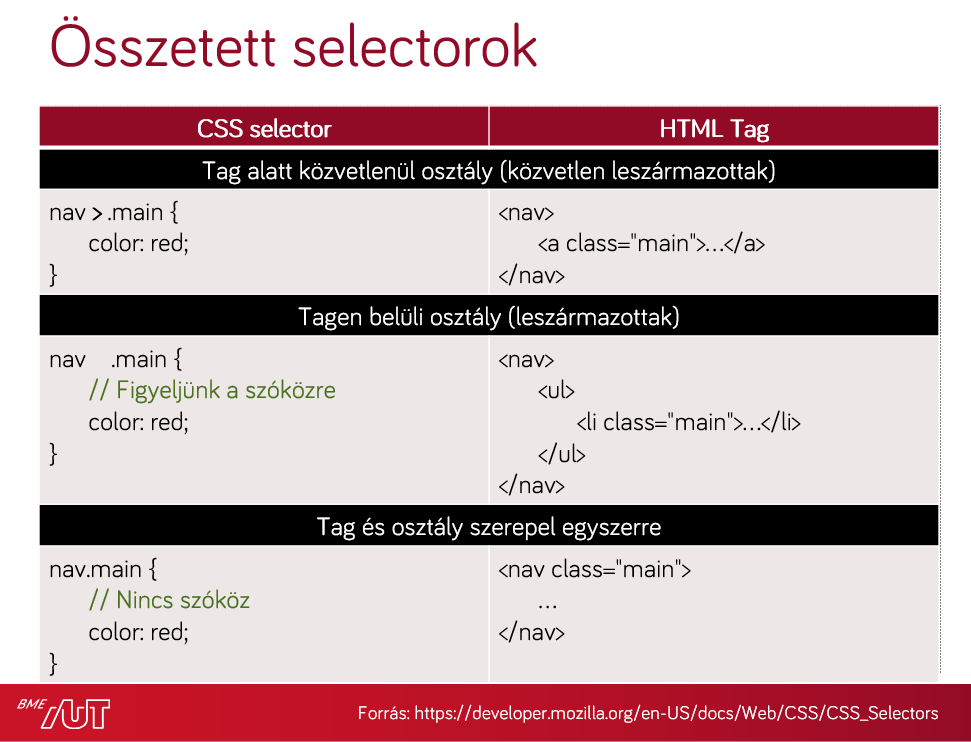
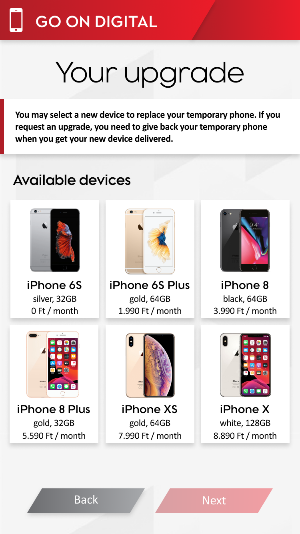
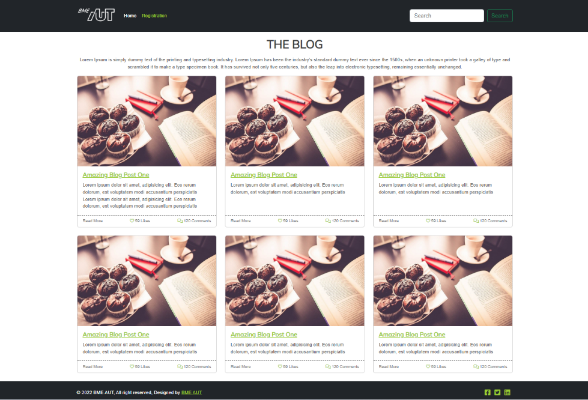
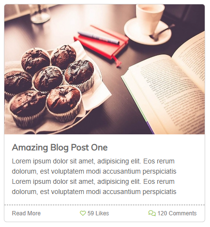

# Labor 02 – CSS és Bootstrap

## Bevezetés

A labor során laborvezetői segítséggel, majd önállóan készítesz el feladatokat a webes technológiák gyakorlati megismerése érdekében.

A labor célja, CSS alapjainak elsajátítása és a CSS debuggolására használt eszközök gyakorlása., illetve a Boostrap CSS keretrendszer megismerése.

## Előkészület

A feladatok megoldása során ne felejtsd el követni a feladat beadás folyamatát [Github](../../tudnivalok/github/GitHub.md).

### Git repository létrehozása és letöltése

1. Moodle-ben keresd meg a laborhoz tartozó meghívó URL-jét és annak segítségével hozd létre a saját repository-dat.
2. Várd meg, míg elkészül a repository, majd checkout-old ki.
    * Egyetemi laborokban, ha a checkout során nem kér a rendszer felhasználónevet és jelszót, és nem sikerül a checkout, akkor valószínűleg a gépen korábban megjegyzett felhasználónévvel próbálkozott a rendszer. Először töröld ki a mentett belépési adatokat (lásd [itt](../../tudnivalok/github/GitHub-credentials.md)), és próbáld újra.
3. Hozz létre egy új ágat `megoldas` néven, és ezen az ágon dolgozz.
4. A neptun.txt fájlba írd bele a Neptun kódodat. A fájlban semmi más ne szerepeljen, csak egyetlen sorban a Neptun kód 6 karaktere.

## 1. feladat – Stíluslapok

Webes HTML-tartalmak stílusozására CSS-t használunk. A CSS alapjai:

* szabály (mintaillesztés) alapú, deklaratív programozási nyelv
* DOM-elemekhez megjelenést rendel.

A böngészőben megjelenített HTML-tartalmak alapértelmezés szerint formázatlanok, viszont bizonyos szabályokat a böngésző alapértelmezetten illeszt az egyes elemekre, az elem típusa szerint.

Vizsgáljuk meg, milyen szabályokat illeszt a böngésző a `html`, `body`, `div`, `span`, `H1`, `H2` és egyéb elemekre!

Nyissuk meg a Visual Studio Code-ban a leklónozott repositorynkat, és a gyökérkönyvtárban található `index.html` fájlba dolgozzunk.

Ahhoz, hogy böngészőben is lássuk a weboldalt, az `index.html`-re kattintsunk jobb gombbal és válasszuk az *Open with Live Server* opciót, ami elindítja a fejlesztői webszervert, és az alapértelmezett böngészőben megnyitja az oldalt.

Vegyük észre, hogy az oldalhoz nem vettünk fel saját stíluslapot, valamilyen formázás mégis érvényesült. Egyes elemek félkövérek, kisebbek-nagyobbak, elrendezésük sorfolytonos vagy tördelt.

Vizsgáljuk meg, milyen szabályok érvényesülnek az egyes elemekre!

Nyissuk meg a böngésző beépített fejlesztői eszközeit (`F12`)! Lehetőségünk van az elemeket kijelölni (*jobb klikk* > *Inspect*), megnézni elhelyezkedésüket a felületen és a DOM szöveges reprezentációjában egyaránt.

<figure markdown>
  
  <figcaption>A HTML alapértelmezett megjelenése a böngészőben</figcaption>
</figure>

!!! tip "Fontos"
    A böngészők és/vagy bizonyos szerverek túl agresszívan gyorsítótárazhatnak bizonyos fájlokat, pl. a HTML- és CSS-fájljainkat, így a változásokat nem biztos, hogy látni fogjuk egy egyszerű újratöltés után. Ha ez előfordul, a cache letiltásához a *Developer Tools* eszköztáron ki kell kapcsolnunk a cache-t.

Jellemzően a menüsor bal oldalán találhatóak a kijelöléshez szükséges műveletek ikonjai, jobb oldalon pedig a részletes nézet.

A kiválasztott elemhez a jobb oldali *Computed* fülön a ténylegesen érvényre lépett szabályokat láthatjuk. Mivel nincs explicit CSS-fájlunk linkelve, és CSS-szabályokat sem írtunk a HTML-ben, ezért kizárólag a böngésző beépített *user agent stylesheet*je érvényesül. Itt láthatjuk a *CSS Box model*t is, ami az elem **tartalma**, a hozzá tartozó *padding*, *border* és *margin* értékek egymásra halmozását jelenti a *2 dimenziós téglalap* oldalaihoz mérten.

A CSS feloldásában a `cascading`, avagy az "egymásba ágyazható" rész szerint több stíluslap létezik a származás szempontjából; mi most a *böngészőbe beépített*, ún. *user agent stylesheet*et látjuk.

A *Computed* fülön lenyitva az egyes szabályokat látható, hogy honnan származik az a stílus, sőt az is, hogy egy érték beállítása pontosan melyik szabályból származik, azaz melyik szabály melyiket írta felül.

<figure markdown>
  
  <figcaption>Chrome computed fül</figcaption>
</figure>

A fenti szűrőt használva van lehetőségünk az alkalmazott CSS-szabályok között keresni is.

A `h1`, `h2` és `b` elemek alapértelmezetten félkövérek, ezt a `font-weight: 700;` tulajdonság írja le nekünk.

A `html`, `body`, `div`, `h1`, `h2` elemek `display` tulajdonsága `block`, a `span`, `a` és `b` elemek pedig `inline` típusúak. A `display: block;` tulajdonságú elemek egy blokkot (sort) foglalnak el az őket befoglaló elemben, az inline típusúak sorfolytonosak (egymás mellett is elhelyezkedhetnek).

Láthatjuk, hogy a `body` elemen található `8px` margó (`margin`) mind a 4 irányban:

<figure markdown>
  
  <figcaption>Margók vizsgálata</figcaption>
</figure>

## 2. feladat – Módosítás futásidőben

??? note "Emlékeztető a CSS-szabályok definiálásához"
    Saját CSS-szabályokat többféle módon tudunk az oldalunkhoz rendelni:

    * CSS-fájlokra történő hivatkozással,
    * CSS-szabályok felvételével a HTML tartalmán belüli `<style>` tagben,
    * inline, a HTML-elemek `style` attribútumának beállításával.

    Ütköző CSS szabályok közül az érvényesül, amelynek nagyobb a specificitása (megegyező specificitás esetében az utoljára definiált).

    Emlékeztetőként a szabályok specificitási sorrendje:

    * `inline` stílus (`<div style="..."> `),
    * ID-k száma (`#azonosito`),
    * osztályok, attribútumok és pszeudo-osztályok száma (`.osztaly`, `[attributum]`, `[attributum="ertek"]`, `:hover`),
    * pszeudo-elemek (`:before`, `:after`).

    A sorrendhez hozzátartozik az `!important` kulcsszó, ami önmagában a fentiektől specifikusabb, viszont az `!important` szabályokra a fenti specificitási sorrend szintén érvényesül.

    A szabályok definiálása:

    
    

* Ha új szabályt akarunk felvenni, akkor a kapcsos zárójelek közé kattintva tehetjük ezt meg, ezután az automatikus kiegészítés funkcióval láthatjuk az összes, a böngésző által ismert CSS tulajdonságot (Firefox Developerben ezt az üres kurzoron a **fel-le nyilak**-kal tehetjük meg, Edge-ben és Chrome-ban a **Ctrl+szóköz**-zel).
* Vegyük fel a `<h1>` elemhez az alábbi CSS-tulajdonságot:

    ```css
    color: red;
    ```

* Közben vegyük észre a DOM-reprezentációban, hogy bár a jobb oldali panelen szerkesztünk, pontosan ugyanaz történik, mintha a HTML elem `style` attribútumát adtuk volna meg.
* Ha beállítjuk a `font-weight: bold;` tulajdonságot a `<body>`-n, akkor láthatjuk, hogy az összes gyermekére is érvényesül a szabály. Bizonyos szabályok öröklődnek (a `font-weight` ilyen), mások (például a `padding` és `margin`) viszont nem.

Lehetőség van esetenként több szabály aggregált megadására is ún. shorthandek használatával. Gyakori például a 4-irányú értékadás, ami a **top-right-bottom-left** iránysorrend szerint ad meg több értéket.

* A `padding: 50px 30px 10px 5px;` szabály mind a négy értéket beállítja a fenti sorrendben.
* A `padding: 10% 1mm;` szabály a fenti-lenti értékeket 10%-ra, a jobb-balt 1 mm-re.
* A `padding: 0;` mind a 4 oldalon 0-ra állítja a paddingot (nem szükséges mértékegység 0 esetén).

!!! tip "Fontos"
    Ha százalékban adjuk meg a paddingot vagy a margót akkor az a **szülő elem szélességének** a százalékát jelenti. Még akkor is ha `margin-top`, vagy `margin-bottom`-ot állítunk be! 
    
    Forrás: https://www.w3.org/TR/CSS21/box.html#margin-properties 

!!! warning "Inline stílusok"
    Inline stílusokat csak kivételes esetekben használjunk, jellemzően programozottan (JavaScriptből) elfogadott lehet egy elem megjelenését ilyen módon állítani, de a nyers HTML-ben nem!

* Vegyünk fel egy új szabályt, amiben megadjuk, hogy a táblázat cellák `td` paddingja `1rem` legyen minden irányba. Ehhez a *Syles* fülön a jobb oldalon található + jelre kell kattintani és akkor létrejön egy új szabály ahol megadhatjuk a selectort és a beállításokat is.
    ``` css
    td {
        padding: 1rem;
    }
    ```
    <figure markdown>
    
    <figcaption>Új szabály létrehozása</figcaption>
    </figure>

* Az új szabály mellett azt látjuk, hogy az *inspector-stylesheet*-ben jött létre. Tehát a háttérben a böngésző létrehoz egy CSS fájlt és abban tárolja a létrehozott stílusokat, amit meg is tudunk nézni ha rákattintunk az *inspector-stylesheet*-re.
* Az így létrehzott szabályok csak az oldal újratöltéséig maradnak meg.
* Figyeljük meg a fenti képernyőn, hogy az új szabállyal nem egy cellára állítottuk be a padding-ot hanem minden cellára.
* Az új szabály alatt egyébként látható a user agent styleheet-ből érvényre jutott szabályok is, illetve ez alatt az örökölt szabályok is.

### Beadandó – 0.1 pont

!!! example "2. feladat beadandó (0.1 pont)"
    * Hozz létre egy új szabályt a `table`-re ahol beállítod az alábbi szabályt
    ``` css
    table {
        border: solid 1px red;
        border-collapse: collapse;
    }
    ```
    * Hozz létre egy új szabályt, amiben a `th` tagekre beállítod, hogy a háttérszín fekete legyen, a betű színe fehér, a padding pedig 1rem.
    * Az első sor utolsó cellájának tartalmát (de csak azt az egyet) igazítsd középre. Tipp: `text-align: center`
    * Készíts egy képernyőképek amin látható az összes fenti módosítás és a készített képernyőképet másold **`f2.png`** néven a repository gyökerébe!

## 3. feladat – CSS-alapok

A HTML-oldalhoz kétféle tudunk stíluslapot rendelni: külső CSS-fájlból, vagy az oldal `head` tagjében definiált `<style>` tagben.

### `float` használata

Az `index.html` forráskódját egészítsük ki, a `<head>` elembe helyezzük el az alábbi kódot:

```html
<style>
    ul {
        list-style: none;
        padding: 0;
    }

    ul > li {
        float: left;
        padding: 10px;
        min-width: 200px;
        border: 1px solid grey;
    }
</style>
```

Ha frissítjük az oldalt (nem szükséges újraindítani a szervert, csak menteni a fájlt), akkor az elrendezés módosul.

* A listaelemet jelző pötty eltűnt
* A listánkban a listaelemek egymás mellé kerültek
* A felsorolás után következő elem felcsúszott a listával egy sorba

<figure markdown>
  
  <figcaption>Float</figcaption>
</figure>

!!! warning "float: left"
    A `float: left;` tulajdonság állításával nem ugyanazt érjük el, mintha a listaelemet `display: inline-block;`-ra állítanánk, mert az `inline-block` megtartja az egymást követő elemek közötti whitespace-eket, a `float: left;` viszont nem.

A float segítségével komplexebb elrendezéseket is el tudunk érni, viszont a float-olást meg kell tudnunk szüntetni. Ehhez a `clear: both;` értéket állíthatjuk be egy elemen. A float-olás azon kevés CSS tulajdonság egyike, ami az elemet sorban követő további testvérekre is közvetlenül hat.

Az alábbi szabályt használhatjuk a float-olás megszüntetéséhez, ekkor az `<ol>` elemre a `clearfix` osztályt alkalmazva az már új sorba is kerül.

```css
.clearfix {
    clear: both;
}
```

```html
<ol class="clearfix">
  <!-- ... -->
</ol>
```

<figure markdown>
  
  <figcaption>Float megtörése a clear segítségével</figcaption>
</figure>

Vegyük észre, hogy az oldal alján is volt egy felsorolás, és sajnos olyan általános szabályt sikerült íni, hogy az ott lévő felsorolásra is érvényre jutott.

<figure markdown>
  
  <figcaption>Túl általános szabály</figcaption>
</figure>


### Specifikus szabályok

A CSS-szabályainknak az esetek nagy többségében nem tesz jót, ha túl általánosak. A fenti szabályok minden listaelemre általánosan illeszkedni fognak, ami ebben a konkrét esetben nem jó döntés, ugyanis valahol az oldal törzsében lehet, hogy szeretnénk használni a "klasszikus" listás megjelenítést is. Ezért a szabályunkat át kell gondolnunk, specifikusabb szabályt érdemes írni:

```css
ul.menu {
    list-style: none;
    padding: 0;
}

ul.menu > li {
    float: left;
    padding: 10px;
    min-width: 200px;
    border: 1px solid grey;
}
```

A fenti osztállyal megkülönböztettük a `menu` osztállyal ellátott `ul` elemeket azoktól, amiken nincs rajta az osztály.

### Pszeudoosztályok

A pszeudoosztályok használatával az elemek különböző állapotainak különböző stílust tudunk adni. Ha a listaelemek kijelölése a felhasználó számára speciális állapot, ezt érdemes jeleznünk a felületen. Használjuk az alábbi szabályt:

```css
ul.menu > li:focus {
    font-weight: bold;
    color: #44AA44;
}
```

Önmagában a `focus` pszeudoosztály használata nem elegendő, ugyanis a li elem nem fókuszálható. A `<li>` elemen elhelyezett tabindex attribútum jelzi a böngészőnek, hogy az elem képes fókuszt kapni:

```html
<ul class="menu">
    <li tabindex="1">Első elem</li>
    <li tabindex="2">Második elem</li>
</ul>
```

Ezután lehetséges az egér kattintással vagy a Tab billentyű használatával kijelölni az elemet.

### CSS külön fájlban

A HTML-be ágyazott CSS-sel a probléma, hogy ugyanaz a stílus nem újrahasznosítható a különböző oldalaink között. Ezért érdemes kiszervezni a CSS tartalmainkat a saját dedikált CSS fájljainkba. A CSS tartalmát mozgassuk át a HTML `<head>` részéből egy új fájlba az `index.html` mellett, legyen a neve `index.css`.

A fájlt a HTML-ből az alábbi módon tudjuk linkelni: tegyük az oldal `<head>` részébe (a korábbi oldalon belüli stílus-definíciók helyére) az alábbi hivatkozást:

```html
<link rel="stylesheet" type="text/css" href="index.css">
```

### Reszponzív elrendezés

A weboldalakat különböző képernyőméretű és felbontású eszközökről szoktuk látogatni. A túl részletes táblázatok, hosszú, meg nem törő sorok nem felhasználóbarátak kisebb méretű kijelzőkön, még ha az eszköz felbontása kellően nagy is. A mobileszközök ezért szorzókat alkalmaznak a valós és a hasznos felbontás közötti megkülönböztetés miatt.

A reszponzív elrendezés során a legfontosabb koncepciók közé tartozik a szélesség függvényében történő átméretezése az oldalnak. Ezeket az alábbi szintaxis alapján, ún. *media query*vel tudjuk implementálni:

```css
.medium-only {
    display: none;
}

@media (min-width: 768px) and (max-width: 991px) {
    .medium-only {
        display: block;
    }
}
```

A fenti szabály 768 és 991 pixel közötti szélességű viewporton jelenik meg, tehát nem a képernyő mérete, hanem a rendelkezésre álló hely függvényében változik (pl. ablak átméretezésekor is). A `medium-only` osztállyal ellátott elemek csak ilyen képernyőméreten jelennek meg, ugyanis a media query szabály specifikusabb, mint az azon kívül definiált.

Próbáljuk ki, mi történik, hogyha a két szabály sorrendjét felcseréljük!

### Beadandó – 0.2 pont

!!! example "3. feladat beadandó (0.2 pont)"
    * Commitolja a módosított HTML-fájlt és a létrehozott CSS-fájlt a repositoryba!
    
    * Készítsen képernyőképet **`f3-1.png`** névvel és másolja a repository gyökerébe, amin az egyik listaelem kijelölt állapotban van. A képernyőképen az érvényre jutott CSS-szabály is legyen látható. (*Styles* a dev toolbarban).

    * Képernyőképekkel demonstrálja, hogy a fenti szabályt a `table` elemre alkalmazva a táblázat az ablak méretének függvényében látható vagy el van rejtve! **`f3-2.png`**, **`f3-3.png`**

## 4. feladat – Bootstrap

### UI- / UX-tervek

A webfejlesztésben általános jelenség, hogy a dizájnerek "csak" UI- / UX-terveket állítanak össze, HTML- és CSS-kódot nem írnak, így a fejlesztők kapják azt a feladatot, hogy a megtervezett kinézetűre varázsolják az alkalmazást.

A UI- / UX-tervek különböző szoftverekkel készülnek attól függően, hogy mi a célja. Azonban egy dolog mindegyikben közös. Gyorsan lehet prototipizálni vele, ami könnyen demózható a megrendelőnek.

* A drótváz (wireframe), ahol a hangsúly az elrendezésen és az adatokon van, nem a színeken, ott gyakran [Figmá](https://www.figma.com/)ban készül a kinézet.
    <figure markdown>
      
      <figcaption>Elkészített oldalváz Figma segítségével</figcaption>
    </figure>
* Ha a hangsúly inkább a színvilágon és a designon van, akkor pedig a [Zeplin](https://app.zeplin.io/) egy gyakori választás.
    <figure markdown>
      
      <figcaption>Zeplin</figcaption>
    </figure>

A fejlesztés céljából mindegy is, hogy melyik alkalmazásban készül el az oldal designja, a rajzokból CSS- és HTML-kódot a fejlesztőnek kell készítenie.

A követkeő feladat alkalmával az alábbi képből (és egy kicsi HTML-váz segítségével) kell az oldalt elkészíteni.

<figure markdown>
  
  <figcaption>Elkészítendő oldal designja</figcaption>
</figure>

### Kiinduló projekt

Live Server segítségével indítsuk el a `feladat4` mappában található `index.html` oldalt, és ellenőrizzük, hogy megfelelően betöltődik-e az alkalmazás!

A dizájnolás folyamán általában valamilyen keretrendszerből indulunk ki, mely kész megoldásokat ad a leggyakoribb feladatokra, így csökkentve az egyedi CSS mennyiségét. A [Bootstrap](http://getbootstrap.com) két alapvető funkciót nyújt:

* Layout rendszer 
    * Reszponzív megjelenés.
    * Bootstrap Gridre épül, ami flexbox alapú
    * 5.1-től lehetőséged az, hogy a SASS forráskóban lecseréljük a Bootstrap Gridet **CSS Grid**re, ez még egyelőre *experimental* státuszban van. (Részletek [itt](https://getbootstrap.com/docs/5.2/layout/css-grid/) találhatók.)
* Egységes színek és formázás az alapvető elemekre.
* Gyakori komponensek (felugró ablakok, kártyák, nyitható-zárható blokkok, kiemelések, panelek) CSS és JS segítségével.

A laboron ezekből a kész komponensekből fogunk megismerni egy párat közelebbről is.

### Bootstrap hozzáadása

* Nyissuk meg az `index.html` fájlt, amit a labor során meg fogunk formázni.
* Nézzük meg, hogy az oldal `head`-jében milyen állományokat és honnan töltünk be.
  ```html
  <head>
    <meta charset="utf-8">
    <meta name="viewport" content="width=device-width, initial-scale=1">
    <title>MyBlog</title>

    <!-- Bootstrap linkelése CDN-ről -->
    <link href="https://cdn.jsdelivr.net/npm/bootstrap@5.2.2/dist/css/bootstrap.min.css" rel="stylesheet" integrity="sha384-Zenh87qX5JnK2Jl0vWa8Ck2rdkQ2Bzep5IDxbcnCeuOxjzrPF/et3URy9Bv1WTRi" crossorigin="anonymous">

    <!-- Font awesome 6 CDN-ről (solid, regular és brand is) -->
    <link rel="stylesheet" href="https://use.fontawesome.com/releases/v6.2.0/css/all.css" crossorigin="anonymous">

    <!-- Google font (Muli) letöltése -->
    <link href="https://fonts.googleapis.com/css?family=Muli" rel="stylesheet">

    <!-- Saját CSS -->
    <link rel="stylesheet" href="assets/css/site.css">
  </head>
  ```
* Figyeljük meg, hogy négy különböző CSS-állományt töltünk be, egy kivételével, a CDN-ről:
    * Az első magát a Bootstrapet tölti be.
    * Ezt követően egy gyakran használt ikongyűjteményt, a Font Awesome-ot töltjük le.
    * Ezen felül, mivel egyedi betűtípust használunk, azt a Google Fonts oldaláról töltjük le.
    * A legutolsó hivatkozás pedig az általunk készített CSS fájlt hivatkozza be.

!!! note "Betöltési lehetőségek"
    A CSS és JS könyvtárakat többféleképpen is be tudjuk tölteni:

    * CDN-ről, publikus webről tölti le a CSS fájlt, amit most is használunk,
    * van lehetőségünk csomagkezelőt (npm, bower) használni letöltésre és magunk kiszolgálni a fájlt,
    * akár saját magunk kézzel is letölthetjük a megfelelő fájlokat, ebben az esetben is a saját webszerverünk szolgálja ki ezeket a fájlokat.

Ha az alkalmazás elrendezését szeretnénk megadni, elég sok boilerplate-jellegű CSS kódot kellene írnunk. A Bootstrap megközelítése, hogy a gyakori elrendezési lehetőségeket és stílusozási lehetőségeket készen és konfigurálhatóan adja nekünk.

A megvalósítandó oldal az alábbi főbb részekből áll:

* navigációs sáv,
* oldal központi eleme, ami blogbejegyzések listáját tartalmazza,
* lábléc.

### 4.1. feladat – Reszponzív navigáció

Első lépésként az oldal navigációs sávját készítjük el.

A navigációs sáv felépítése a következő:

* bal szélen található a BME AUT logo, ami az `./assets/img/logo-bme-aut.png` útvonalon érhető el,
* ezt követően a két navigációs link: Home és Registration,
* a sáv jobb szélén pedig egy keresés szövegdoboz és egy Search feliratú gomb található.

A HTML váz szerepel a kiinduló `index.html`-ben, de ebben is kell majd módosításokat végezni.

???+ tip "Fejléc tervezett kinézete az egyes felbontásokon"
    <figure markdown>
    
    <figcaption>Fejléc magas felbontáson</figcaption>
    </figure>

    <figure markdown>
    
    <figcaption>Fejléc alacsony felbontáson</figcaption>
    </figure>

    <figure markdown>
    
    <figcaption>Fejléc alacsony felbontáson nyitva</figcaption>
    </figure>

A navigációs sáv formázása gyakori feladat, így a Bootstrap ad rá kész komponenst, a *navbar*t. 

A navigációt is reszponzívan kell megvalósítani, tehát ha átméretezzük az oldalt, akkor a navigációs menüpontokat el kell rejteni és egy úgynevezett hamburger menüt kell megjeleníteni helyette, amire kattintva megjelennek a menüpontok.

A feladat elkészítése előtt nézzük meg, hogyan épül fel a [Bootstrap navbar](https://getbootstrap.com/docs/5.2/components/navbar/) komponense. Az oldalon találunk kész HTML vázakat is.

Alapvetően két irányba indulhatunk el

* A Bootstrap mintakódját másoljuk át egyben és ebbe illesztjük bele a saját tartalmunkat.
* A saját HTML oldalvázunkból indulunk ki és egészítjük ki lépésről lépésre a Bootstrap mintában szereplő elemekkel és osztályokkal.

???+ warning "A legfontosabb osztályok, amire a navbar épít"
    * `nav` tagen értelmezett osztályok
        * **`navbar`**: Maga a navigációs sáv.
        * **`navbar-expand{-sm|-md|-lg|-xl|-xxl}`**: Töréspont definiálása ami alatt a hamburger ikonnak kell látszódia, fölötte pedig a rendes navigációs linkeknek.
        * **`navbar-dark`** és **`bg-dark`**: Sötét téma használata. 
    * **`.navbar-brand`**: brand logo megjelenítésére.
    * Hamburger ikon formázása
        * **`navbar-toggler`**: A hamburger ikon gombjára kell tenni. Mobil nézeten el lehessen rejteni a linkeket egy hamburger menü alá.
        * **`data-bs-toggle`**: Ha rákattintanak minek kell történnie. Valójában ez váltja ki az a JS hívást, aminek hatására a `data-bs-target`-ben megadott elemen mit hajtson végre.
        * **`data-bs-target`**: Melyik elemen kell végrehatani a toggle műveletet.
        * Az `aria-*` tagek az Accessibility szempontjából fontosak, de ezek megadása nélkül is működik minden.
            * `aria-controls`: Melyik HTML elemet vezérli ez az elem.
            * `aria-expanded`: Azt adja meg, hogy az elem éppen zárva `collapsed` vagy nyitva `expanded` van.
            * `aria-label`: Mivel itt labelt nem tudunk megadni, ide lehet megadni azt a szöveget, amit a `label`-nek adnánk.
    * Menüelemek formázása
        * **`collapse`** és **`navbar-collapse`**: Ez mondja meg, hogy az adott elem nyitva vagy zárva jelenjen meg, ha a hamburger ikon aktív. Ezen az elemen kell beállítani azt az `id`-t amit a `data-bs-target`-ben megadtunk.
        * **`.navbar-nav`**: teljes magasságú egyszerű navigációs elemek megadásához (a legördülő lista is támogatott).
        * **`.nav-item`**: Egy menüpont a navigációs listában.
        * **`.nav-link`**: Egy menüponton belüli linkre kell rátenni.
        * **`.active`**: Kiválasztott navigációs elem. Értemes az `aria-current="page"`-el együtt állítani.
    * `.navbar-text`: ha függőlegesen középre igazított szöveget szeretnénk használni.
    * `.collapse.navbar-collapse`: elemek csoportos elrejtésére használható.

* Válasszuk kiindulásnak [ezt](https://getbootstrap.com/docs/5.2/components/navbar/#supported-content) a template-et. Ebben már benne van minden fontos funkció, csak testre kell szabni a tartalmát és egy-egy helyen a megjelenését.

* Ennél a feladatnál azt a megoldást választjuk, hogy a Boostrap által nyúltott minta kódot szabjuk testre, hogy azok a tartalmi elemek legyenek benne ami nekünk kell.
* Másoljuk be a template teljes kódját a `index.html`-be.

``` html
<!-- Navigációs sáv -->
<nav class="navbar navbar-expand-lg bg-light">
    <div class="container">

        <!-- Brand -->
        <a class="navbar-brand" href="#">Navbar</a>

        <!-- Hamburger menü  -->
        <button class="navbar-toggler" type="button" 
            data-bs-toggle="collapse" data-bs-target="#navbarSupportedContent"
            aria-controls="navbarSupportedContent" aria-expanded="false" 
            aria-label="Toggle navigation">
            <span class="navbar-toggler-icon"></span>
        </button>

        <!-- Ez az elem záródik be ha a hamburger ikonra kattintunk -->
        <div class="collapse navbar-collapse" id="navbarSupportedContent">

            <!-- Navigációs linkek -->
            <ul class="navbar-nav me-auto mb-2 mb-lg-0">
                <li class="nav-item">
                    <a class="nav-link active" aria-current="page" href="#">Home</a>
                </li>
                <li class="nav-item">
                    <a class="nav-link" href="#">Link</a>
                </li>
                <li class="nav-item dropdown">
                    <a class="nav-link dropdown-toggle" href="#" role="button"
                        data-bs-toggle="dropdown" aria-expanded="false">
                        Dropdown
                    </a>
                    <ul class="dropdown-menu">
                        <li><a class="dropdown-item" href="#">Action</a></li>
                        <li><a class="dropdown-item" href="#">Another action</a></li>
                        <li><hr class="dropdown-divider"></li>
                        <li><a class="dropdown-item" href="#">Something else here</a></li>
                    </ul>
                </li>
                <li class="nav-item">
                    <a class="nav-link disabled">Disabled</a>
                </li>
            </ul>

            <!-- Kereső form -->
            <form class="d-flex" role="search">
                <input class="form-control me-2" type="search" placeholder="Search" aria-label="Search">
                <button class="btn btn-outline-success" type="submit">Search</button>
            </form>
        </div>
    </div>
</nav>
```

* Figyeljük meg, hogy a `nav` tagen már rajta van a `navbar` és `navbar-expand-lg` osztály, viszont be kell állítani, hogy sötét témát használjon. Ehhez a `navbar-dark` és `bg-dark` osztályt kell használni. Részletek: [Sötét téma használata](https://getbootstrap.com/docs/5.2/components/navbar/#color-schemes).
* A `nav` alatt lévő `div` tag szolgál arra, hogy megadhassuk milyen széles legyen a fejlécünk. Itt a `container` vagy `container-fluid` értékeket célszerű használni.
* A következő elem a brand, ami a template-ben egy link, amiben csak sima szöveg található. 
    * A link a https://www.aut.bme.hu oldalra navigáljon.
    * A linken belül tanszéki logó képe szerepeljen ami a `./assets/img/logo-bme-aut.png` URL-en érhető el.
    * *Részletek: [Kép használata a brandben](https://getbootstrap.com/docs/5.2/components/navbar/#image).*
* Ezt egy `button` tag követi, ami a hamburgermenü.
    * A `navbar-toggler` osztály már szerepel is rajta
    * Be van állítva, a `data-bs-target` tagben hogy melyik elemet kell megjelenítenie / elrejtenie és az is
    * És láthatjuk, hogy a `data-bs-toggle` tagben meg van adva, hogy a kattintásra minek kell történnie. 
    * A gombban pedig egy `span` található ami pedig maga a hamburger menü képe.
    * *Részletek: [Collapse használata](https://getbootstrap.com/docs/5.2/components/collapse/)*
* A következő részben az egyes navigációs linkek szerepelnek – itt kell a legnagyobb változtatás.
    * Az első `li` tagben lévő link legyen a *Home* link ami az **index.html** oldara navigáljon.
    * A második `li` tagben lévő link pedig a *Registration* ami a **register.html** oldalra navigáljon.
    * A többi elemre nincs szükség, töröljük ki.
    * *Részletek: [Navigációs linkek](https://getbootstrap.com/docs/5.2/components/navbar/#nav)*.
* Az utolsó blokk pedig a kereső form.
    * Állítsuk be, hogy a `form` alsó margóra 0 legyen. Tipp: `mb-0`.
    * *Részletek [Kereső form](https://getbootstrap.com/docs/5.2/components/navbar/#forms).*

#### Beadandó – 0.2 pont

!!! example "4.1. feladat beadandó (0.2 pont)"
    Készítsd el a fent ismertetett navigációs sávot Bootstrap segítségével. Ügyelj a reszpozív megjelenítésre.

    Készítsd el az alábbi képernyőképeket az elkészült navigációs sávról és másold be őket a repository gyökerébe!

    * Magas felbontáson, ahol a kereső szövegdobozban a Neptun-kódod szerepel **`f4-1-high.png`**
    * Kis felbontás, zárt hamburgermenü **`f4-1-low.png`**
    * Kis felbontás, lenyitott hamburgermenü, ahol a kereső szövegdobozban a Neptun-kódod szerepel **`f4-1-low-open.png`**

    Commitold a módosított HTML-fájlt a repositoryba!

### 4.2. feladat – Blogbejegyzés

A navigációs sáv elkészítése után térjünk át a fő tartalmi elemre, a blogbejegyzések formázására. Először csak egy bejegyzést formázzunk meg úgy, hogy az alábbi designt kapjuk.

<figure markdown>
  
  <figcaption>Egy blogbejegyzés megjelenése card használatával</figcaption>
</figure>

A blogposzt HTML-váza már szerepel az indexoldalon, ezt kell kiegészíteni a megfelelő Bootstrap-osztályokkal, és helyenként készíteni egy-egy egyedi CSS-szabályt, amivel kiegészítjük a bootstrapes osztályokat.

A feladat megoldása előtt vizsgáljuk meg a [Bootstrap card](https://getbootstrap.com/docs/5.2/components/card/) komponenst!

A card komponens legfontosabb CSS-osztályai az alábbiak:

* `card`: Maga a kártya
* `card-body`: A kártya tartalmi része
* `card-title`: A bodyban használjuk a cím kiemelésére.
* `card-footer`: A kártya lábléce. [Card header and footer](https://getbootstrap.com/docs/5.2/components/card/#images)
* `card-img-top`: A kártyába helyezett kép fent jelenjen meg. [Card image caps](https://getbootstrap.com/docs/5.2/components/card/#image-caps)

Az alábbi kódrészlet egy kártya felépítését mutatja, melyben kép és lábléc is szerepel.

``` html
<div class="card">
  
  <div class="card-body">
    <h5 class="card-title">Card title</h5>
    <p class="card-text">
        Some quick example text to build on the card title and make up the bulk of the card's content.
    </p>
  </div>
  <div class="card-footer">
    Footer
  </div>
</div>
```

#### A megvalósítás lépései

Először az oldal címsorát és az alatta lévő bekezést formázzuk:

* Állítsd be, hogy a cím alatt és fölött legyen margó. Tipp: `my-3`
* A címsor alatti bekezdés legyen középre igazítva. Tipp: `text-center`

A fenti kártyatemplate alapján ki kell egészíteni az előre elkészített kódvázat:

* A kép legyen a kártya tetején egy linkbe ágyazva. A kép igazításához használd a `card-img-top` osztályt.
* A kép után kezdődik kártya törzse: `card-body`.
* A címhez a `card-title` osztályt használd, ami link is egyben. Itt készíteni kell egy külön CSS-szabályt, hogy a link szövege szürke legyen (`#666666`), ha fölé viszik az egeret, akkor pedig sötétzöld (`#44AA44`). Ha jó helyre illeszted a CSS-ben az új szabályt, akkor csak egyet kell létrehozni.
* A szöveges részhez a `card-text` osztályt használd.
* Az egyéb adatok pedig a kártya láblécében `card-footer` jelenjenek meg. Tipp: A lábléchez érdemes egyedi CSS-osztály(oka)t is definiálni, melyben az alábbiakat kell beállítani:
    * a lábléc fölötti vonal legyen szaggatott,
    * a betűméret 0.75rem,
    * a háttérszín átlátszó,
    * a láblécben szereplő linkek legyenek szürkék és ha fölé visszük az egeret akkor zöldek. Az ikonok mindig legyenek zöldek.
    * a láblécben lévő szöveg elrendezésére is figyelj! Tipp: használj flexboxot `d-flex` úgy hogy az elemek közötti távolság nőjön csak. `justify-content-between`.

#### Beadandó – 0.2 pont

!!! example "4.2. feladat beadandó (0.2 pont)"
    Készíts egy képernyőképet a teljes oldalról, amin látható az elkészített blogposzt – csak ez az egy – megformázva, és másold a képernyőképet **`f4-2.png`** néven a repository gyökerébe!

### 4.3. feladat - Reszponzív blog

Egészítsd ki a HTML-kódot úgy, hogy az oldalon összesen 6 blogbejegyzés jelenjen meg. Az egyes bejegyzések minden adata lehet azonos, csak a képeket cseréld le. A képeket az `assets/img` könyvtárban találod. 

Mivel több kártya kerül egymás mellé, egy layoutmegoldást kell készíteni. Az alábbi két lehetőség közül válaszd ki a szimpatikusat, és az alapján készítsd el az oldal elrendezését úgy, hogy magas felbontáson 3, közepesen 2, kicsin pedig 1 bejegyzés kerüljön egy sorba.

* Az egyik megoldás a [Card groups](https://getbootstrap.com/docs/5.2/components/card/#card-groups) használata. Itt nincs padding az egyes kártyák között.
* A másik megoldás a [Grid cards](https://getbootstrap.com/docs/5.2/components/card/#grid-cards) használata, ami a bootstrap grid rendszerén alapszik.

* Állítsd be, hogy a kátyák a benne lévő szövegtől függetlenül egyforma magasak legyenek. Ahhoz, hogy látható legyen a helyes működés az első blogbejegyzés szövegét vedd hosszabbra! Tipp: `h-100`

??? info "Képernyőképek különböző felbontások"
    <figure markdown>
    
    <figcaption>Nagy képernyőméret</figcaption>
    </figure>

    <figure markdown>
    
    <figcaption>Közepes képernyőméret</figcaption>
    </figure>

    <figure markdown>
    
    <figcaption>Kicsi képernyőméret</figcaption>
    </figure>

#### Beadandó - 0.1 pont

!!! example "4.3. feladat beadandó (0.1 pont)"
    Készíts egy képernyőképet, közepes felbontáson, ahol két hasábban jelennek meg a képek. A képernyőn legyen látható a böngésző DevToolbarja, ahol ki van jelölve az első `div` amin a `col` osztály szerepel és látható a rajta beállított CSS szabályok is. 

    A képernyőképet **`f4-3.png`** névvel másold a repository gyökerébe!

### 4.4. feladat - Regisztráció

Az elkészített oldal tetején található egy Register feliratú link, ami a register.html oldalra irányít. A feladat ennek az oldalnak az elkészítése.

Mielőtt nekikezdesz a feladatnak, érdemes átnézni a [Bootstrap form kezelését](https://getbootstrap.com/docs/5.2/forms/overview/).

A legfontosabb CSS osztályok az űrlapok formázásához az alábbiak:

* `form-label`: a labelre tesszük, ami egy alsó margót állít be, hogy az egymás alatt elhelyezhető `label` és `input` tagek között megfelelő távolság legyen.
* `form-control`: ezzel formázzuk a beviteli mezőket.
* `form-text`: Ha a szövegdoboz alatt szeretnénk apróbb betűs információs szöveget elhelyezni.
* Ha a címke és szövegdoboz párokat egymás alá szeretnénk tenni, akkor egy `div` tagben szoktuk összefogni a címke, szövegdoboz és az esetleges magyarázó szöveget. Így ezeket a blokkokat a `row` és `col` CSS osztályok segítségével már tetszőlegesen el tudjuk rendezni.

``` html
<div class="mb-3">
    <label for="exampleInputEmail" class="form-label">Email address</label>
    <input type="email" class="form-control" id="exampleInputEmail" aria-describedby="emailHelp">
    <div id="emailHelp" class="form-text">
        We'll never share your email with anyone else.
    </div>
</div>
```

#### A megvalósítás lépései

* Hozd létre a `register.html`-t a repository gyökerében.
* Az oldal fejléc és lábléc része változatlan, tehát azt másold át a meglévő `index.html` oldalról. Csak az oldal középső `section` tagen belüli része fog változni.
* Adj az oldalhoz egy headinget a *Regisztráció* szöveggel. A headingek megjeléséhez is vannak előre definiált (és felüldefiniálható) CSS osztályok: [Bootstrap heading](https://getbootstrap.com/docs/5.2/content/typography/#display-headings)
* A címsor alatt egy regisztrációs űrlapot kell készíteni, ahol a felhasználótó bekérjük a következő alábbi adatokat: 
    * **Email**: A felhasználó email címe.
    * **Password**: Választott jelszó, ahol a beírt karakterek nem látszódnak.
    * **State**: Előre feltöltött legödülő lista. Tipp: [Bootstrap select](https://getbootstrap.com/docs/5.2/forms/select/) 
    * **ZIP**: Irányítószám (csak szám lehet)
    * **City**: Város szabad szöveges mező
    * **Address**: Utca, házszám szabad szöveges mező
    * **Accept terms**: Checkbox, hogy elfogadja a feltételeket. Tipp: [Bootstrap checkbox](https://getbootstrap.com/docs/5.2/forms/checks-radios/)
    * **Sign in**: gomb, ami elküldi az űrlapot a szerverre.

* Az inputok létrehozásánál ügyelj mindig a megfelelő típus használatára és mindenhol adj meg name attribútumot, hogy az adatokat el lehessen küldeni a szerverre.
* A szövegdobozokba tegyél placeholder szöveget is.
* Az alábbi képen látható elrendezést valósítsd meg. A layout kialakításához vizsgáld meg a [Bootstrap form layout](https://getbootstrap.com/docs/5.2/forms/layout/) megoldásokat.

<figure markdown>
  
  <figcaption>Regisztrációs űrlap asztali nézetben</figcaption>
</figure>

* Ellenőrizd, hogy az oldal kis képernyőméreten az alábbi elrendezésben jelenik-e meg. Ha nem, akkor javítsd a kódot, hogy az alábbi kinézetet kell kapnod.

<figure markdown>
  
  <figcaption>Regisztrációs űrlap mobilnézetben</figcaption>
</figure>

#### Beadandó – 0.2 pont

!!! example "4.4. feladat beadandó (0.2 pont)"
    Az elkészített űrlapot töltsd ki, és a *Address* mezőbe a **Neptun-kódodat** írd be, majd kattints a *Sign in* gombra. Ekkor az URL-ben láthatóak lesznek a formban megadott adatok is. Erről készíts egy képernyőképet, amit **`f4-5.png`** néven másolj be a repository gyökerébe.
