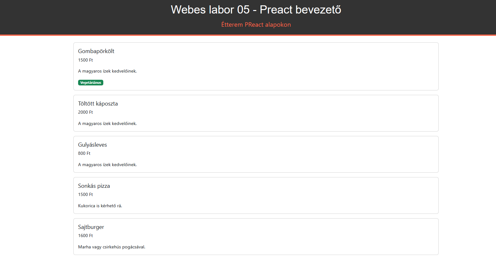

# Labor 05 – Preact bevezető

## Bevezetés

A laboron egy étterem webalkalmazás első részét fogjuk elkészíteni a Preact keretrendszer segítségével. Az előző webes laborok ismereteinek megszerzése jelen labor elvégzéséhez erősen ajánlott.

Felhasznált technológiák és eszközök:

- webböngészők beépített hibakereső eszközei,
    - javasolt az [új Microsoft Edge](https://www.microsoft.com/en-us/edge), a [Firefox](https://www.mozilla.org/en-US/firefox/new/) vagy a [Google Chrome](https://www.google.com/chrome/) böngésző használata,

- npm, a [NodeJS](https://nodejs.org/en/download/) csomagkezelője
    - a laborhoz használható mind a Current, mind az LTS verzió, de ha még nem telepítetted a NodeJS-t, akkor érdemes a Currentet telepíteni (ha korábbi verzió van telepítve, akkor pedig a Currentre frissíteni)

- [Visual Studio Code](https://code.visualstudio.com/download) kódszerkesztő alkalmazás

??? warning "Nagyméretű függőségek"
    A React laborok során számos, viszonylag nagyméretű (~50-100 megabájt) függőségi csomag letöltésére lesz szükség, de ha már sikeresen telepítettük korábban az NPM csomagokat, akkor azokat várhatóan nem kell újra letölteni.

??? note "A Preact-ről dióhéjban"
    A Preact egy könnyű, gyors és modern frontend könyvtár, amely a Reacthez hasonló komponens alapú architektúrát használ. A Preact célja, hogy a lehető legkisebb méretben (kb. 3KB) ugyanazokat a funkciókat nyújtsa, mint a React, de gyorsabb és hatékonyabb legyen. A Preact kompatibilis a React-tel, így a React komponensek többsége használható Preact-ben is.

    A Preact kulcsgondolatai:

    - **Komponensek**: Az alkalmazás egymásba ágyazható elemei, amik egy adott felületi elem (oldal, menü, gomb stb.) kirajzolásáért és adatkötéséért felelősek.
    - **TSX**: A TypeScript XML szintaxis, amely lehetővé teszi a HTML-szerű kód írását TypeScript-ben.
    - **Virtual DOM**: A Preact egy virtuális DOM-ot használ, amely optimalizálja a DOM frissítéseket és gyorsabbá teszi az alkalmazást.
    - **Hooks**: A Preact támogatja a Reacthez hasonló hookokat, amelyek lehetővé teszik a funkcionális komponensek használatát állapotokkal és életciklusokkal.

## Előkészület

A feladatok megoldása során ne felejtsd el követni a [feladatbeadás folyamatát](../../../tudnivalok/github/GitHub.md).

### Git repository létrehozása és letöltése

1. A Moodle-ben keresd meg a laborhoz tartozó meghívó URL-jét, és annak segítségével hozd létre a saját repositorydat.
2. Várd meg, míg elkészül a repository, majd checkoutold ki.
    * Egyetemi laborokban, ha a checkout során nem kér a rendszer felhasználónevet és jelszót, és nem sikerül a checkout, akkor valószínűleg a gépen korábban megjegyzett felhasználónévvel próbálkozott a rendszer. Először töröld ki a mentett belépési adatokat (lásd [itt](../../../tudnivalok/github/GitHub-credentials.md)), és próbáld újra.
3. Hozz létre egy új ágat `megoldas` néven, és ezen az ágon dolgozz.
4. A `neptun.txt` fájlba írd bele a Neptun-kódodat. A fájlban semmi más ne szerepeljen, csak egyetlen sorban a Neptun-kód 6 karaktere.

### A feladatról

A labor során egy étterem webalkalmazásának alapjait készítjük el, miközben megismerkedünk a Preact keretrendszerrel. Az alkalmazás az éttermekben kapható ételek adatait képes egy listás nézetben megjeleníteni. A stílusozáshoz `Bootstrap`-et használunk. Az alkalmazást a következő laboron további funkciókkal is kiegészítjük, ehhez egy kiinduló projekt fog rendelkezésre állni, de folytathatjuk akár a mostani projektünket is.

## 1. feladat – Kiindulóprojekt

Nyissunk meg a kiinduló repository `feladat` mappáját VS Code-ban, majd a Terminalban (`Ctrl+Ö`) adjuk ki az alábbi parancsot:

> `npm init preact`

A parancs kiadása után több kérdésre kell válaszolnunk. Projektkönvytárnak (`Project directory`) válasszunk egy hangzatos nevet (pl. `restaurant`), a projekt nyelvének (`Project language`) pedig a `TypeScript`-et. A többi kérdésre nyomjunk ENTER-t, tehát automatikusan nemmel válaszoljunk.

A parancs lefutása után navigáljunk az újonnan létrehozott mappába a Terminalban:

> `cd restaurant`

Ezután telepítsük a függőségeket a következő parancs kiadásával:

> `npm install`

A stílusozáshoz a `Bootstrap`-re is szükségünk lesz, telepítsük ezt is:

> `npm install bootstrap`

Nézzük meg, hogy elindul-e az alkalmazás:

> `npm run dev`

??? warning "node.js frissítése"
    Ha valamilyen hibába futunk a fenti parancsok lefutása során, győződjünk meg róla, hogy friss node.js-t (és npm-et) használunk a `node -v` és `npm --version` parancsok kiadásával. Amennyiben nem frissek, próbáljuk meg a [node.js-t](https://nodejs.org/en) és / vagy az npm-et (`npm install -g npm@latest` parancs) frissíteni.

Az alkalmazás alapértelmezetten (ahogy azt a konzolon is olvashatjuk) a <a href="http://localhost:5173" target="_blank">`http://localhost:5173`</a> címen fut. Hasonlóan a korábbiakhoz, a legtöbb esetben itt sem kell újraindítanunk a futást ha változtatunk a forráskódon. A háttérben a fordító automatikusan figyeli ezeket a változásokat. Indítás után az alábbihoz hasonlót kell, hogy lássunk:

```
VITE v6.2.1  ready in 555 ms

  ➜  Local:   http://localhost:5173/
  ➜  Network: use --host to expose
  ➜  press h + enter to show help
```

??? note "npm run dev és start"
    Opcionálisan a `package.json` fájlban (`"start": "vite"` --> `"dev": "vite"`) átírhatjuk, hogy ne az `npm run dev`, hanem az `npm start` parancs kiadásával fusson az alkalmazásunk. Ez jobban követi az ipari standardeket, de végső soron bármelyiket használhatjuk.

Nyissuk meg tehát a böngészőt a <a href="http://localhost:5173" target="_blank">`http://localhost:5173`</a>-on (ha magától nem nyílna meg)!

Az `npm run dev` (vagy ha átírtuk, akkor `npm start`) parancsot hagyjuk a háttérben futni. Ha új parancsokat kell végrehajtanunk, nyissunk egy új terminált a `Ctrl+Shift+Ö` billentyűkombinációval! **FONTOS!** Ha a fordítás hibát jelez, és úgy gondoljuk, hogy mégsincs hiba, akkor állítsuk le a parancsot (pl. `Ctrl+C`), és indítsuk újra. Ez akkor fordulhat elő esetenként, ha például fájlt törlünk vagy új függőségi csomagot hivatkozunk be.

<figure markdown>
  
  <figcaption>A kiinduló Preact projekt böngészőben</figcaption>
</figure>

Vizsgáljuk meg a létrejött projekt tartalmát (csak a releváns mappák és fájlok vannak kiemelve):

- **node_modules**: a Preact és függőségei, melyek a kiinduló projekthez kellenek
- **package.json**: az alkalmazás függőségeinek listája, ide tudjuk felvenni az npm csomagjainkat függőségként (vagy az `npm install [függőség_neve]` paranccsal ebbe a fájlba kerülnek be)
- **tsconfig.json**: az alkalmazás TypeScript konfigurációja
- **vite.config.ts**: a [Vite](https://vite.dev/) build tool konfigurációja, ezt használjuk a háttérben
- **index.html**: a kiinduló HTML fájl, itt tudjuk átállítani a címet és egyéb metaadatokat
  - a `div` segítségével van összekötve az `index.tsx` fájllal
- **src**: az alkalmazás forráskódja, elsősorban itt fogunk dolgozni
    - **assets**: ebben a mappában tárolhatjuk a statikus tartalmakat (pl. képek)
    - **style.css**: a globális CSS fájl, az egész alkalmazásra érvényes szabályokkal - az egyes komponenseknek külön CSS fájlokat is készíthetünk
    - **index.tsx**: a fő komponens, ami a tartalom megjelenítéséért felelős

Írjuk át az alkalmazás címét az `index.html` fájlban valami kifejezőbbre!

```HTML
<title>Webes labor 05 - Preact bevezető</title>
```

???+ tip "Formázás"
    A kódot formázni az `Alt+Shift+F` billentyűkombinációval tudjuk.

### Beadandó (0.1 pont)
!!! example "1. feladat beadandó"
    Illessz be egy képernyőképet, ahol bal oldalon a böngészőben futó Preact kezdőprojekt, jobb oldalon a VS Code-ban futó terminál látható! (`f1.png`)

## 2. feladat – Fejléc és ételek listázása

Mielőtt új komponenseket hozunk létre, érdemes egy külön mappába szervezni őket. Hozzuk létre az `src/components` mappát, és innentől minden új komponenst itt hozzunk létre! Opcionálisan minden komponensnek egy új mappát is létrehozhatunk (pl. `src/components/header` mappa).

### Header komponens

A Header komponens egy díszítő fejlécként funkcionál az alkalmazásban. Dinamikusan beállítható tulajdonságai nincsenek, mindig egy statikus HTML kódrészletet fog visszaadni. Tartozik hozzá viszont egy külön CSS fájl is, amit létre kell hoznunk.

Elsőként hozzuk létre a `Header.tsx` fájlt, majd töltsük fel az alábbi tartalommal:

```javascript
export default function Header() {
  return (
    <header>
      <h1>Webes labor 05 - Preact bevezető</h1>
      <div className="subtitle">Étterem PReact alapokon</div>
    </header>
  );
}
```

Láthatjuk, hogy a `.tsx` fájlokban keveredik a HTML és TypeScript szintaxisa. Az `export default` lehetővé teszi, hogy egyszerűbben (kapcsos zárójelek nélkül) beimportáljuk a függvényt más fájlban. Ehelyett nyugodtan használhatnánk a az `export` kulcsszót önmagában is (`default` nélkül), ahogy azt előző laboron láttuk. A Header függvény a szemantikus `header` HTML tag-el tér vissza vissza, ezt tudjuk más komponensben, például az `index.tsx` fájlban felhasználni. A `className="subtitle"`-vel a CSS stílusozásra készülünk fel.

??? note "Komponensek létrehozásának automatizálása"
    Bár kényelmes lenne valamilyen szkript vagy CLI parancs segítségével komponenseket létrehozni (mint pl. az Angular keretrendszerben), a Preact sajnos erre nem ad beépített támogatást. Szerencsére viszont egy komponens létrehozása nem egy bonyolult folyamat, általában egy `.tsx` és egy `.css` fájl létrehozása elég. Ezen kívül ha nagyon szeretnénk, saját Node.js szkriptet is írhatunk, de a tárgy keretein belül erre nincs szükség.

Hozzuk létre a `Header.css` fájlt a `Header.tsx` fájl mellé a következő tartalommal:

```CSS
header {
    background-color: #333;
    color: #fff;
    padding: 20px;
    text-align: center;
    border-bottom: 5px solid #ff6347;
}

header h1 {
    font-size: 2.5rem;
    margin: 0;
    font-family: 'Arial', sans-serif;
}

header .subtitle {
    font-size: 1.4rem;
    color: #ff6347;
    margin-top: 10px;
}
```

A CSS szabályai csak arra a komponensre fognak vonatkozni, amelyik beimportálja a CSS-t, esetünkben ez a Header komponens lesz. Importáljuk a CSS fájlt a `Header.tsx` fájl elején:

```javascript
import './Header.css';
```

Annak érdekében, hogy a komponensünk megjelenjen az oldalon, írjuk felül az index komponens (`index.tsx`) teljes tartalmát az alábbival:

```javascript
import "bootstrap/dist/css/bootstrap.min.css";
import { render } from "preact";
import Header from './components/Header';

export default function App() {

  return (
    <div>
      <Header />
    </div>
  );
}

render(<App />, document.getElementById('app'));
```

??? note "Komponensek létrehozásának automatizálása"
    A fenti kódrészletből kikerült az `import './style.css';` sor, tehát a globális CSS beállításainkat ezzel töröltük. Ezen a ponton akár törölhetnénk a fájlt vagy a tartalmát, de az sem zavar minket, ha így marad a `style.css` fájl.

A `<Header />` tag segítségével tudjuk beágyazni a Header komponenst. A `Bootstrap` import a későbbi feladatokhoz fog kelleni. A `render` függvényhívás illeszti be a dinamikus tartalmat a főoldal megfelelő helyére (`div` tag `app` classal). A fejlécnél erre még nem feltétlenül van szükségünk, de később mindenképpen kelleni fog. Nézzük meg, hogy megjelenik-e az oldalon a komponens!

<figure markdown>
  
  <figcaption>Header komponens az oldalon</figcaption>
</figure>

### MenuItem komponens

Folytassuk az ételek elkészítésével! Hozzuk létre a MenuItem komponenst (`MenuItem.tsx`) az alábbi tartalommal:

```javascript
export type MenuItemProps = {
    name: string;
    price: number;
    description: string;
    isVegetarian: boolean;
}

export default function MenuItem({ name, price, description, isVegetarian }: MenuItemProps) {
    return (
        <div className="card mb-3">
            <div className="card-body">
                <h5 className="card-title">{name}</h5>
                <p className="card-text">{price} Ft</p>
                <p className="card-text">{description}</p>
                {isVegetarian && <span className="badge bg-success">Vegetáriánus</span>}
            </div>
        </div>
    );
}
```

Ehhez a komponenshez nem készítünk saját CSS-t, helyette a `Bootstrap` osztályaira támaszkodunk (`card`, `mb-3` stb.). A `MenuItemProps` tárolja egy étel adatait, a props segítségével tudunk dinamikus tartalmat (adatokat) vinni az alkalmazásba. A `MenuItem` függvény paraméterül megkapja a szükséges adatokat és egy `MenuItemProps`-ot készít belőlük. Az `isVegetarian` tagváltozó a megjelenítési logikában szerepel (az értékétől függően jelenik meg a badge), a többi tagváltozót adatként jelenítjük meg.

Importáljuk be az új komponenst az `index.tsx` fájlban:

```javascript
import MenuItem from "./components/MenuItem";
```

Mivel többféle ételünk lesz és minden `MenuItem` komponenst fel kell paramétereznünk, valahonnan adatokat kell szolgáltatnunk az oldalnak. Egy éles alkalmazásban az adatok tipikusan a szerverről vagy valamilyen külső API-ról érkeznének, de most (és a házi feladatnál is!) megelégszünk a memóriában tárolt adatokkal. Vegyük fel a következő listát az `index.tsx` fájlba, az importok után:

```javascript
const menuItems = [
	{ id: 1, name: "Gombapörkölt", price: 1500, description: "A magyaros ízek kedvelőinek.", isVegetarian: true },
	{ id: 2, name: "Töltött káposzta", price: 2000, description: "A magyaros ízek kedvelőinek.", isVegetarian: false },
	{ id: 3, name: "Gulyásleves", price: 800, description: "A magyaros ízek kedvelőinek.", isVegetarian: false },
	{ id: 4, name: "Sonkás pizza", price: 1500, description: "Kukorica is kérhető rá.", isVegetarian: false },
	{ id: 5, name: "Sajtburger", price: 1600, description: "Marha vagy csirkehús pogácsával.", isVegetarian: false },
];
```

Végezetül adjuk hozzá az `App` függvényhez a `<Header />` tag után a következő kódrészletet, hogy meg is jelenjenek az ételek:

```javascript
<div className="container mt-4">
  {menuItems
    .map((item) => (
      <MenuItem
        key={item.id}
        name={item.name}
        price={item.price}
        description={item.description}
        isVegetarian={item.isVegetarian}
      />
    ))}
</div>
```

<figure markdown>
  
  <figcaption>Ételek az oldalon</figcaption>
</figure>

### Beadandó (0.3 pont)
!!! example "2. feladat beadandó (0.3 pont)"
    Illessz be egy képernyőképet, ahol bal oldalon az oldal, jobb oldalon a VS Code-ban futó terminál látható! (`f2.png`)

## 3. feladat – Vegetáriánus ételek megjelenítése

Szeretnénk az összes, vagy pedig csak a vegetáriánus ételeket megjeleníteni. Ezért egy gombot fogunk felvenni, ami állapotkezelés (`useState`) segítségével szabályozza, hogy melyik megjelenítési módban vagyunk. Importáljuk a `useState` hook-ot és vegyük fel a következő állapotváltozót az `index.tsx` `App` függvényébe:

```javascript
import { useState } from "preact/hooks";
// ...
export default function App() {
  const [showVegetarianOnly, setShowVegetarianOnly] = useState(false);
  // ...
}
```

Az állapotváltozó kezdetben `false` értéket vesz fel. Ezután vegyük fel a gombot is az `App` függvényen belül és módosítjuk az ételek kiírását, hogy mindig csak a megfelelő ételek jelenjenek meg (a `filter` függvény használatával):

```javascript
export default function App() {
  // ...

  <div className="container mt-4">
    <div className="text-center">
      <button
        className="btn btn-primary mb-3"
        onClick={() => setShowVegetarianOnly(!showVegetarianOnly)}>
        {showVegetarianOnly ? "Minden Étel" : "Csak Vegetáriánus Ételek"}
      </button>
    </div>
    {menuItems
      .filter((item) => !showVegetarianOnly || item.isVegetarian)
      .map((item) => (
        <MenuItem
          key={item.id}
          name={item.name}
          price={item.price}
          description={item.description}
          isVegetarian={item.isVegetarian}
        />
      ))}
  </div>
}
```

A gomb `onClick` eseménykezelője invertálja a `showVegetarianOnly` aktuális értékét. Ehhez a `setShowVegetarianOnly` set függvényt kell használnia. Állapotkezeléssel a következő laboron is fogunk még foglalkozni.

<figure markdown>
  
  <figcaption>Csak vegetáriánus ételek megjelenítése</figcaption>
</figure>

### Beadandó (0.1 pont)
!!! example "3. feladat beadandó (0.1 pont)"
    Illessz be egy képernyőképet, ahol bal oldalon az oldal, jobb oldalon a VS Code-ban futó terminál látható! (`f3.png`)

## 4. feladat (önálló) – Speciális ajánlat

Hozz létre egy új komponenst `SpecialOffer` néven, amely egy speciális ajánlatot jelenít meg. Egy speciális ajánlatnak van neve, ára, és leírása. Adj hozzá egy új szekciót az ételek listája és a vegetáriánus megjelenítő gomb közé. Az ajánlat az alábbi ábrához hasonló módon nézzen ki! Használj props-okat az ajánlat tulajdonságainak átadására!

A vezetett feladatokhoz hasonlóan itt is dolgozz beégetett adatokkal.

???+ tip "CSS"
    A feladat során arra törekedjünk, hogy az alábbi ábrához hasonló elrendezést érjünk el, de nem baj, ha nem 100%-os az egyezés. A következő CSS szabályokat érdemes használni a megoldás során: `background-color`, `border-radius`, `padding`, `margin`, `font-size`, `color`.

<figure markdown>
  
  <figcaption>Speciális ajánlat megjelenítése</figcaption>
</figure>

### Beadandó (0.2 pont)
!!! example "4. feladat beadandó (0.2 pont)"
    Illessz be egy képernyőképet, ahol bal oldalon az oldal, jobb oldalon a VS Code-ban futó terminál látható! (`f4.png`)

## 5. feladat (önálló) – Vásárlói vélemények

Hozz létre egy új komponenst `CustomerReview` néven, amely egy vásárlói véleményt jelenít meg egy adott ételről. Egy vásárlói véleménynek van neve, értékelése (1-5-ös skálán, de nem kell kezelni azt, hogyha a szélső értékeken kívül esne), és hozzá tartozó megjegyzése. Minden étel saját maga jelenítse meg a hozzá tartozó véleményeket az alábbi ábrához hasonló módon! Használj props-okat a vásárlói vélemény tulajdonságainak átadására! Ügyelj arra, hogy akkor ne jelenjen meg a vásárlói vélemények blokk, ha nincs egy vélemény sem!

A vezetett feladatokhoz hasonlóan itt is dolgozz beégetett adatokkal.

???+ tip "Tippek a feladathoz"
    A vásárlói véleményeket (egészen pontosan azok tulajdonságait - `CustomerReviewProps`) a `MenuItemProps`-on belül, egy tömbben érdemes tárolni. Az index komponensben felvehetünk beégetett listákat, maelyeket a szintén beégetett `menuItems` lista elemeinek értékül lehet adni. Importálni a `MenuItem` komponensben a következő utasítással érdemes: `import CustomerReview, { CustomerReviewProps } from "./CustomerReview";`.

    A vásárlói vélemények blokkot feltételes megjelenítéssel kell csinálni, a vegetáriánus badge-hez hasonló módon. Lehet például a tömb hosszára szűrni.

???+ tip "CSS"
    A feladat során arra törekedjünk, hogy az alábbi ábrához hasonló elrendezést érjünk el, de nem baj, ha nem 100%-os az egyezés. A következő CSS szabályokat érdemes használni a megoldás során: `background-color`, `border-radius`, `padding`, `margin`, `font-size`, `color`.

<figure markdown>
  
  <figcaption>Vásárlói vélemények megjelenítése</figcaption>
</figure>

### Beadandó (0.3 pont)
!!! example "5. feladat beadandó (0.3 pont)"
    Illessz be egy képernyőképet, ahol bal oldalon az oldal, amin legalább 2 ételnél összesen legalább 3 vásárlói vélemény van, jobb oldalon a VS Code-ban futó terminál látható! (`f5.png`)