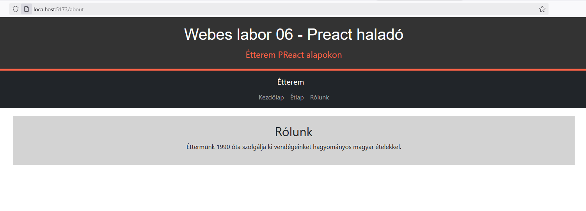
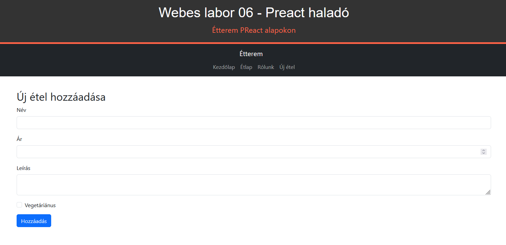
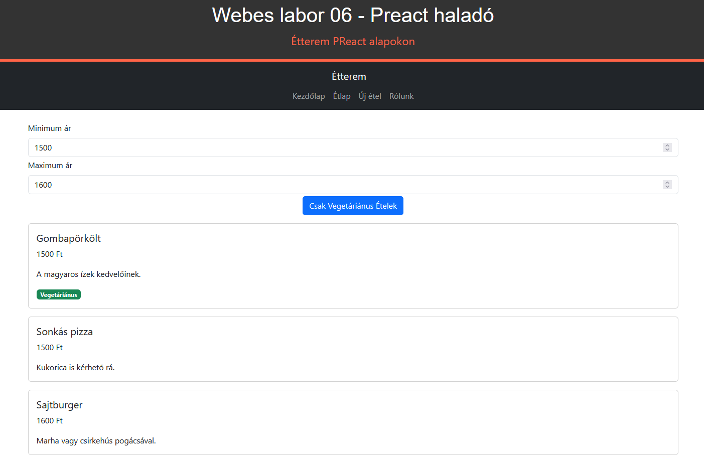
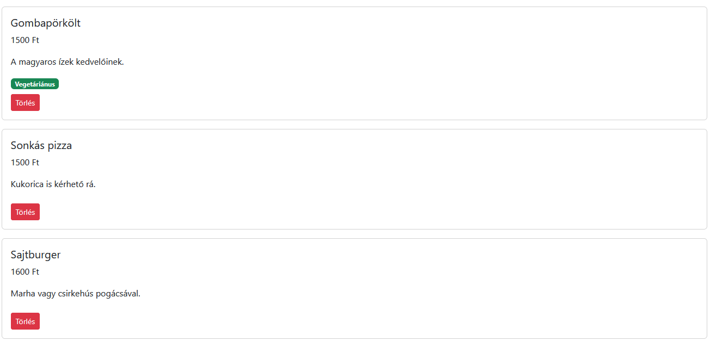

# Labor 06 – Preact haladó

## Bevezetés

A labor során továbbfejlesztjük az előző laboron elkészített étterem webalkalmazást. Az alkalmazásba újdonságként routing-ot és felhasználói inputot építünk be, így az már többoldalas lesz, és lehetőség nyílik új ételek hozzáadására is. Nem szükséges a korábbi saját megoldásunkat használni kiindulásként, a kiinduló repository-ban az előző labor vezetett feladatainak megoldásai megtalálhatók.

Felhasznált technológiák és eszközök:

- webböngészők beépített hibakereső eszközei,
    - javasolt az [új Microsoft Edge](https://www.microsoft.com/en-us/edge), a [Firefox](https://www.mozilla.org/en-US/firefox/new/) vagy a [Google Chrome](https://www.google.com/chrome/) böngésző használata,

- npm, a [NodeJS](https://nodejs.org/en/download/) csomagkezelője
    - a laborhoz használható mind a Current, mind az LTS verzió, de ha még nem telepítetted a NodeJS-t, akkor érdemes a Currentet telepíteni (ha korábbi verzió van telepítve, akkor pedig a Currentre frissíteni)

- [Visual Studio Code](https://code.visualstudio.com/download) kódszerkesztő alkalmazás

??? warning "Nagyméretű függőségek"
    A React laborok során számos, viszonylag nagyméretű (~50-100 megabájt) függőségi csomag letöltésére lesz szükség, de ha már sikeresen telepítettük korábban az NPM csomagokat, akkor azokat várhatóan nem kell újra letölteni.

## Előkészület

A feladatok megoldása során ne felejtsd el követni a [feladatbeadás folyamatát](../../../tudnivalok/github/GitHub.md).

### Git repository létrehozása és letöltése

1. A Moodle-ben keresd meg a laborhoz tartozó meghívó URL-jét, és annak segítségével hozd létre a saját repositorydat.
2. Várd meg, míg elkészül a repository, majd checkoutold ki.
    * Egyetemi laborokban, ha a checkout során nem kér a rendszer felhasználónevet és jelszót, és nem sikerül a checkout, akkor valószínűleg a gépen korábban megjegyzett felhasználónévvel próbálkozott a rendszer. Először töröld ki a mentett belépési adatokat (lásd [itt](../../../tudnivalok/github/GitHub-credentials.md)), és próbáld újra.
3. Hozz létre egy új ágat `megoldas` néven, és ezen az ágon dolgozz.
4. A `neptun.txt` fájlba írd bele a Neptun-kódodat. A fájlban semmi más ne szerepeljen, csak egyetlen sorban a Neptun-kód 6 karaktere.

## 1. feladat – Routing bevezetése

Az alkalmazásunk többoldalassá válik, így szükségünk lesz útvonal választásra is. Ehhez a `preact-router` könyvtárat fogjuk használni. A `preact-router` a React `react-router` könyvtárához hasonlít, de kifejezetten Preact-hez készült, és kisebb méretű.

Először telepítsük a `preact-router` csomagot:

> `npm install preact-router`

### Új komponensek létrehozása

Az alkalmazásunkat innentől kezdve három fő oldalra bontjuk:

- a kezdő (Home) oldalon egy statikus üdvözlő szöveg található
- a menü (Menu) oldalon az előző laboron elkészített étlap található
- az információs (About) oldalon szintén egy statikus szöveg található

Ezeket az oldalakat külön komponensekként valósítjuk meg. A `Home.tsx` és `Home.css` fájlok tartalma legyen a következő:

```javascript
import './Home.css';

export default function Home() {
    return (
        <div className="home">
            <h2>Üdvözöljük éttermünkben!</h2>
            <p>Fedezze fel finom ételeinket.</p>
        </div>
    );
}
```

```CSS
.home {
    width: 75%;
    margin: 20px auto 0;
    padding: 20px;
    text-align: center;
    background-color: #d3d3d3;
}
```

A `Menu.tsx` fájl tartalma legyen a következő (ehhez nem kell külön CSS-t készítenünk, továbbra is a `Bootstrap` segítségével stílusozzuk):
```javascript
import MenuItem from "./MenuItem";
import { useState } from "preact/hooks";

export default function Menu({ menuItems }) {
    const [showVegetarianOnly, setShowVegetarianOnly] = useState(false);

    return (
        <div className="container mt-4">
            <div class="text-center">
                <button
                    className="btn btn-primary mb-3"
                    onClick={() => setShowVegetarianOnly(!showVegetarianOnly)}>
                    {showVegetarianOnly ? "Minden Étel" : "Csak Vegetáriánus Ételek"}
                </button>
            </div>
            {menuItems
                .filter((item) => !showVegetarianOnly || item.isVegetarian)
                .map((item) => (
                    <MenuItem
                        key={item.id}
                        name={item.name}
                        price={item.price}
                        description={item.description}
                        isVegetarian={item.isVegetarian}
                    />
                ))}
        </div>
    );
}
```

Ezután az `index.tsx` fájlból töröljük ki az `App` függvény `Menu`-re vonatkozó részeire (ld. fent), itt már ezekre nem lesz szükségünk. Az ételek listája maradjon, erre később még visszatérünk.

Az `About.tsx` és `About.css` fájlok tartalma legyen a következő:

```javascript
import './About.css';

export default function About() {
    return (
        <div className="about">
            <h2>Rólunk</h2>
            <p>Éttermünk 1990 óta szolgálja ki vendégeinket hagyományos magyar ételekkel.</p>
        </div>
    );
}
```

```CSS
.about {
    width: 75%;
    margin: 20px auto 0;
    padding: 20px;
    text-align: center;
    background-color: #d3d3d3;
}
```

### Routing elkészítése

A routing beállításához módosítsuk az `index.tsx` fájlt, ne feledkezzünk el az importokról sem:

```javascript
import { Router, Route } from "preact-router";
import Home from "./components/Home";
import Menu from "./components/Menu";
import About from "./components/About";
import { useState } from "preact/hooks";

// ...

export default function App() {
	const [menuItems, setMenuItems] = useState([
		{ id: 1, name: "Gombapörkölt", price: 1500, description: "A magyaros ízek kedvelőinek.", isVegetarian: true },
		{ id: 2, name: "Töltött káposzta", price: 2000, description: "A magyaros ízek kedvelőinek.", isVegetarian: false },
		{ id: 3, name: "Gulyásleves", price: 800, description: "A magyaros ízek kedvelőinek.", isVegetarian: false },
		{ id: 4, name: "Sonkás pizza", price: 1500, description: "Kukorica is kérhető rá.", isVegetarian: false },
		{ id: 5, name: "Sajtburger", price: 1600, description: "Marha vagy csirkehús pogácsával.", isVegetarian: false },
	]);

	return (
		<div>
			<Header />
			<Router>
				<Route path="/" component={Home} />
        <Route path="/home" component={Home} />
				<Route path="/menu" component={() => <Menu menuItems={menuItems} />} />
				<Route path="/about" component={About} />
			</Router>
		</div>
	);
}
```

A routing beállításán kívül még egy fontos változás történt: az ételek tömbjét beraktuk az `App` függvény elejére és állapotváltozóként kezeljük konstans tömb helyett. A `Menu` komponens pedig paraméterként megkapja ezt a tömböt. Erre később lesz szükségünk, amikor új ételt fogunk felvenni.

Ezzel felkészítettük a fő komponensünket a routing-ra, vagyis ha a böngésző URL-be a megadott útvonalat írjuk, akkor a megfelelő komponensek fognak megjelenni. Egy komponenst több útvonalra is beregisztrálhatunk, a `Home` komponens esetén így is tettünk. Próbáljuk ki böngészőből, hogy tényleg megjelennek a megfelelő oldalak (pl. <a href="http://localhost:5173/menu" target="_blank">`http://localhost:5173/menu`</a> stb.)!

Ez a megoldás - bár működőképes - nem felhasználóbarát, mivel nem tudunk az oldalak között váltani a felületen. Ennek orvoslására hozzuk létre a `Navbar.tsx` komponenst. Stílusozásra itt a `Bootstrap`-et használjuk, de készítsünk egy `Navbar.css` fájlt is, melynek segítségével a kurzort pointeresre alakítjuk, ha az egeret a linkek fölé visszük:

```javascript
import './NavBar.css';
import { route } from "preact-router";

export default function NavBar() {
    return (
        <nav className="navbar navbar-expand-lg navbar-dark bg-dark">
            <div className="container-fluid d-flex flex-column align-items-center">
                <a className="navbar-brand" onClick={() => route('/')}>Étterem</a>
                <div className="navbar-nav justify-content-center">
                    <a className="nav-link" onClick={() => route('/home')}>Kezdőlap</a>
                    <a className="nav-link" onClick={() => route('/menu')}>Étlap</a>
                    <a className="nav-link" onClick={() => route('/about')}>Rólunk</a>
                </div>
            </div>
        </nav>
    );
}
```

```CSS
.nav-link, .navbar-brand {
    cursor: pointer;
}
```

Már csak annyi maradt hátra, hogy az `index.tsx` fájlban felhasználjuk az új komponenst:

```javascript
import NavBar from "./components/NavBar";

export default function App() {
  // ...
	return (
		<div>
			<Header />
			<NavBar />
			// ...
		</div>
	);
}
```

Próbáljuk ki az alkalmazást és figyeljük meg az URL váltást a böngészőben!

<figure markdown>
  
  <figcaption>Routing NavBar komponenssel</figcaption>
</figure>

### Beadandó (0.25 pont)
!!! example "1. feladat beadandó (0.25 pont)"
    Illessz be egy képernyőképet, ahol bal oldalon az oldal, ahol látszik az URL és az étlap van megnyitva, jobb oldalon a VS Code-ban futó terminál látható! (`f1.png`)

## 2. feladat – Új étel létrehozása

Ebben a feladatban egy űrlapot hozunk létre, amelyen keresztül új ételeket adhatunk hozzá az étlaphoz. Az űrlapot egy új komponensben valósítjuk meg, és `useState` hook segítségével kezeljük az input mezőket.

### AddMenuItem komponens

Hozzuk létre az `AddMenuItem.tsx` (az `AddMenuItem.css` fájlt is) komponenst:

```javascript
import { useState } from 'preact/hooks';
import './AddMenuItem.css';

export default function AddMenuItem({ onSave }) {
  const [name, setName] = useState('');
  const [price, setPrice] = useState('');
  const [description, setDescription] = useState('');
  const [isVegetarian, setIsVegetarian] = useState(false);

  const handleSubmit = (e: Event) => {
    e.preventDefault();

    const newItem = {
      name,
      price: Number(price),
      description,
      isVegetarian,
    };

    onSave(newItem);

    setName('');
    setPrice('');
    setDescription('');
    setIsVegetarian(false);
  };

  return (
    <div className="formContainer">
      <h2>Új étel hozzáadása</h2>
      <form onSubmit={handleSubmit}>
        <div className="mb-3">
          <label className="form-label">Név</label>
          <input
            type="text"
            className="form-control"
            value={name}
            onChange={(e: Event) => setName((e.target as HTMLInputElement).value)}
            required
          />
        </div>
        <div className="mb-3">
          <label className="form-label">Ár</label>
          <input
            type="number"
            className="form-control"
            value={price}
            onChange={(e: Event) => setPrice((e.target as HTMLInputElement).value)}
            required
          />
        </div>
        <div className="mb-3">
          <label className="form-label">Leírás</label>
          <textarea
            className="form-control"
            value={description}
            onChange={(e: Event) => setDescription((e.target as HTMLTextAreaElement).value)}
            required
          />
        </div>
        <div className="mb-3 form-check">
          <input
            type="checkbox"
            className="form-check-input"
            checked={isVegetarian}
            onChange={(e: Event) => setIsVegetarian((e.target as HTMLInputElement).checked)}
          />
          <label className="form-check-label">Vegetáriánus</label>
        </div>
        <button type="submit" className="btn btn-primary">Hozzáadás</button>
      </form>
    </div>
  );
}
```

```CSS
.formContainer {
    width: 75%;
    margin: 20px auto 0;
    padding: 20px;
}
```

Az `AddMenuItem` függvény paraméterként megkap egy callback függvényt (`addMenuItem`), amit majd az `index` komponens fog átadni neki. A `handleSubmit` függvényben adjuk át a beírt adatokat az `addMenuItem` függvény meghívásával. A form a `Bootstrap` stílusozását használja. A form `input` mezőihez be van kötve a megfelelő állapotváltozó változtatása (pl. `onChange={(e: Event) => setName((e.target as HTMLInputElement).value)}`), így értesülünk a felhasználói input változásáról.

Vegyük fel az `addMenuItem` függvényt az `index.tsx` fájlban az `App` függvénybe és egy routing-ot is az új komponensnek:

```javascript
export default function App() {
	// ...

	const addMenuItem = (newItem) => {
		setMenuItems((prevItems) => [
			...prevItems,
			{ ...newItem, id: prevItems.length + 1 },
		]);
	};

	return (
    <div>
			// ...
			<Router>
        // ...
				<Route path="/add-menu-item" component={() => <AddMenuItem onSave={addMenuItem} />} />
			</Router>
		</div>
	);
}
```

Már csak a `Navbar.tsx` kiegészítése van hátra az új linkkel:

```javascript
<a className="nav-link" onClick={() => route('/add-menu-item')}>Új étel</a>
```

<figure markdown>
  
  <figcaption>Étel létrehozó form</figcaption>
</figure>

### Beadandó (0.25 pont)
!!! example "2. feladat beadandó (0.25 pont)"
    Illessz be egy képernyőképet, ahol bal oldalon az űrlap, jobb oldalon a VS Code-ban futó terminál látható! (`f2.png`)

## 3. feladat (önálló) – Szűrés ár alapján

Alakítsd át a `Menu.tsx` komponenst, hogy támogassa a minimum és maximum ár szerinti szűrést. Csak azok az ételek jelenjenek meg, amelyeknek ára >= a minimum árnál és <= a maximum árnál.

???+ tip "Tippek a feladathoz"
    Érdemes új állapotváltozókat (`minPrice` és `maxPrice`) felvenni a `Menu.tsx` komponensbe és valamilyen default értéket megadni nekik. Nem kell fentebbi komponensben (`index.tsx`) kezelni a szűrést. A minimum és maximum ár bekéréséhez az új ételt hozzáadó formhoz hasonló megoldás használható.

    Új CSS-t nem kötelező felvenni, a feladat `Bootstrap` stílusozással megoldható.

<figure markdown>
  
  <figcaption>Szűrés ár alapján</figcaption>
</figure>

### Beadandó (0.25 pont)
!!! example "3. feladat beadandó (0.25 pont)"
    Illessz be egy képernyőképet, ahol bal oldalon az oldal (szűrt ételekkel), jobb oldalon a VS Code-ban futó terminál látható! (`f3.png`)

## 4. feladat (önálló) – Ételek törlése

Oldd meg, hogy legyen lehetőség minden ételt egy saját gombon keresztül törölni. A törléshez itt nem kell felugró dialógus ablakot megvalósítani.

???+ tip "Tippek a feladathoz"
    A `MenuItemProps`-ba érdemes felvenni a következő két tulajdonságot: `id: number;` és `onDelete: (id: number) => void;`. Utóbbi egy callback függvény, amit a `MenuItem` komponens meg tud hívni a gombra való kattintáskor. A callback függvényt a `Menu` komponensen keresztül kell eljuttatni a `MenuItem` komponenshez és az `index` komponensben kell definiálni, az `addMenuItem` függvényhez hasonló módon.

<figure markdown>
  
  <figcaption>Ételek törlése</figcaption>
</figure>

### Beadandó (0.25 pont)
!!! example "4. feladat beadandó (0.25 pont)"
    Illessz be egy képernyőképet, ahol bal oldalon az oldal (már kitörölt ételekkel), jobb oldalon a VS Code-ban futó terminál látható! (`f4.png`)