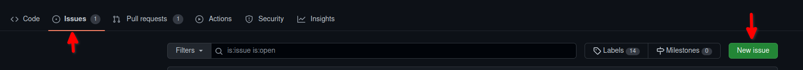
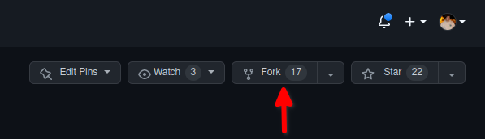
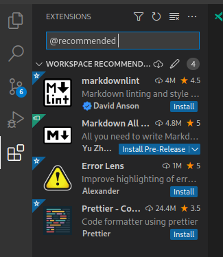

# Hozzájárulás az anyaghoz

Az anyag terjedelméből adandóan apróbb hibák, esetenként hiányosságok jelentkezhetnek a laborfeladatokban.
Ha egy ilyennel találkozol, és úgy döntesz, szeretnél segíteni hallgatótársaidnak, azt a következőkben leírtak alapján tudod megtenni.

!!! quote "Pluszpont jegyzet javításáért"

    Más tantárgyak mintájára itt is szeretnénk pluszpontot adni a jegyzet open-source hozzájárulásaiért.
    Akik a tárgyat jelenleg hallgatják, pontokat kaphatnak a hozzájárulásaikért.

    A félév során max. 3 db pluszpontot lehet szerezni fejenként olyan javításokért, amik a triviális 1-2 betű elgépelésen túl érdemben javítanak a GitHubon található laborjegyzetek minőségén.
    Pl.: jelentős mennyiségű elgépelés javítása, egyértelműsítések, illusztrációkiegészítések készítése vagy akár egy teljes kiegészítő jegyzet írása  (természetesen nem azonos pontértékkel).

    Persze pont nélkül az 1-1 betűs elgépelések javítását is szívesen fogadjuk, ami bemelegítésnek is tökéletes.

## Hibák jelzése

Amennyiben hibát találsz az anyagban, vagy szeretnéd bővíteni, de nem áll módodban javítani, nyithatsz egy issue-t, amiben leírod a hibát.

0. Nézd meg, hogy valaki nem jelezte-e már korábban, amit szeretnél.
    Gyakran már létező problémákat találnak a hallgatók, amire már van pull request,
    így mielőtt bármit tennél, nézd meg, valaki nem előzött-e meg.
1. Az issues tabon a _New issue_ gombbal hozz létre egy új issue-t.
    
2. Lásd el a megfelelő címkékkel.
    1. A labor típusa (`android` az androidos laboroknál)
    2. A hiba típusa (`clarification`, `typo`, `illustration` vagy `notes`)
3. Írd le, hogy mit kéne tartalmaznia a javításnak

!!! tip

    Az címe legyen rövid és lényegretörő, pl.: `Megfogalmazás pontosítása a 4. laborban` vagy `A 6. laborban a leírt kód hibásan működik Android 12-n`

    A issue descriptionjében pedig fejtsd ki, hol található a hiányosság, illetve – ha van rá ötleted –, hogy miként lehetne orvosolni ezt.
    Ha ezeken túl még screenshotot is tudsz mellékelni, az nagyban segíti a probléma mihamarabbi javítását.

!!! warning

    A GitHub issues nem a laborfeladatok megoldásával kapcsolatos problémák helye, így a "Nem tudom megoldani, hogy az értesítés megérkezzen" jellegű problémákat ne itt jelezzétek, erre vannak a laboralkalmak.

## Változtatások javaslása

Amennyiben a hozzájárulásod meg tudod valósítani, indíts pull requestet!

1. Forkold a repositoryt a GitHubon a jobb felső sarokban található gombbal.
    

2. Végezd el a változtatásokat.

    !!! tip
        Ez nagyon hasonlóan működik [a laborok beadásához](GitHub.md)

    1. Hozz létre egy branchet a saját forkodon, amin a változtatásokat el fogod végezni.

    2. Ezen a branchen készítsd el a javításokat.

    3. Ellenőrizd, hogy ne kerüljön bele a commitba olyan file, amit az editor generált (pl.: `.idea` mappa),
    illetve olyan file, aminek nem kéne kikerülnie, pl.: GitHub Private Access Token.

    4. Ha kész vagy, a laborok beadásához hasonlóan indíts egy pull requestet a `BMEVIAUBB03/laborok` `master` branchére.

    5. Lásd el a megfelelő címkékkel:
        1. A labor típusa (`android` az androidos laboroknál és `web` a webes laboroknál)
        2. A hiba típusa (`clarification`, `typo`, `illustration` vagy `notes`)
    6. A leírásban részletezd a változtatások okát.
        Ne felejtsd el beleírni a Neptun-kódod a leírásba, mert így fogjuk tudni megadni a pontokat.

3. Valaki, akinek hozzáférése van a repositoryhoz, ellenőrzi a változtatások szükségességét, és elbírálja, hogy valóban bekerülhet-e az anyagba.
4. A változtatásokra reviewt indítunk, és ha kell, módosításokat fogunk kérni.
5. Ha minden kért változtatás megtörtént, a hozzájárulásod belekerül az anyagba.

## Code style

- Kotlin: a [hivatalos style guide](https://kotlinlang.org/docs/coding-conventions.html) alapján
- Markdown: Mivel az alap spec nem mindig a legtisztábban érthető, a [markdownlint szabályai](https://github.com/markdownlint/markdownlint/blob/master/docs/RULES.md) alapján, néhány kivétellel – ezeket a `.markdownlint.yaml`-ben találod. Ha VSCode-ot használsz, automatikusan alkalmazza őket az editor, és jelzi, ha nem megfelelő, amit írsz.

Ezek a stílusok a tárgyban ajánlott editorokban könnyen beállíthatóak.

### VSCode

Ajánlott extensionök:

- [`yzhang.markdown-all-in-one`](https://marketplace.visualstudio.com/items?itemName=yzhang.markdown-all-in-one): MD-szinkronizált live preview
- [`DavidAnson.vscode-markdownlint`](https://marketplace.visualstudio.com/items?itemName=DavidAnson.vscode-markdownlint): MD-formázás, -szabályok stb.
- [Prettier](https://marketplace.visualstudio.com/items?itemName=esbenp.prettier-vscode): HTML+CSS-formázó
- [Error Lens](https://marketplace.visualstudio.com/items?itemName=usernamehw.errorlens): Kiemeli a hibákat, hogy gyorsabben megtaláljuk őket

Az editor beállításához nyisd meg a repót a gyökerében a VSCode-dal. A VSCode fel fogja ajánlani a két Markdown extensiont.
<figure markdown>
  
</figure>

Ha ez megtörtént, nyiss meg egy Markdown-dokumentumot, és használd a ++ctrl+shift+p++ shortcutot a command palette megnyitásához.

!!! tip

    A command palette a VSCode parancsaihoz nyújt hozzáférést, autocomplete-eli a parancsokat, és egy minimális GUI-t is biztosít.

A command palette-ben keressük meg a `Format Document With...` menüpontot, és válasszuk ki.
Ekkor egy almenübe dob az editor, és kiválaszthatjuk, hogy melyik formázóval formázzuk a MD-dokumentumokat.
Legalul lesz egy `Configure Default Formatter` – válasszuk ezt.
Ezután válasszuk a `markdownlint` extensiont, és készen is vagyunk.

!!! caution "Megfelelő formatter kiválasztása"
    Ne válaszd ki a prettiert formatterként, mert eltöri a szövegbuborékokat!

Ezen felül érdemes lehet bekapcsolni a mentés előtti formázást is.

A ++ctrl+comma++ shortcuttal megnyitjuk a beállításokat, és rákeresünk arra, hogy _format on save_.
Itt kipipáljuk a checkboxot, és készen vagyunk.

Ha ehhez nem lenne türelmed, itt a `.json`, amit a `settings.json`-be illesztve beállítódik minden.

```json
{
  "[markdown]": {
    "editor.defaultFormatter": "DavidAnson.vscode-markdownlint",
    "editor.formatOnSave": true
  }
}
```

## Ajánlások

### Android

- Az androidos Kotlin- és XML-fájlokat, illetve kódrészleteket Android Studióban formázva érdemes hozzáadni az anyaghoz.
- Ahhoz, hogy biztosan formázva legyenek a fájlok, használd a ++ctrl+alt+l++ shortcutot.

### Markdown-fájlok

- A Markdown-fájlokat se az Android Studio, se a Visual Studio Code nem rendereli alaphelyzetben.
  Erre a feladatra a következő extensionöket/pluginokat tudom ajánlani:
  - VSCode: [`yzhang.markdown-all-in-one`](https://marketplace.visualstudio.com/items?itemName=yzhang.markdown-all-in-one)
  - Android Studio: [Markdown Editor](https://plugins.jetbrains.com/plugin/17254-markdown-editor)
